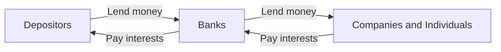
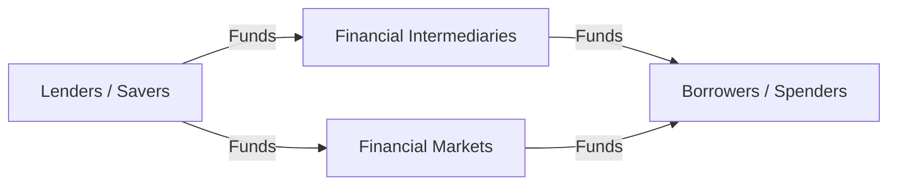

# Engineering Economics

## Introduction

### What is Economics

> Economics is the study of how people choose to use resources.

经济学研究的是人如何选择使用资源。

- Resources include money, land, equipment, time, knowledge, etc.
- Economics studies how to make the best decision given limited
	resources.
- Decision making can be hard in practice because different
	alternatives involve trade-offs and there is a lot of uncertainty.

$$
Economics = Make\ choices\ under\ limited\ resources
$$

Different alternatives usually involve **trade-offs**, and future outcomes are often **uncertain**. Therefore, economic decision making is essentially about allocating limited resources among competing alternatives.

### What is Engineering Economics

> Engineering economics is primarily concerned about economic evaluation of real investments; a.k.a. economic decision analysis.

面对一个现实投资决策，用经济角度去分析到底值不值得、选哪个更好。

- **Real investment：**plant, equipment, physical business assets

- **Financial investment：**stocks, bonds

Engineering economic analysis focuses mainly on the **economic aspects**, or the **money side**, of a decision.
$$
 \text{Engineering Economics} = \text{Economic Evaluation of Real Investments}
$$
However, economic analysis is only one part of the final decision. Other relevant aspects, such as flexibility, reliability, and safety, may also need to be considered.
$$
\text{Economic Analysis} \subset \text{Overall Decision Making}
$$

### Principles of Engineering Economics

**Develop the Alternatives**

Before evaluating a decision, identify the feasible alternatives as comprehensively as possible.

Creativity and innovation are important because the best solution may not be obvious. Decision makers should avoid imposing unnecessary constraints and should consider simple solutions when they are effective.
$$
\text{Develop Alternatives} \rightarrow \text{Evaluate Alternatives}
$$
**Focus on the Differences**

When comparing alternatives, only attributes with different values affect the decision. Attributes with identical values should be eliminated from the comparison.
$$
\text{Relevant Information} = \text{Differences among Alternatives}
$$
For example, if two workstations have the same resale value, resale value does not need to be considered.

**Use a Consistent Viewpoint**

Use the same viewpoint (perspective) throughout the entire analysis.
The relevant costs, benefits, and risks depend on whose perspective is adopted. The viewpoint of the decision maker is usually used, but the appropriate perspective should reflect whose objective the decision is intended to serve.
$$
\text{Different Perspectives}
\rightarrow
\text{Different Evaluation}
$$
**Example:** In the Mr. Rogue case, the firm’s perspective should be used because the decision is made on behalf of the firm.

**Use a Common Unit of Measure**

Economic outcomes should be expressed in a **common monetary unit** before alternatives are compared.

For example, if one quotation is in EUR and another is in USD, both should first be converted into the same currency.
$$
\text{Different Units} \rightarrow \text{Common Unit} \rightarrow \text{Comparison}
$$
**Consider All Relevant Criteria**

A decision should consider all criteria that are relevant to the alternatives and the decision objective.
$$
\text{Good Decision} \neq \text{Decision Based on One Criterion Only}
$$
**Make Uncertainty Explicit**

Future outcomes are usually uncertain and cannot be predicted with certainty.

Therefore, uncertainty should be explicitly recognized in the decision analysis.

**Revisit Your Decisions**

After a decision is implemented, compare the predicted outcomes with the actual results.

This feedback helps improve future decision making.

### Procedure of Engineering Economic Analysis

1. **Problem recognition and formulation**
	Clearly define the decision problem.

2. **Development of feasible alternatives**
	Identify realistic options that can be implemented.

3. **Development of outcomes for each alternative**
	Identify relevant attributes and estimate their outcomes. Eliminate attributes with identical outcomes and use a consistent viewpoint.

4. **Selection of criteria**
	Determine the standards used to evaluate the alternatives.

5. **Analysis and comparison of alternatives**
	Evaluate each alternative and compare them under the selected criteria.

6. **Selection of the preferred alternative**
	Choose the alternative that best satisfies the criteria.

7. **Performance monitoring and post-evaluation**
	Compare actual results with predicted outcomes and improve future decisions.

### Cost Classification

**Fixed Cost vs Variable Cost**

- A **fixed cost** remains constant with the quantity of output or service level.
- A **variable cost** changes with the quantity of output or service level.

**Recurring Cost vs Nonrecurring Cost**

- A **recurring cost** occurs repeatedly.
- A **nonrecurring cost** occurs only once, or does not repeat regularly.

**Direct Cost vs Indirect Cost**

- A **direct cost** can be attributed to a specific activity or output, such as direct labor and materials.
- An **indirect cost**, also called an **overhead cost**, cannot be attributed to a specific activity or output.

**Cash Cost vs Book Cost**

- A **cash cost** involves an actual payment of money.
- A **book cost** is recorded in the accounting system as a cost but does not involve a current cash transaction.

A typical example of a book cost is **depreciation**.

Book costs may still be relevant to economic analysis because they can affect **tax payments**.

**Suck Cost**

A **sunk cost** is a cost that has already occurred in the past and is unrecoverable.

Because a sunk cost cannot be changed by the current decision, it is **irrelevant to the current analysis**.

**Example:** A previously paid option fee is a sunk cost and should not affect the current comparison between two buildings.

**Opportunity Cost**

An **opportunity cost** is the value of the **best rejected opportunity**.

It represents the benefit sacrificed when one alternative is chosen instead of another.

Opportunity cost does not necessarily involve an actual cash payment, but it must be considered in economic analysis.

## Firms and Financial Statements

### The Firm

#### Shareholders vs. Debtholders

**Shareholders（股东）**

A firm’s owners are called shareholders (also called stockholders or equity holders).

they:

- own stocks of the firm;
- may receive dividends;
- can sell their stocks;
- are the residual claimants of the firm.

> 也叫 stockholders / equity holders，意思都是“公司的所有者”。他们持有公司的股票，可以获得 dividend（股息），也可以把股票卖掉。

例如你买了某公司 100 股股票，你就是这个公司的 shareholder。公司赚了钱以后，可能会给你分红；但注意，是“**可能**”，不是一定。

**Debtholders（债权人）**

公司不只可以靠股东的钱，还可以借钱。把钱借给公司的个人或机构，就是 **debtholder**。

例如：

- 银行给公司贷款 → 银行是 debtholder
- 投资者购买公司发行的 bond（债券） → 投资者是 debtholder

公司需要向债权人偿还 **principal + interest**，也就是：
$$
\text{本金 principal}+\text{利息 interest}
$$
Shareholders are **residual claimants**, meaning that the firm must satisfy the claims of debtholders before distributing the remaining value to shareholders.

Interest payments are contractual, while dividends are not guaranteed.

> 公司对债权人的 **interest（利息）是必须支付的债务义务**；但给股东的 **dividend（股息）并不保证一定支付**。

#### Objective of a Firm

The objective of a firm is to **maximize shareholders’ wealth**, measured by the market value of the firm’s stock.
$$
\text{Market Value of Stock} = \text{Market Price per Share} \times \text{Number of Shares}
$$
The market price reflects:

- present earnings;
- prospective earnings;
- timing and duration of earnings;
- risk;
- other relevant factors.

Maximizing shareholders’ wealth is not the same as maximizing current profits, because stock value reflects not only earnings, but also their timing, duration, and risk.

#### Three Decisions of a Firm

**Investment Decision**

The **investment decision**, also called **capital budgeting**, concerns the allocation of capital among competing investment projects.

Capital budgeting is difficult because future outcomes are uncertain.

Typical activities include:

- developing new investment opportunities;
- estimating future cash flows;
- organizing capital expenditure programs;
- reviewing investment programs.

**Financing Decision**

The **financing decision** determines the sources of funds used to finance investments.

There are two main types:

- **Equity financing**

	- issue new stocks;

	- retained earnings.

- **Debt financing**

	- issue bonds;

	- loans from financial institutions.

A firm may use a combination of equity and debt financing.

#### Dividend Policy

**Dividend policy** determines how much and how often dividends are paid to shareholders and whether they are paid in cash or stock.
$$
\text{Payout Ratio} = \frac{\text{Dividends}}{\text{Earnings}}
$$
Common dividend policies:

- **Regular dividend**: fixed dividend amount;
- **Stable dividend**: relatively stable payout ratio;
- **Residual dividend**: dividends are paid from earnings remaining after investment needs are funded;
- **Irregular dividend**: no fixed schedule or amount.

Firms with high-growth opportunities often retain more earnings and pay lower dividends, while mature firms may favor stable or regular dividends.

#### Relationship among the Three Decisions

The firm's **investment, financing, and dividend decisions are not independent**.

- Investment depends on the firm's access to funding.
- Current investment decisions may affect future access to financing.
- A higher dividend payout reduces retained earnings and therefore reduces internal funds available for reinvestment.

All three decisions should be made with the objective of **maximizing shareholders' wealth** in mind.

### Financial Statements

#### Accounting Information

Accounting information is useful in capital budgeting because an investment project should be evaluated not only by its own profitability, but also by its effect on the firm's **financial condition and financial position**.

Accounting information has two major uses:

- **Forecasting:** past financial data can help predict future financial conditions.
- **Post-evaluation:** actual project performance can be compared with predicted performance.

The three major financial statements are:

- Balance Sheet
- Income Statement
- Cash Flow Statement

#### Basic Principles of Accounting

**Monetary Measurement**

Accounting records facts that can be expressed in monetary terms.

**Cost Principle**

Assets are generally recorded at their **acquisition cost**, rather than their current market value.

**Accrual Concept**

Revenues and expenses are recognized when they are **earned or incurred**, regardless of when cash is received or paid.

#### Balance Sheet

A **balance sheet** shows the financial condition of a firm **at a specific point in time**.

The fundamental accounting identity is:
$$
Assets=Liabilities+Equity
$$

- **Assets** represent the **use of money**.
- **Liabilities and equity** represent the **sources of money**.

---

**Assets**

**Current Assets**

Assets that can be converted into cash or cash equivalents in **less than one year**.

Main items:

- Cash
- Marketable securities - Short-term liquid financial instruments that can be converted into cash quickly.
- Accounts receivable - Money owed to the firm by customers for goods or services already delivered.
- Inventories - Goods owned by the firm but not yet sold. Inventories are recorded at their **cost**, rather than their selling price.
- Prepaid expenses - Payments made in advance for goods or services to be received later. The unused portion remains an **asset**.
- Deferred charges - Similar to prepaid expenses, but generally associated with a longer period.

**Fixed Assets**

Relatively permanent assets used in normal business operations and not normally converted into cash during the operating cycle.

Examples of categories include:

- land
- buildings
- machinery
- equipment
- vehicles

**Other Assets**

Other assets may include investments in other companies and **intangible assets**.

Important intangible assets include:

- Goodwill - **Goodwill** arises when a company acquires another business and pays more than the net asset value of that business.
- Copyright - A **copyright** is a legal right associated with intellectual property. It gives the owner the exclusive right to reproduce a work.
- Franchise - A **franchise** is a type of license that allows a franchisee to use the franchisor’s: business knowledge, processes, trademarks, business name.

---

**Liabilities**

**Current Liabilities**

Current liabilities are debts payable within **one year**.

Examples include:

- accounts payable;
- accrued expenses;
- short-term bonds or loans.

**Other / Long-term Liabilities**

These are obligations due more than one year in the future.

Examples include:

- bonds;
- mortgages;
- long-term notes.

---

**Equity**

Equity represents the shareholders’ interest in the firm.

Main components include:

- Common stock
- Preferred stock
- Paid-in capital
- Retained earnings

Preferred stockholders have priority over common stockholders in dividends and liquidation claims, but rank after bondholders.
$$
\text{Bondholders} > \text{Preferred Stockholders} > \text{Common Stockholders}
$$
**Paid-in capital** is the amount raised from stock issuance:
$$
\text{Paid-in Capital} = \text{Par Value} + \text{Capital Surplus}
$$
**Retained earnings** are accumulated earnings kept in the firm rather than distributed as dividends.

---

**Working Capital**

Working capital represents the excess of short-term assets over short-term obligations.
$$
\text{Working Capital} = \text{Current Assets} - \text{Current Liabilities}
$$

> Working capital 主要反映公司的短期财务余量。Current assets 超过 current liabilities 越多，通常说明公司短期资金状况越宽松。

#### Income Statement

The **income statement** summarizes revenues, expenses, and net income **for an accounting period**.
$$
\text{Net Income} = \text{Revenues} - \text{Expenses}
$$
Two accounting methods are:

- **Cash basis:** record revenue and expenses when cash is received or paid.
- **Accrual basis:** record revenue when it is earned and expense when it is incurred, regardless of cash movement.

$$
\text{Revenue}\neq\text{Cash Receipt}
$$

$$
\text{Expense}\neq\text{Cash Payment}	
$$

This course uses the **accrual basis method**.

#### EPS and ROE

#### Cash Flow Statement

#### Accounting Scandals

## Time Value of Money I

### Simple and Compound Interest

#### Interest and Interest Rate

Let

$$
P=\text{principal},\qquad i=\text{interest rate per period}
$$
We want to find the balance after \(n\) periods.

#### Banking / Financial Market

In a classical banking system:

Banks act as **financial intermediaries**.

$$
\text{Spread} = \text{Loan Rate} - \text{Deposit Rate}
$$
Funds may flow through:

- **Indirect finance**: through financial intermediaries;
- **Direct finance**: through financial markets, e.g. bond issuance.

Different financial products have different interest rates, but these rates are related within the financial system.

$$
\text{Interest is charged in borrowing-lending relationships.}
$$

#### Simple Interest

Only the **original principal** earns interest.

| Period | Beginning Balance | Interest | Ending Balance |
| --- | ---: | ---: | ---: |
| 1 | $P$ | $Pi$ | $P(1+i)$ |
| 2 | $P(1+i)$ | $Pi$ | $P(1+2i)$ |
| $\vdots$ | $\vdots$ | $Pi$ | $\vdots$ |
| $n$ | $P[1+(n-1)i]$ | $Pi$ | $P(1+ni)$ |

Therefore,

$$
F=P(1+ni)
$$

and total interest is

$$
I_{\text{simple}}=nPi
$$

#### Compound Interest

Both the **principal and accumulated interest** earn interest.

| Period | Beginning Balance | Interest | Ending Balance |
| --- | ---: | ---: | ---: |
| 1 | $P$ | $Pi$ | $P(1+i)$ |
| 2 | $P(1+i)$ | $P(1+i)i$ | $P(1+i)^2$ |
| $\vdots$ | $\vdots$ | $\vdots$ | $\vdots$ |
| $n$ | $P(1+i)^{n-1}$ | $P(1+i)^{n-1}i$ | $P(1+i)^n$ |

Therefore,

$$
F=P(1+i)^n
$$

and total interest is

$$
I_{\text{compound}}=P(1+i)^n-P
$$

#### Simple Interest vs. Compound Interest

|  | Simple Interest | Compound Interest |
| --- | --- | --- |
| Interest earned on | Principal only | Principal + accrued interest |
| Future balance | $P(1+ni)$ | $P(1+i)^n$ |
| Growth | Linear | Exponential |

- Simple: principal earns interest
- Compound: balance earns interest

The longer the investment horizon, the larger the difference between simple and compound interest. 

### Time Value of Money

#### Time Value

Money has **time value** because money available today can be invested and earn a return over time. Therefore, receiving the same amount of money today is generally better than receiving it in the future.

#### Present Value and Future Value

Present Value (PV) is the value of a future amount of money measured at the present time.

Future Value (FV) is the value of a present amount of money measured at a future time.

If $P$ is the present value, $F$ is the future value, $i$ is the interest rate per period, and $N$ is the number of periods:

$$
F=P(1+i)^N
$$

Finding $F$ from $P$ is called **compounding**.

$$
P=\frac{F}{(1+i)^N}
$$

Finding $P$ from $F$ is called **discounting**.

#### Interpretations of Present Value and Future Value

The meanings of PV and FV depend on the context.

**Present Value**

For a future cash flow $F$:

$$
P=\frac{F}{(1+i)^N}
$$

- **Deposit:** $P$ is the amount that must be deposited now to obtain $F$ in the future.
- **Loan:** $P$ is the amount that can be borrowed now if $F$ will be repaid in the future.

**Future Value**

For a present cash flow $P$:

$$
F=P(1+i)^N
$$

- **Deposit:** $F$ is the future balance of the account.
- **Loan:** $F$ is the future repayment amount.

#### Some Notations and Terminology

The **compound factor** is

$$
(F/P,i,N)=(1+i)^N
$$

and

$$
F=P(F/P,i,N)
$$

where $(F/P,i,N)$ means **find $F$ given $P$** at interest rate $i$ per period for $N$ periods.

The **discount factor** is

$$
(P/F,i,N)=\frac{1}{(1+i)^N}
$$

and

$$
P=F(P/F,i,N)
$$

where $(P/F,i,N)$ means **find $P$ given $F$** at interest rate $i$ per period for $N$ periods.

**Notation rule:** the first letter is the value to be found, and the second letter is the given value.

### Cash-Flow Diagrams

A **cash-flow diagram** is a graphical representation of cash flows occurring at different times.

- The horizontal line represents **time**.
- Time $n$ means the **end of period $n$** and the **beginning of period $n+1$**.
- An **upward arrow** represents a cash inflow.
- A **downward arrow** represents a cash outflow.
- The diagram depends on the **point of view**, so the same perspective must be used consistently.

### Future and Present Value of Cash-Flow Streams

#### Value of a Single Cash Flow

A single cash flow can be moved to another time point by **compounding forward** or **discounting backward**.

**FV of a Single Cash Flow**

For a cash flow $C$ at time $t$, its value $n$ periods later is

$$
FV=C(1+i)^n
$$

**PV of a Single Cash Flow**

For a cash flow $C$ at time $t$, its value $n$ periods earlier is

$$
PV=C(1+i)^{-n}
=\frac{C}{(1+i)^n}
$$

Moving forward in time uses **compounding**, while moving backward in time uses **discounting**.

#### General Cash-Flow Stream

For a cash-flow stream $C_0,C_1,\ldots,C_n$, the value of the stream at a given time is the sum of the values of all individual cash flows at that time.

**Future Value of a Cash-Flow Stream**
$$
FV=\sum_{t=0}^{n} C_t(1+i)^{n-t}
$$

**Present Value of a Cash-Flow Stream**
$$
PV=\sum_{t=0}^{n}\frac{C_t}{(1+i)^t}
$$

At any general time $k$, cash flows before $k$ are compounded forward and cash flows after $k$ are discounted backward.

#### Annuities

An **annuity** is a series of equal cash flows $A$ occurring at the end of each period from time 1 to time $N$.

**Future Value of an Annuity**
$$
F=A\frac{(1+i)^N-1}{i}
$$

Define

$$
(F/A,i,N)=\frac{(1+i)^N-1}{i}
$$

then

$$
F=A(F/A,i,N)
$$

**Sinking Fund**

If $F$ is given,

$$
A=F\frac{i}{(1+i)^N-1}
$$

Define

$$
(A/F,i,N)=\frac{i}{(1+i)^N-1}
$$

then

$$
A=F(A/F,i,N)
$$

**Present Value of an Annuity**
$$
P=A\frac{1-(1+i)^{-N}}{i}
$$

Define

$$
(P/A,i,N)=\frac{1-(1+i)^{-N}}{i}
$$

then

$$
P=A(P/A,i,N)
$$

**Capital Recovery**

If $P$ is given,

$$
A=P\frac{i}{1-(1+i)^{-N}}
$$

Define

$$
(A/P,i,N)=\frac{i}{1-(1+i)^{-N}}
$$

then

$$
A=P(A/P,i,N)
$$

The four annuity factors describe the conversions $A \leftrightarrow F$ and $A \leftrightarrow P$.

#### Deferred Annuities

A **deferred annuity** is an annuity whose first payment is postponed for several periods.

If the first payment occurs at time $J+1$ and the last payment occurs at time $N$, there are $N-J$ payments.

**Present Value**

First calculate the annuity value at time $J$, then discount it back to time 0.

$$
P=A(P/A,i,N-J)(P/F,i,J)
$$

**Future Value**

The future value at time $N$ is

$$
F=A(F/A,i,N-J)
$$

For a deferred annuity, first identify the time immediately before the first payment and treat the remaining cash flows as an ordinary annuity.

#### Arithmetic Gradient Series

An **arithmetic gradient series** is a cash-flow series that increases or decreases by a constant amount $G$ from one period to the next.

The standard pattern is $0, G, 2G, \ldots, (N-1)G$, so the gradient component starts at time 2.

**Future Value**
$$
F=G(F/G,i,N)
$$

where

$$
(F/G,i,N)
=
\frac{1}{i}(F/A,i,N)-\frac{N}{i}
$$

**Present Value**
$$
P=G(P/G,i,N)
$$

where

$$
(P/G,i,N)
=
\frac{1}{i}
\frac{1-(1+i)^{-N}}{i}
-
\frac{N}{i(1+i)^N}
$$

**Equivalent Annuity**

An arithmetic gradient series can be converted into an equivalent annuity with the same PV or FV.

$$
A=G(A/G,i,N)
$$

where

$$
(A/G,i,N)
=
\frac{1}{i}
-
\frac{N}{(1+i)^N-1}
$$

#### Geometric Gradient Series

A **geometric gradient series** is a cash-flow series that increases or decreases by a constant percentage $f$ from one period to the next.

If the first cash flow is $A_1$, the cash-flow pattern is $A_1, A_1(1+f), A_1(1+f)^2, \ldots, A_1(1+f)^{N-1}$.

**Present Value**

For $f\neq i$,

$$
P=
A_1
\frac{1-(1+f)^N/(1+i)^N}{i-f}
$$

For $f=i$,

$$
P=\frac{A_1N}{1+i}
$$

**Future Value**

For $f\neq i$,

$$
F=
A_1
\frac{(1+i)^N-(1+f)^N}{i-f}
$$

For $f=i$,

$$
F=A_1N(1+i)^{N-1}
$$

A geometric gradient changes by a constant **percentage**, while an arithmetic gradient changes by a constant **amount**.

## Time Value of Money II

### Time-Varying Interest Rates

When the interest rate changes over time, each cash flow must be accumulated using the interest rate that applies to each period.

For a principal $P$ exposed to rates $i_1,i_2,\ldots,i_N$,

$$
F=P(1+i_1)(1+i_2)\cdots(1+i_N)
$$

For multiple cash flows, first convert all of them to the same time point using their corresponding interest rates, then add them together.

In a debt-consolidation problem, first calculate the total outstanding balance at the consolidation date, then treat this balance as the present value of the new loan.

$$
A=P_0(A/P,i,N)
$$

The main difference from constant-rate compounding is that the growth factor changes from period to period.

### Nominal and Effective Interest Rates

#### Compounding Frequency

The **nominal annual interest rate** is the stated annual rate, while the **effective annual interest rate** measures the actual annual growth after considering compounding frequency.

If the nominal annual rate is $r^{(M)}$ and interest is compounded $M$ times per year, then the rate per compounding period is

$$
\frac{r^{(M)}}{M}
$$

and the effective annual interest rate is

$$
i=\left(1+\frac{r^{(M)}}{M}\right)^M-1
$$

where $M$ is the compounding frequency.

If $M=1$, then the nominal and effective annual rates are equal. If $M>1$, the effective annual rate is greater than the nominal annual rate because of intra-year compounding.

#### Continuous Compounding

Under **continuous compounding**, interest is calculated continuously over time.

Let $B(t)$ be the balance at time $t$, with $B(0)=P$, and let $r$ be the nominal annual interest rate.

The balance satisfies

$$
dB(t)=B(t)r\,dt
$$

with solution

$$
B(t)=Pe^{rt}
$$

Thus, under continuous compounding,

$$
F=Pe^{rN}
$$

and the effective annual interest rate is

$$
i=e^r-1
$$

Compared with discrete compounding, $(1+i)^N$ is replaced by $e^{rN}$.

The time units of $r$ and $N$ must be consistent.

### Loan Calculations

#### Loans and Monthly Payment

A **secured loan** requires collateral, while an **unsecured loan** does not. A mortgage is a secured loan, while a credit card is an example of an unsecured loan.

For a loan repaid with uniform monthly payments:

- $L$: total amount borrowed
- $j$: APR, or nominal annual interest rate
- $i$: monthly interest rate
- $A$: monthly payment
- $N$: total number of monthly payments

$$
i=\frac{j}{12}
$$

$$
N=\text{number of years}\times12
$$

Since the monthly payments form an annuity whose present value equals the loan amount,

$$
L=A(P/A,i,N)
$$

so the monthly payment is

$$
A=L(A/P,i,N)
$$

or

$$
A=L\frac{i}{1-(1+i)^{-N}}
$$

#### Loan Amortization

For a loan repaid with uniform monthly payments:

- $I_n$: interest paid in month $n$
- $P_n$: principal repaid in month $n$
- $B_n$: remaining loan balance at the end of month $n$

with

$$
B_0=L
$$

The interest payment in month $n$ is

$$
I_n=B_{n-1}i
$$

The principal payment is

$$
P_n=A-I_n
$$

The remaining balance is

$$
B_n=B_{n-1}-P_n
$$

or equivalently,

$$
B_n=B_{n-1}(1+i)-A
$$

With a fixed monthly payment, the interest portion decreases over time while the principal portion increases.

#### Loan Balance: Retrospective and Prospective Methods

The remaining loan balance can be calculated without constructing the full amortization table.

**Retrospective Method**

The balance is calculated by looking at the history of payments.

$$
B_n=L(F/P,i,n)-A(F/A,i,n)
$$

The remaining balance equals the accumulated value of the original loan minus the accumulated value of payments already made.

**Prospective Method**

The balance is calculated by looking at future remaining payments.

$$
B_n=A(P/A,i,N-n)
$$

The remaining balance equals the present value of all future payments.

Both methods give the same loan balance.

#### Changing Loan Terms

When loan terms change, first calculate the remaining balance at the change date, then treat it as the principal of a new loan.

**Change in Loan Period**

After $n$ payments, first calculate the remaining balance

$$
B_n=L(F/P,i,n)-A(F/A,i,n)
$$

If the new loan has $N'$ remaining payments, the new payment is

$$
A'=B_n(A/P,i,N')
$$

**Change in Interest Rate**

First calculate the remaining balance using the original interest rate.

Then convert the new APR $j'$ to the new periodic rate $i'$ and calculate

$$
A'=B_n(A/P,i',N-n)
$$

A shorter repayment period or a higher interest rate generally increases the required periodic payment.

#### Two Types of Mortgages

There are two major types of mortgages:

**Fixed Rate Mortgage (FRM)**

In a **fixed rate mortgage**, the APR remains constant over the loan period.

As long as the loan term and payment schedule remain unchanged, the periodic payment is generally fixed.

**Adjustable Rate Mortgage (ARM)**

In an **adjustable rate mortgage**, the APR may change over the loan period.

In Hong Kong, the APR is often determined by

$$
APR=\min(\text{HIBOR}+\text{Spread}_1,\ \text{Prime Rate}-\text{Spread}_2)
$$

**HIBOR** is the average interest rate banks charge each other for borrowing and changes over time.

**Prime Rate** is the rate banks charge their most trustworthy customers and typically remains unchanged for a relatively long period.

$\text{Spread}_1$ and $\text{Spread}_2$ are fixed.

When the APR changes, the remaining loan balance is recalculated under the new rate, causing the periodic payment to change.

### Inflation and the Real Interest Rate

#### Inflation and Deflation

**Inflation** is an increase in the general price level of goods and services in an economy.

**Deflation** is the opposite of inflation, meaning a decrease in the general price level.

High or hyperinflation is undesirable because it reduces purchasing power and may lower quality of life.

Moderate inflation is generally considered acceptable, and most central banks aim for a low and stable inflation rate.

Deflation is generally regarded as undesirable because it is often associated with economic recession.

#### Inflation Measures by Price Index

A **price index** is a dimensionless numerical measure of the price level of a group of goods and services.

Common price indexes include:

- **CPI (Consumer Price Index):** measures prices faced by consumers.
- **PPI (Producer Price Index):** measures prices faced by producers.

For a single good or service, choose a base time and assign an index value of 100.

$$
index_k=\frac{price_k}{price_b}\times100
$$

For multiple goods and services,

$$
index=\sum_{i=1}^{N}w_i\,index_i
$$

where $w_i$ is the weight of item $i$.

The inflation rate between two consecutive periods is

$$
\text{Inflation Rate}_k
=
\frac{index_k-index_{k-1}}{index_{k-1}}
$$

A negative inflation rate indicates **deflation**.

#### Purchasing Power

**Purchasing power** is the amount of goods and services that can be purchased with a given amount of money.

If the price level increases due to inflation, the same amount of money can purchase fewer goods and services.

For example, if the inflation rate is 2%, the price of one unit of goods increases from $1 to $1.02, so the purchasing power of $1 becomes

$$
\frac{1}{1.02}\approx0.98
$$

units of goods and services.

Inflation reduces the purchasing power of money.

#### Actual Dollars and Real Dollars

Choose a **base time $b$** before performing inflation analysis.

**Actual dollars $A$** are the dollar amount of a cash flow at the time it occurs. They are also called **nominal dollars** or **current dollars**.

**Real dollars $R$** are the equivalent amount expressed in the purchasing power of the base time.

To convert actual dollars at time $k$ into real dollars,

$$
R=\frac{A}{(1+f)^{k-b}}
$$

or

$$
R=A(P/F,f,k-b)
$$

To convert real dollars into actual dollars,

$$
A=R(1+f)^{k-b}
$$

or

$$
A=R(F/P,f,k-b)
$$

The conversion between actual and real dollars is similar to discounting and compounding, with the inflation rate $f$ playing the role of the interest rate.

#### Market Interest Rate vs. Real Interest Rate

The **market interest rate $i_m$** measures the return in actual dollars, while the **real interest rate $i_r$** measures the return in terms of purchasing power.

Most interest rates observed in practice are market interest rates.

Let $f$ be the inflation rate. The relationship between market and real interest rates is

$$
1+i_m=(1+i_r)(1+f)
$$

Therefore,

$$
i_m=i_r+f+i_rf
$$

and

$$
i_r=\frac{i_m-f}{1+f}
$$

When $f$ is small,

$$
i_r\approx i_m-f
$$

This approximation is called the **Fisher equation**, but the exact formula should be used in calculations.

#### Present Value and Future Value under Inflation

Set time 0 as the base time.

For **actual-dollar cash flows**, use the **market interest rate $i_m$**.

For **real-dollar cash flows**, use the **real interest rate $i_r$**.

Both methods give the same present value if the cash flows and interest rates are matched correctly.

For future value:

- actual-dollar cash flows compounded at $i_m$ give FV in **actual dollars**;
- real-dollar cash flows compounded at $i_r$ give FV in **real dollars**.

The type of cash flow and the interest rate must be consistent.