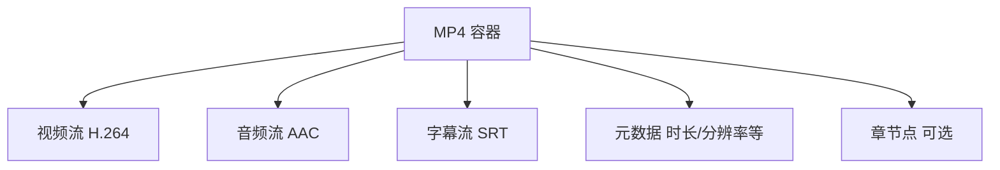
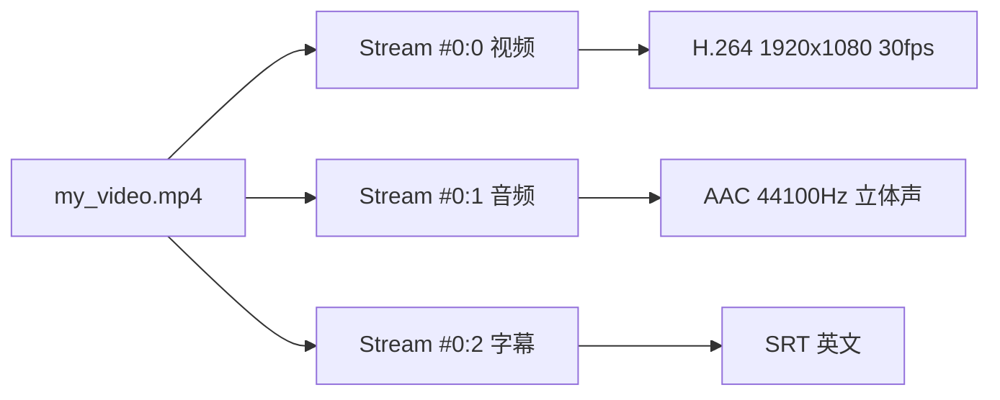
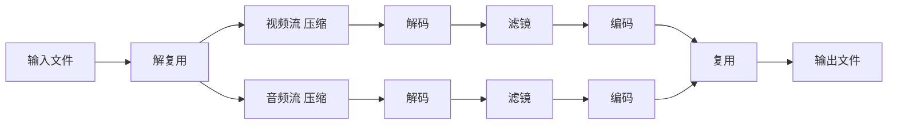
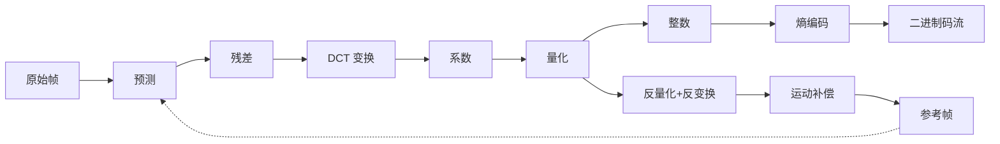

# FFmpeg 原理入门

## 引言

在前文《FFmpeg 入门》中，有一些没有解释的地方：`-c copy` 为什么几秒就出片，同样的视频重新编码却要等半天？拼接那步也一样——为什么尺寸不同就拼不到一起？要回答这些问题，得先弄明白一个视频文件从里到外到底是怎么构成的。


和《FFmpeg 入门》一样，这篇我们就沿着这条线走一遍：容器、数据流、编码、时间基、滤镜图、软硬编解码。最后回到《FFmpeg 入门》里的混剪流程，把五步脚本并成一条命令来收尾。

## 容器

编码器产出的是一段裸码流，它本身不含音频、字幕、元数据，容器负责把这些东西打包成一个完整的文件。



**容器 ≠ 编码**，这是理解 FFmpeg 各种参数的前提。文件后缀指的是容器是什么，编码指的是里面的内容怎么压的。同一个 `.mp4` 里装的可以是 H.264，也可以是 H.265；反过来，同一段 H.264 码流可以放进 MP4，也可以放进 MKV。《FFmpeg 入门》里「改变编码与压制」那组命令改变的是内容的压制方式，而后缀指代的这个容器自始至终没动。

要查看一个文件用的什么容器，《FFmpeg 入门》里用过的 ffprobe 就能看：输出第一行是 `Input #0, mov,mp4,m4a,3gp,3g2,mj2, from 'part1.mp4':`，开头那串就是 FFmpeg 识别出的封装格式。

回到引言里的问题：`-c copy` 为什么能这么快？按容器的定义就清楚了——它只是把码流从一个容器挪到另一个容器，视频和音频数据都没重新编码（耗时最大的部分），所以基本秒完成。

```shell
# 换壳不换内容：码流从 MOV 容器挪到 MP4 容器
ffmpeg -i input.mov -c copy output.mp4
```

常见容器有这几种：

| 容器 | 特点 |
|------|------|
| MP4 | 最通用，兼容性最好 |
| MKV | 功能最强，支持任意编码、多字幕、多音轨 |
| MOV | Apple 生态，QuickTime |
| AVI | 古老，大体积，容器效率低 |
| WebM | Google 开源，用于 Web |

容器只是外壳。外壳里面装着的一条条数据流才是 FFmpeg 真正处理的对象，接下来我们要了解它们是怎么被读出来、加工、再装回去的。

## 数据流

一个媒体文件通常不止一条流：视频、音频、字幕各占一条，互不干扰。前面用过的 ffprobe，输出里 `Stream #0:0`、`Stream #0:1` 这样的行，指的就是一条条流。

把一个文件拆开，大致是这样：



每条流都有自己的编号，`Stream #0:0` 里前面的 `0` 是输入序号，后面的 `0` 是流序号。到了命令里，FFmpeg 用 `输入编号:流类型` 的格式来指它们，输入编号就是第几个 `-i`：

| 引用 | 含义 |
|------|------|
| `0:v` | 第 1 个输入的视频流 |
| `0:a` | 第 1 个输入的音频流 |
| `1:v` | 第 2 个输入的视频流 |
| `0:v:0` | 第 1 个输入的第 1 路视频流（如果有多个） |

处理这些流，FFmpeg 内部走的是下面这条流程。输入文件拆开的流是压缩着的，光把容器拆开是无法修改这些流的，得先还原成原始帧才能加工，加工完还要再压缩回去。



- **解复用（demux）**：从容器中分离出各条压缩流
- **解码（decode）**：压缩流 → 原始帧
- **滤镜（filter）**：操作原始帧
- **编码（encode）**：原始帧 → 压缩流
- **复用（mux）**：合并各条压缩流到输出容器

引言中「解码 → 滤镜 → 编码」，就是上面这个流程中对应的三个步骤。

前面提到过，只是更换容器时速度非常快，从流程图里就能看出原因：`-c copy` 从解复用出来直接进复用，跳过了解码、滤镜、编码三个步骤——搬的本来就是压缩好的流，不用重算。少了中间这一大片步骤，速度自然就上来了。

还有一个点：一个文件里有多条流，输出时要哪几条？FFmpeg 默认自动挑一路视频和音频。想要自己指定，可以使用 `-map`，后面接流引用：

```shell
# -map 手动指定取哪条流：只保留视频流，丢掉音频和字幕
ffmpeg -i input.mp4 -map 0:v -c copy output.mp4

# 从两个输入各取一路：0:v 是第一个输入的视频，1:a 是第二个输入的音频
ffmpeg -i video.mp4 -i audio.mp3 -c:v copy -map 0:v -map 1:a output.mp4
```

## 编码

上一节里「压缩」这个词出现了好几次：流是压缩着的，解码是把压缩解开，编码是把解开的原始帧再压回去。压缩本身却一直没解释——它到底在压什么？引言里说「重新编码却要等半天」，等的就是这一步。先看看不压缩行不行：一段原始视频有多大？

### 为什么要压缩

按 1080p、30fps、24 位色算：

```text
1920 × 1080 × 3（字节/像素）× 30（帧/秒）= 186 MB/s
```

一分钟就是 11 GB。不压缩，没人存得下，没人传得动。

编码器（codec）就是解决这个问题的——把原始像素压成二进制码流。

### 帧内压缩与帧间压缩

压缩分两类，一类盯单帧内部，一类盯帧与帧之间。

**帧内压缩**：每一帧独立压缩，类似 JPEG 图片。压缩比一般，但每一帧都能单独解码。

**帧间压缩**：视频相邻帧之间通常变化很小，编码器只记录变化的部分，不变的部分复用前一帧的数据。这就引出了三种帧类型：

- **I 帧（关键帧）**：完整保存一帧画面，可独立解码。压缩率最低，但它是解码的起点
- **P 帧（前向预测帧）**：只记录和前一帧的差异，依赖前面的 I 帧或 P 帧
- **B 帧（双向预测帧）**：参考前后帧，压缩率最高，但解码最复杂

```text
帧序列示例：I B B P B B P B B I ...
```

每段时间插入一个 I 帧，称为**关键帧间隔（GOP）**。所以用 `-c copy` 切割，切点只能落在关键帧上——P 帧和 B 帧依赖前面的帧，单独取出来没法解码。

### 从像素到码流

帧内、帧间解决的是「压缩哪部分信息」，接下来的问题是具体怎么压。

空间压缩是帧内压缩的实现方式，走一个经典流程：**变换 → 量化 → 熵编码**。

- **变换**：把像素从空间域（亮度值）转换到频率域（DCT 系数）。人眼对高频细节不敏感，变换后方便丢掉不重要的信息
- **量化**：把变换后的系数除以一个值再取整。量化越狠，高频细节丢得越多，文件越小，画质越差
- **熵编码**：把量化后的数据用更紧凑的方式（如霍夫曼编码）写成二进制

这个过程和 JPEG 是同一个原理。帧内压缩去掉的是**视觉冗余**——人眼看不出来的细节。

时间压缩是帧间压缩的实现方式，去掉的是**时间冗余**——相邻帧之间重复的内容。

编码器会做**运动估计（motion estimation）**：把当前帧划分成小块（如 16×16 的宏块），然后在参考帧中搜索最匹配的位置，只记录「这个块从位置 A 移动到了位置 B」的向量。


投影片、静态背景、纯色区域——这些场景的压缩率极高，因为大量像素没有变化。

把整条管线画出来是这样：



注意管线末端那条虚线回环：编码器内部还有一个**解码回路**，它要模拟解码器的行为，确保参考帧和最终解码出来的一致。否则微小误差会逐帧累积，导致画面漂移。

### 码率控制

编码器需要在**文件大小**和**画质**之间做选择，有三种模式：

| 模式 | 原理 | 适用场景 |
|------|------|----------|
| **CRF**（恒定画质） | 自动调整量化参数保证稳定画质，文件大小不确定 | 默认选择，通用发布 |
| **CBR**（恒定码率） | 固定每秒数据量，画质随场景波动 | 直播、流媒体 |
| **VBR**（目标码率） | 允许峰值码率超出设定值，复杂场景多用，简单场景少用 | 上传平台有限制码率时 |

《FFmpeg 入门》里用过的 `-crf 23`，就是这三种模式里的第一种。

```shell
# CRF：值越小画质越高，文件越大（常用 18～28）
ffmpeg -i input.mp4 -c:v libx264 -crf 18 out.mp4

# CBR：固定 2 Mbps
ffmpeg -i input.mp4 -c:v libx264 -b:v 2M -maxrate 2M -bufsize 4M out.mp4

# 限制峰值码率的 VBR：平均 2 Mbps，峰值不超过 4 Mbps
ffmpeg -i input.mp4 -c:v libx264 -b:v 2M -maxrate 4M -bufsize 8M out.mp4
```

> CRF 本质上是 VBR 的一种——它动态分配码率来维持稳定的画质。日常用 CRF 就够了，只有在需要控制输出码率上限时才用显式的 CBR/VBR 参数。

### 常见编码格式

| 编码 | 特点 | 适用场景 |
|------|------|----------|
| H.264 | 兼容性最好，几乎任何设备都能硬解 | 通用发布 |
| H.265 | 比 H.264 省 30-50% 码率，但老旧设备不支持 | 4K 视频、存档 |
| VP9 | Google 开源，YouTube 在用 | 网页视频 |
| AV1 | 新一代开源，压缩率最高但编码极慢 | 流媒体 |

《FFmpeg 入门》里「改变编码与压制」那组用的就是 `libx264`，也就是表里的 H.264：

```shell
# -c:v 指定编码器
ffmpeg -i input.mp4 -c:v libx264 output.mp4  # H.264
ffmpeg -i input.mp4 -c:v libx265 output.mp4  # H.265
```

帧压完了，还有一件事：一秒钟 30 帧，播放器怎么知道哪一帧该在什么时刻显示？