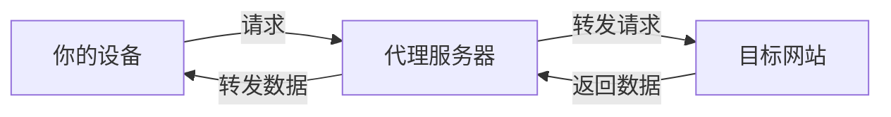
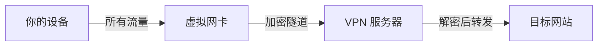
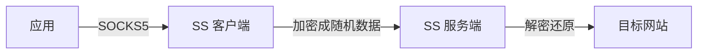
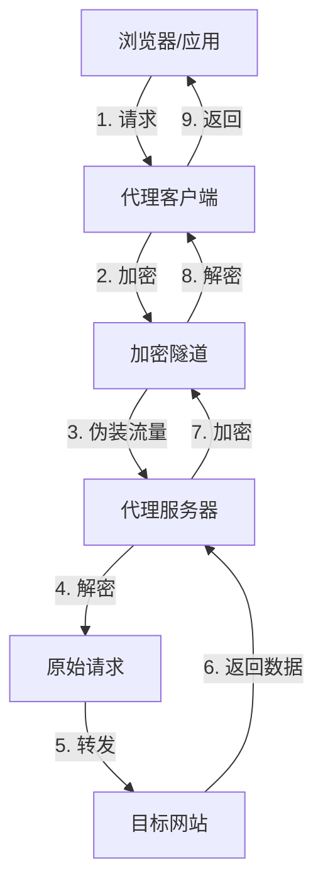
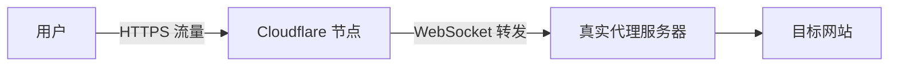
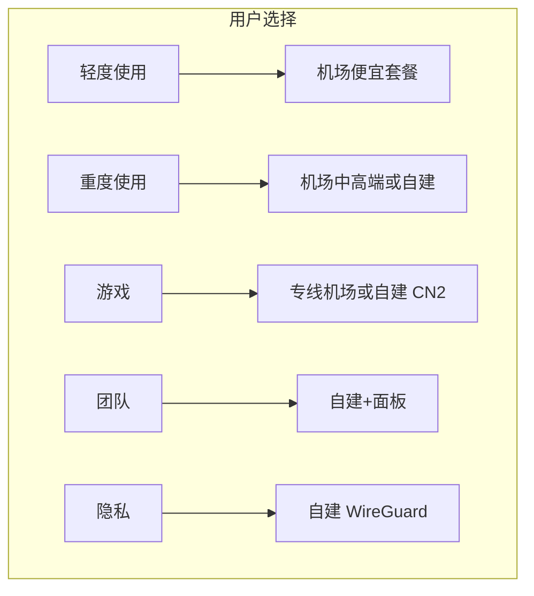

# VPN、机场、代理、梯子：一篇讲清楚

- [一个场景](#一个场景)
- [概念辨析](#概念辨析) — 代理 · VPN · 梯子 · 机场
- [核心协议](#核心协议) — SOCKS5 · Shadowsocks · VMess · Trojan · WireGuard · Hysteria2
- [流量是怎么走的](#流量是怎么走的)
- [关键机制](#关键机制) — 加密 · 混淆 · 分流 · 中转
- [场景选型](#场景选型)
- [常见误区](#常见误区)

## 一个场景

你打开浏览器想查个资料，网站打不开。朋友说"你挂个梯子"——你装了个客户端，点了开关，就能打开了。

这个过程中发生了什么？"梯子"是什么？"机场"又是什么？为什么有人说 VPN 有人说代理？

这篇文章从底层概念讲起，把这些词一次说透。

## 概念辨析

这四个词常被混用，但它们指向的是不同层面的东西。

### 代理（Proxy）

代理是最基础的概念。它就是一个**中间人**：



关键特征：
- 工作在应用层（或传输层），只处理指定应用的流量
- 本身不加密流量（除非上层做了加密）
- 分为 HTTP 代理、SOCKS5 代理等

代理本身是一个中立的转发机制，没有"翻墙"的属性。但它是上层所有代理工具的基石。

### VPN（虚拟专用网络）

VPN 在**操作系统层面**创建一个虚拟网卡，接管整个设备的所有网络流量：



关键特征：
- 工作在系统网络层，接管所有流量（不限于某个应用）
- 自带加密
- 典型协议：WireGuard、OpenVPN、IPsec/IKEv2

本来 VPN 的用途是安全地连接内网（如公司员工远程办公）。后来也因为其加密和隧道的特性被用作翻墙工具。

### 梯子

"梯子"是中文互联网里的**俗称**，不是一个技术术语。它泛指"能帮你访问受限网站的工具组合"，通常包括：

- 一个客户端软件（Clash Meta / Surge / Shadowrocket / v2rayNG 等）
- 一套代理协议（Shadowsocks / VMess / Trojan 等）
- 一个或多个远端服务器

说"挂个梯子" = "启动代理客户端"。

### 机场

"机场"是**服务提供商**——他们搭建和维护代理服务器，卖套餐给用户。用户买了订阅链接，导入客户端就能用。

- 机场 ≈ 代理服务的 SaaS
- 用户不需要自己买服务器、装服务端软件
- 付钱买流量或包月

### 一句话总结

| 概念 | 本质 | 类比 |
|------|------|------|
| 代理 | 转发机制 | 快递中转站 |
| VPN | 系统级加密隧道 | 专车通道 |
| 梯子 | 代理工具链的总称 | 开车出门 |
| 机场 | 代理服务商 | 租车公司 |

## 核心协议

光有转发机制不够，客户端和服务器之间还要约定"怎么加密、怎么传输"。这就是协议做的事情。

### SOCKS5

最基础的代理协议。只定义"怎么转发"，不定义"怎么加密"。

```shell
# 本地开一个 SOCKS5 代理（通过 SSH）
ssh -D 1080 user@server
# 浏览器设置 SOCKS5 代理到 127.0.0.1:1080 就能用
```

- 优点：极其简单，几乎所有软件都支持
- 缺点：不加密，容易被识别和干扰
- 适合：临时用一下、内网穿透

### Shadowsocks（SS）

Shadowsocks 在 SOCKS5 外面包了一层加密，把流量伪装成**随机数据流**。



- 优点：轻量、速度快、部署简单
- 缺点：流量特征明显（固定包长度、无填充），容易被机器学习识别
- 加密方式：aes-256-gcm / chacha20-poly1305 等

十年前 SS 是主流，现在持续被检测，纯 SS 节点存活率越来越低。

### VMess / V2Ray

V2Ray 是 Shadowsocks 的升级替代。VMess 是它的传输协议，比 SS 多做了几件事：

- **多种传输方式**：支持 TCP、WebSocket、gRPC、QUIC 等
- **流量伪装**：可以伪装成 HTTPS 网页流量（通过 WebSocket + TLS）
- **动态端口**：可以随机更换端口

```shell
# V2Ray 服务端配置片段：伪装成 HTTPS 网站
{
  "inbounds": [
    {
      "port": 443,
      "protocol": "vmess",
      "settings": {
        "clients": [{"id": "UUID"}]
      },
      "streamSettings": {
        "network": "ws",
        "wsSettings": {
          "path": "/websocket"
        },
        "security": "tls"
      }
    }
  ]
}
```

- 优点：灵活、伪装能力强、抗检测性好
- 缺点：配置复杂、协议本身较重
- 适合：对隐蔽性有要求的场景

现在大部分机场的核心协议就是 VMess over WebSocket + TLS。

### Trojan

Trojan 的思路和 V2Ray 的 WebSocket + TLS 类似——也伪装成 HTTPS 流量。但它更极端：

- 协议极简，就是一个 HTTPS 请求
- 检测到这是一个 Trojan 请求 → 转发
- 检测到不是（普通浏览器访问）→ 返回一个真实的网页

```text
浏览器访问 https://example.com:443
  ↓
如果请求带有 Trojan 密码 → 转发到目标
如果没有 → 返回 example.com 的真实网页
```

这让被动检测几乎不可能——你的流量和正常访问 HTTPS 网站一模一样。

- 优点：协议极简、性能好、伪装极强
- 缺点：没有 V2Ray 那么灵活（传输方式单一）
- 适合：对隐蔽性要求高的场景

### WireGuard

WireGuard 是一个**现代 VPN 协议**，不是代理协议。

```shell
# WireGuard 配置极其简洁
[Interface]
PrivateKey = ......
Address = 10.0.0.2/32

[Peer]
PublicKey = ......
Endpoint = server_ip:51820
AllowedIPs = 0.0.0.0/0
```

- 内核级实现（Linux 内核内置），性能极高
- 比 OpenVPN 快 3-5 倍
- 代码量只有 OpenVPN 的 1%
- 连接几乎是瞬时的

很多机场也开始提供 WireGuard 节点，因为它速度快、延迟低。但 WireGuard 作为 VPN 协议，流量特征是"加密隧道"，容易被深度包检测识别。

### Hysteria2

基于 QUIC（HTTP/3 的传输层）的代理协议。利用 UDP 的特性做到：

- **速度极快**：在丢包环境下比其他协议快数倍
- **暴力加速**：通过发送冗余数据包对抗 QoS 限速

- 优点：在差网络环境下表现极好
- 缺点：容易被 QoS 针对（UDP 流量特征明显）
- 适合：游戏、视频等高带宽需求场景

### 协议对比

| 协议 | 类型 | 速度 | 隐蔽性 | 部署复杂度 |
|------|------|------|--------|-----------|
| SOCKS5 | 代理 | 快 | 无 | 极简 |
| Shadowsocks | 代理 | 快 | 低 | 简单 |
| VMess/V2Ray | 代理 | 中 | 高 | 复杂 |
| Trojan | 代理 | 快 | 高 | 简单 |
| WireGuard | VPN | 极快 | 中 | 简单 |
| Hysteria2 | 代理 | 极快 | 中 | 简单 |

## 流量是怎么走的

把上面所有概念串起来，一次完整的请求路径长这样：



每一步涉及的概念：

| 步骤 | 涉及的概念 |
|------|-----------|
| 1. 发出请求 | 客户端代理配置（HTTP/SOCKS5） |
| 2. 加密 | 协议（Shadowsocks/VMess/Trojan） |
| 3. 伪装 | 传输方式（WebSocket + TLS、mKCP 等） |
| 4-5. 转发 | 服务端中转 |
| 7-8. 回程 | 同样走加密隧道 |

**核心认知**：加密和伪装是两个不同的维度，由协议和传输方式分别处理。

## 关键机制

### 加密

所有现代代理协议都会对流量加密。加密的目的不是"防止内容泄露"（虽然附带这个效果），而是**让流量看起来不像流量本身**——如果墙能看到你在请求什么，就能判断该不该阻断。

加密算法对比：

| 算法 | 速度 | 安全性 | 硬件加速 |
|------|------|--------|---------|
| aes-128-gcm | 快（有 AES-NI 时） | 高 | 是 |
| chacha20-poly1305 | 快（无 AES-NI 时） | 高 | 否 |
| xchacha20-poly1305 | 快 | 高 | 否 |

手机上推荐 chacha20 系列（没有 AES 硬件加速）。

### 混淆（Obfuscation）

混淆是"让流量看起来像别的东西"。纯粹加密只能隐藏内容，不能隐藏"这是一条加密隧道"这个事实。混淆补上这一层。

常见混淆方式：
- **TLS**：伪装成 HTTPS 加密连接（目前最主流）
- **WebSocket + TLS**：伪装成网页请求（V2Ray 常见）
- **HTTP/2**：伪装成 HTTP/2 协议
- **gRPC**：伪装成 gRPC 调用
- **伪装成视频流**：某些工具可以模拟 YouTube/Netflix 的流量特征

### 分流

代理客户端可以配置"什么流量走代理、什么流量直连"。这就是**分流规则**。

```yaml
# Clash 规则片段
rules:
  - DOMAIN-SUFFIX,google.com,Proxy
  - DOMAIN-SUFFIX,youtube.com,Proxy
  - DOMAIN-SUFFIX,baidu.com,DIRECT
  - GEOIP,CN,DIRECT
  - MATCH,Proxy
```

常见分流模式：
- **国内直连 + 国外代理**：最常用，不影响访问国内网站的速度
- **按域名分流**：特定网站走代理，其他直连
- **按 IP 地理分流**：国内 IP 直连，国外 IP 代理
- **全量代理**：所有流量都走代理

### CDN 中转

机场经常用 CDN（Cloudflare 等）来**隐藏服务器真实 IP**。流量先到 CDN 节点，CDN 再转发到真实的代理服务器。



这样即使墙检测到异常流量，也只能封掉 CDN 的 IP，而 CDN 的 IP 是共享的、成千上万个网站在用，不可能全封。

## 场景选型

### 轻度使用：偶尔查资料、看网页

- 推荐：买一个靠谱机场的便宜套餐
- 协议：V2Ray / Trojan 均可
- 客户端：Clash Meta（全平台）或 Shadowrocket（iOS）

### 重度使用：看视频、下载、日常所有流量

- 推荐：机场的中高端套餐，或自建 VPS
- 协议：Trojan 或 WireGuard
- 注意：流量大的话容易被限速，选不限速的套餐

### 游戏场景

- 推荐：专线机场或自建（CN2 GIA 线路）
- 协议：Hysteria2 或 WireGuard
- 原因：游戏对延迟和丢包非常敏感，普通中转线路不行

### 团队使用

- 推荐：自建 VPS + 多用户管理面板
- 协议：VMess + WebSocket + TLS（方便管理）
- 工具：X-UI / 3X-UI / sspanel

### 隐私优先

- 推荐：自建 VPS + WireGuard
- 原因：机场能看到你的所有流量，自建才能保证不被记录



## 常见误区

### "我用 VPN 就能翻墙"

VPN 设计之初不是为翻墙做的。OpenVPN 等传统 VPN 的流量特征非常明显，容易被精准识别和阻断。现在翻墙主流用的是代理协议（SS/VMess/Trojan），不是 VPN。说"挂 VPN"的人，实际上用的多半是代理客户端。

### "免费节点也能用"

免费节点的问题是：
- 速度慢、不稳定（多人共用）
- 不安全（操作者可以记录你的流量）
- 存活时间短（被封就换）

偶尔查个资料可以，日常用不建议。

### "加密了就是安全的"

加密防的是中间人窥探，不防服务端记录。如果用机场，你的流量在机场的服务端解密后再转发——机场能看到你访问了什么。对隐私有要求的场景请自建。

### "协议越新越好"

V2Ray 比 SS 新，Trojan 比 V2Ray 新——但"新"不等于"适合你"。SS 在某些场景下仍然够用，而且比 V2Ray 轻量。选协议看场景，不看发布时间。

---

这篇文章帮你理清了 VPN、机场、代理、梯子这四个概念的区别，以及背后的协议和机制。核心记住一句话：

**代理是转发机制，VPN 是系统级加密隧道，梯子是工具组合，机场是服务商。**

理解了这层，选什么协议、用什么客户端、买什么套餐，都是根据场景做选择的问题。
