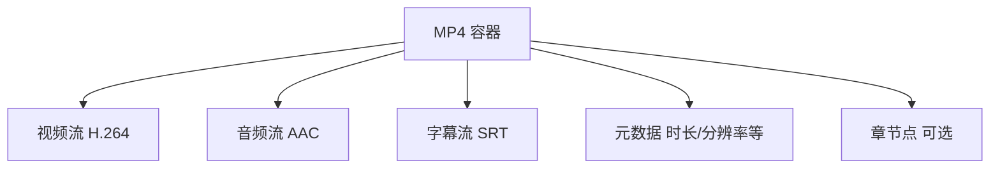
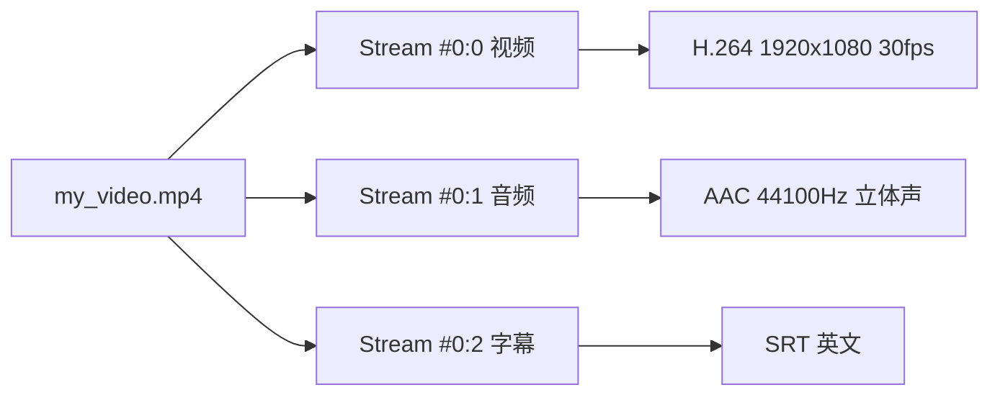
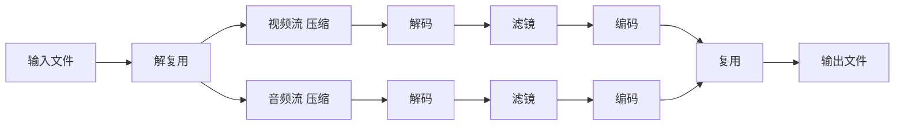
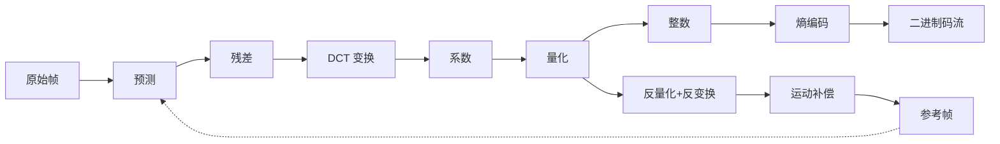
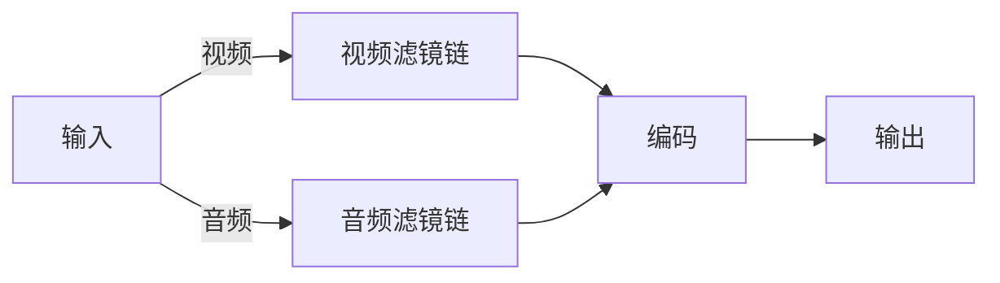
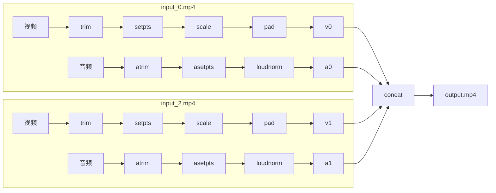

# FFmpeg 视频剪辑入门：从原理到实战

FFmpeg 是一个**命令行多媒体处理工具**。它不是一个有图形界面的软件（如 PR、剪映），也不是编程框架——你通过命令行参数告诉它"输入什么文件、做什么处理、输出什么"，它执行完就结束。核心价值是**可脚本化、可批量、可复制**。

- [安装与下载](#安装与下载)
- [使用场景](#使用场景)
- [核心概念](#核心概念)
- [编解码实战](#编解码实战)
- [常用命令](#常用命令)
- [完整案例拆解](#完整案例拆解)
- [常见问题](#常见问题)

## 安装与下载

FFmpeg 是免费开源软件，各平台安装方式：

**macOS**
```shell
# Homebrew 安装（推荐）
brew install ffmpeg

# Homebrew 会自动将 ffmpeg 加入 PATH。
# 如果找不到命令，检查 brew 安装路径是否在 shell 配置中：
# Apple Silicon:  export PATH="/opt/homebrew/bin:$PATH"
# Intel:          export PATH="/usr/local/bin:$PATH"
# 将对应行添加到 ~/.zshrc（zsh）或 ~/.bash_profile（bash）后 source 即可
```

**Ubuntu/Debian**
```shell
sudo apt install ffmpeg
```

**Windows**
```shell
# winget（自动配置环境变量）
winget install ffmpeg

# 或从官网下载安装包：
# https://ffmpeg.org/download.html
# 官网下载的是 zip 压缩包，解压后将 bin 目录添加到系统 PATH 环境变量
```

安装后验证：
```shell
ffmpeg -version
```

## 使用场景

假设你现在手上有3段视频素材，需求是：

1. 每段取前 30 秒
2. 统一缩放到 1080×1920 竖屏，黑边填充
3. 统一音量，别一段大声一段小声
4. 拼接成一个视频
5. 导出

用 PR 或剪映，流程是：导入素材 → 拖到时间轴 → 裁剪 → 缩放 → 调整音频 → 导出。如果是手动操作，需要你把素材拖来拖去，对齐，再加点效果，最后导出。对于上面给出的这个任务，似乎还能接受，但是如果我们手头上有的不是3段视频素材，而是300段视频素材呢？这时手动处理就不太现实了。在这种场景下FFmpeg就有了用武之地。

用FFmpeg，只需要把命令准备好，再搭配脚本写一个循环，就可以开始刷视频等待它处理完成了。

这就是 FFmpeg 的核心价值：**可脚本化、可批量、可复制**。

### FFmpeg 适合你吗

| | FFmpeg | PR / 剪映 |
|---|--------|-----------|
| 学习成本 | 高，需要记住参数 | 低，拖拽即可 |
| 重复操作 | 写一次命令，永远复用 | 每次手动 |
| 批量处理 | 一行循环搞定 100 个 | 手会断 |
| 服务器或 CI 自动处理 | 完美 | 做不到 |
| 精确控制 | 参数写清楚即可 | 来回拖拽 |
| 多轨道复杂剪辑 | 不适合 | 适合 |
| 特效与逐帧调整 | 有限 | 强大 |

FFmpeg 是**命令行工具**，PR 和剪映是**图形界面工具**。它们解决不同的问题。

> 实践中最好的方案是组合使用：FFmpeg 处理批量、重复、自动化的部分，PR/剪映处理需要人工判断的精细编辑。

## 核心概念

### 容器（Container）：包装格式

编码器产出的是一段"裸"码流（比如纯 H.264 数据），它不包含音频、字幕、元数据。容器就是把所有东西打包在一起的文件格式。



**要点：容器格式 ≠ 编码格式。** 一个 `.mp4` 文件可以装 H.264，也可以装 H.265；同样一个 H.264 视频可以放进 MP4，也可以放进 MKV。

这就是 `ffmpeg -i input.mov -c copy output.mp4` 的原理——不重新编码视频和音频，只把数据从 MOV 容器转移到 MP4 容器。

```shell
# 查看文件容器信息
ffprobe input.mp4

# 重新封装，不重新编码
ffmpeg -i input.mov -c copy output.mp4
```

#### 常见容器格式

| 容器 | 特点 |
|------|------|
| MP4 | 最通用，兼容性最好 |
| MKV | 功能最强，支持任意编码、多字幕、多音轨 |
| MOV | Apple 生态，QuickTime |
| AVI | 古老，大体积，容器效率低 |
| WebM | Google 开源，用于 Web |

### 数据流（Stream）：输入输出管线

一个媒体文件通常包含多条流：



FFmpeg 用 `输入编号:流类型` 的格式引用它们：

| 引用 | 含义 |
|------|------|
| `0:v` | 第 1 个输入的视频流 |
| `0:a` | 第 1 个输入的音频流 |
| `1:v` | 第 2 个输入的视频流 |
| `0:v:0` | 第 1 个输入的第 1 路视频流（如果有多个） |

#### 解复用（Demux）与复用（Mux）



- **解复用（demux）**：从容器中分离出各条压缩流
- **解码（decode）**：压缩流 → 原始帧
- **滤镜（filter）**：操作原始帧
- **编码（encode）**：原始帧 → 压缩流
- **复用（mux）**：合并各条压缩流到输出容器

理解这条流水线，就能明白为什么 `-c copy` 是快速通道——它直接从"解复用"跳到"复用"，跳过了解码→滤镜→编码整个中间环节。

```shell
# 只保留视频流，丢掉音频和字幕
ffmpeg -i input.mp4 -map 0:v -c copy output.mp4

# 从两个输入各取一条流
ffmpeg -i video.mp4 -i audio.mp3 -c:v copy -map 0:v -map 1:a output.mp4
```

### 编码（Codec）：为什么要压缩

一段原始视频有多大？假设 1080p、30fps、24 位色：

```text
1920 × 1080 × 3（字节/像素）× 30（帧/秒）= 186 MB/s
```

一分钟就是 11 GB。不压缩，没人存得下，没人传得动。

编码器（codec）就是解决这个问题的——它把原始像素压缩成二进制码流。压缩方式分两类：

#### 帧内压缩（Intra-frame）

每一帧独立压缩，类似 JPEG 图片。压缩比一般，但每一帧都能单独解码。

#### 帧间压缩（Inter-frame）

视频相邻帧之间通常变化很小。编码器只记录变化的部分，不变的部分复用前一帧的数据。这就引出了三种帧类型：

- **I 帧（关键帧）**：完整保存一帧画面，可独立解码。压缩率最低，但它是解码的起点
- **P 帧（前向预测帧）**：只记录和前一帧的差异，依赖前面的 I 帧或 P 帧
- **B 帧（双向预测帧）**：参考前后帧，压缩率最高，但解码最复杂

```text
帧序列示例：I B B P B B P B B I ...
```

每段时间插入一个 I 帧，称为 **关键帧间隔（GOP）**。这就是 `-c copy` 切割只能切在关键帧的原因——P 帧和 B 帧依赖前面的帧，单独取出来无法解码。

上面说的"帧内压缩"和"帧间压缩"解决的是"压缩哪部分信息"的问题。下面展开他们具体怎么做：

#### 空间压缩（帧内压缩的实现方式）

帧内压缩用的是一个经典流程：**变换 → 量化 → 熵编码**。

- **变换**：把像素从空间域（亮度值）转换到频率域（DCT 系数）。人眼对高频细节不敏感，变换后方便丢掉不重要的信息
- **量化**：把变换后的系数除以一个值再取整。量化越狠，高频细节丢得越多，文件越小，画质越差
- **熵编码**：把量化后的数据用更紧凑的方式（如霍夫曼编码）写成二进制

这个过程和 JPEG 是同一个原理。帧内压缩去掉的是**视觉冗余**——人眼看不出来的细节。

#### 时间压缩（帧间压缩的实现方式）

帧间压缩去掉的是**时间冗余**——相邻帧之间重复的内容。

编码器会做**运动估计（motion estimation）**：把当前帧划分成小块（如 16×16 的宏块），然后在参考帧中搜索最匹配的位置，只记录"这个块从位置 A 移动到了位置 B"的向量。


投影片、静态背景、纯色区域——这些场景的压缩率极高，因为大量像素没有变化。

#### 完整的压缩管线



编码器内部有一个"解码回路"——它要模拟解码器的行为，确保参考帧和最终解码出来的一致。否则微小误差会逐帧累积，导致画面漂移。

#### 码率控制

编码器需要在**文件大小**和**画质**之间做选择，有三种模式：

| 模式 | 原理 | 适用场景 |
|------|------|----------|
| **CRF**（恒定画质） | 自动调整量化参数保证稳定画质，文件大小不确定 | 默认选择，通用发布 |
| **CBR**（恒定码率） | 固定每秒数据量，画质随场景波动 | 直播、流媒体 |
| **VBR**（目标码率） | 允许峰值码率超出设定值，复杂场景多用，简单场景少用 | 上传平台有限制码率时 |

```shell
# CRF：值越小画质越高，文件越大（常用 18~28）
ffmpeg -i input.mp4 -c:v libx264 -crf 18 out.mp4

# CBR：固定 2 Mbps
ffmpeg -i input.mp4 -c:v libx264 -b:v 2M -maxrate 2M -bufsize 4M out.mp4

# 限制峰值码率的 VBR：平均 2 Mbps，峰值不超过 4 Mbps
ffmpeg -i input.mp4 -c:v libx264 -b:v 2M -maxrate 4M -bufsize 8M out.mp4
```

> CRF 本质上是 VBR 的一种——它动态分配码率来维持稳定的画质。日常用 CRF 就够了，只有在需要控制输出码率上限时才用显式的 CBR/VBR 参数。

#### 常见编码格式

| 编码 | 特点 | 适用场景 |
|------|------|----------|
| H.264 | 兼容性最好，几乎任何设备都能硬解 | 通用发布 |
| H.265 | 比 H.264 省 30-50% 码率，但老旧设备不支持 | 4K 视频、存档 |
| VP9 | Google 开源，YouTube 在用 | 网页视频 |
| AV1 | 新一代开源，压缩率最高但编码极慢 | 流媒体 |

```shell
# 查看视频的编码格式
ffmpeg -i input.mp4

# 指定编码器
ffmpeg -i input.mp4 -c:v libx264 output.mp4  # H.264
ffmpeg -i input.mp4 -c:v libx265 output.mp4  # H.265
```

### 时间基（Time Base）与 PTS/DTS

FFmpeg 内部不用"秒"来标记帧的时间位置，而是用**时间基（time base）**。时间基是一个分数，比如 `1/30` 表示每 tick 是 1/30 秒。

> 为什么不用秒？因为帧率可能是分数（如 29.97fps），用浮点数累计误差会越来越大。用整数 tick 可以做到精确表示。

#### PTS（Presentation Time Stamp）

每一帧都有一个 PTS，单位是 time base 的 tick。

```text
一个 30fps 视频，time base = 1/30:
  第 1 帧的 PTS = 0    → 在 0s 显示
  第 2 帧的 PTS = 1    → 在 1/30s 显示
  第 30 帧的 PTS = 29  → 在 29/30s 显示
```

#### setpts 做了什么

```shell
setpts=PTS-STARTPTS
```

把这一帧的 PTS 减去第一帧的 PTS。如果剪出来的片段是从原始第 10 秒开始的，帧的 PTS 就从 10s 变成 0s。没有这一步，concat 拼接时所有片段的 PTS 都从 0 开始，FFmpeg 不知道谁先谁后。

#### atempo 的数学

```shell
setpts=0.5*PTS   # 视频 2 倍速
atempo=2.0       # 音频 2 倍速
```

PTS 减半，意味着原本在 1s 显示的帧提前到 0.5s，看起来就快了一倍。音频同理，用 atempo 改变采样率对应的时间位置。

### 滤镜图（Filter Graph）

滤镜图是所有 FFmpeg 复杂操作的基石。


每个滤镜是一个处理节点，输入原始帧，输出处理后的帧。帧在滤镜间流动，形成有向无环图。



滤镜操作的单位是**解码后的原始帧**（像素或采样），所以不受原始编码格式限制。代价是必须经过解码→编码，比 `-c copy` 慢很多。

### -c copy：不解码的快速通道

```shell
# 无损切割：只截取数据包，不重新编码
ffmpeg -i input.mp4 -c copy -ss 10 -t 20 out.mp4
```

`-c copy` 不做解码和编码，所以速度极快且画质无损。但代价是：
- 切割不能精确到帧（只能切在关键帧位置）
- 不能做任何画面/音频处理（没有滤镜）
- 输出格式必须兼容原始编码

如果需要精确到帧的切割或加滤镜，就必须重新编码（不用 `-c copy`）。

> **真正无损的编码**：如果既要重新编码又要保持无损，H.264 支持 `-crf 0` 模式（H.265 对应 `-x265-params lossless=1`）。文件极大，只用于中间素材存档。

```shell
# 无损 H.264 编码（画质 100% 保留，文件巨大）
ffmpeg -i input.mp4 -c:v libx264 -crf 0 -preset ultrafast output.mp4
```

## 编解码实战

核心概念讲完了，但还有一个直接影响"怎么选参数"的问题：解码和编码，到底该用 CPU 还是 GPU？下面分别讲清楚。

### 软解 vs 硬解：解码到底是谁干的

视频解码有两个选择：交给 CPU（软解）或交给 GPU 的专用模块（硬解）。

| | 软解（CPU） | 硬解（GPU） |
|------|------------|------------|
| 原理 | 用软件的 codec 库逐帧计算解码 | 调用 GPU 内置的固定功能解码单元 |
| CPU 占用 | 高 | 低（5-10%） |
| 功耗 | 高，笔记本掉电快 | 低，省电 |
| 兼容性 | 好，几乎支持所有格式 | 差，受硬件限制（老旧 GPU 不支持 H.265/AV1） |
| 画质 | **好** | **可能略差** |
| 在 FFmpeg 中使用 | 默认，无需额外参数 | 需指定 `-hwaccel` |

#### 为什么硬解可能会"糊片"

这是很多人的实际体验：同一个视频，硬解看起来就是不如软解清晰。原因有几个：

**1. 硬解是"够用就好"的实现**

GPU 里的解码模块是**固定功能的硬件电路**——芯片流片后就定死了。为了在有限的晶体管预算内达到最高的解码速度，厂商会做妥协：

- 使用低精度的中间计算（省晶体管）
- 省略非标准的后处理步骤（参考帧重采样、环路滤波的某些优化）
- 用简单的 bilinear 上采样替代高质量的 debanding/deringing 算法

而软件解码器（如 FFmpeg 的 `libavcodec`）可以持续更新优化，使用更高精度的数学运算和更完善的解码链路。

**2. 色度采样与格式转换的差异**

硬解输出到显存后，需要从 YUV 转 RGB 再送给显示器。这一步的格式转换算法决定了最终画质：

- 软解：可以用高质量的 swscale 算法（lanczos、spline 等）
- 硬解：通常使用 GPU 固定管线中的简单线性插值，效率高但画质软

在播放低分辨率视频时差异尤其明显——硬解的放大效果像一层模糊滤镜，软解则能保留更多细节。

**3. 错误隐藏策略不同**

视频码流在传输过程中可能有损坏或编码器产生了非标准数据。软解会尽力修复或做精细的错误隐藏，硬解为了保持实时性，倾向于"快速跳过"，可能产生马赛克或色块。

**4. 高码率/高分辨率下的量化损失**

硬解在处理 4K HDR 高码率视频时，内部缓冲区精度可能不足，导致色带（banding）或暗部细节丢失。软解因为使用 CPU 的高精度宽位计算，这类问题较少。

#### 什么时候用硬解，什么时候用软解

```shell
# 纯硬解 + 软编（解码用 GPU，编码用 CPU，画质好）
ffmpeg -hwaccel videotoolbox -i input.mp4 -c:v libx264 -crf 23 output.mp4

# 纯软解（默认，什么都不指定就是纯 CPU）
ffmpeg -i input.mp4 -c:v libx264 -crf 23 output.mp4
```

**用硬解的时机**：
- 播放视频时（节省 CPU、省电、减少风扇噪音）
- 服务器批量转码（硬件编码器比 CPU 快 5-10 倍）
- 笔记本/低功耗设备上处理 4K 视频

**用软解的时机**：
- 对画质有严格要求（存档、二压前的中间素材）
- 视频格式特殊，硬解不支持
- 需要精确到帧的处理（硬解的时间戳行为有时不可预测）

> 硬解和软解都能正确解码——输出的"内容"是一致的。画质差异主要来自后处理、上采样算法和精度取舍。大多数情况下肉眼分不出来，但在低分辨率放大、高码率 HDR 场景下，软解确实更干净。

#### 如何避免硬解糊片

如果你希望用硬解省电提速，又不想牺牲画质，可以按优先级做以下处理：

**方案一：用软解处理关键帧，用硬解处理普通帧**

大多数场景不需要每帧都追求极致画质。如果只是快速浏览/预览，硬解完全够用。只在最终输出或处理关键素材时切到软解。

**方案二：FFmpeg 转码时用软解解码 + 硬解编码**

这是最常见的"兼顾速度与画质"的方案——解码阶段用 CPU 保证画质，编码阶段用 GPU 加速输出。

```shell
# 软解解码 + 硬解编码（macOS）
ffmpeg -i input.mp4 -c:v h264_videotoolbox -b:v 5M output.mp4
# 不指定 -hwaccel，解码走 CPU 软解，编码走 GPU 硬解

# 软解解码 + 硬解编码（NVIDIA）
ffmpeg -i input.mp4 -c:v h264_nvenc -preset p7 -cq 23 output.mp4

# 软解解码 + 软解编码（纯 CPU，画质最好）
ffmpeg -i input.mp4 -c:v libx264 -crf 18 -preset slow output.mp4
```

**方案三：播放时使用高质量渲染器**

如果只是播放时觉得画质模糊，问题可能不在解码，而在**渲染/缩放环节**：

| 播放器 | 设置方法 |
|--------|----------|
| VLC | 工具 → 偏好设置 → 视频 → 输出 → 选择 "OpenGL" 或 "Direct3D"，勾选 "高级缩放" |
| MPC-HC | 右键 → 选项 → 渲染器 → 选择 "madVR"（画质最好的渲染器） |
| IINA (macOS) | 偏好设置 → 视频 → 硬件解码 → 选择 "仅限编码器不支持时" |
| mpv | `--profile=gpu-hq --scale=lanczos --dscale=mitchell` |

mpv 的参数尤其值得参考——通过指定高质量上采样算法（lanczos/mitchell），可以显著改善低分辨率视频放大后的模糊感：

```shell
# mpv 高质量播放配置
mpv --profile=gpu-hq --scale=lanczos --deband=yes video.mp4
```

**方案四：升级硬件**

新世代 GPU 的解码模块比老款好得多。Apple Silicon 的 Media Engine、NVIDIA RTX 40 系列的 NVDEC、Intel Arc 的媒体引擎——它们在精度和算法上都比 5 年前的产品有明显提升。

**方案五：FFmpeg 输出时加后处理滤镜**

如果硬解码后的帧有 banding（色带）或模糊，可以用 FFmpeg 的滤镜做补偿：

```shell
# 去色带（deband）滤镜
ffmpeg -hwaccel videotoolbox -i input.mp4 -vf "deband=1.5:1.5:1:1" output.mp4

# 锐化（unsharp）滤镜
ffmpeg -hwaccel videotoolbox -i input.mp4 -vf "unsharp=3:3:1.5" output.mp4
```

### 硬件编码 vs 软件编码

编码也分软硬，规则和解码类似：

| | 软编（CPU） | 硬编（GPU） |
|------|------------|------------|
| 速度 | 慢 | 快 5-10 倍 |
| 画质（同码率下） | **好**，算法更完善 | 一般，压缩效率低 10-20% |
| 文件体积（同画质下） | 小 | 大 10-30% |
| 适用场景 | 最终交付、存档 | 预览、直播、快速转码 |

```shell
# 软编（画质最好，速度最慢）
ffmpeg -i input.mp4 -c:v libx264 -crf 18 -preset slow output.mp4

# 硬编（速度快，画质够用）
ffmpeg -i input.mp4 -c:v h264_videotoolbox -b:v 5M output.mp4   # macOS
ffmpeg -i input.mp4 -c:v h264_nvenc -cq 23 output.mp4            # NVIDIA
```

> **解码用软解保证画质，编码用硬解加速输出**——这是最常见的平衡方案。除非对体积和画质有极致要求，日常用硬编完全够用。

---

理解了核心概念和编解码的选择，接下来就是一个可以直接抄的命令工具箱。

## 常用命令

> 以下命令按场景分组，括号里是核心参数说明。

### 查看文件信息（ffprobe）

动手处理前先用 ffprobe 看一眼文件，避免参数写错。用 ffplay 可以快速预览效果。

```shell
# 查看文件的所有流信息
ffprobe input.mp4

# 只看视频流
ffprobe -v error -select_streams v:0 -show_entries stream=codec_name,width,height,r_frame_rate input.mp4

# 只看音频流
ffprobe -v error -select_streams a:0 -show_entries stream=codec_name,sample_rate,channels input.mp4

# 查看编码器是否支持硬件加速
ffmpeg -encoders | grep videotoolbox   # macOS
ffmpeg -encoders | grep nvenc           # NVIDIA
ffmpeg -encoders | grep qsv             # Intel

# 快速预览视频（ffplay 自带，无需额外安装）
ffplay input.mp4

# 预览指定时间的片段
ffplay -ss 00:01:00 -t 10 input.mp4

# 预览滤镜效果（不用等导出）
ffplay -vf "scale=1080:1920" input.mp4
```

### 裁剪与拼接

```shell
# 取前 30 秒
ffmpeg -i input.mp4 -t 30 out.mp4
# -t 指定时长

# 跳过开头 10 秒，再取 20 秒
ffmpeg -i input.mp4 -ss 10 -t 20 out.mp4
# -ss 指定起始时间（支持秒或 HH:MM:SS 格式）

# 裁剪精确时间段
ffmpeg -i input.mp4 -ss 00:01:00 -to 00:01:30 out.mp4
# -to 指定结束时间，和 -ss 配合就是"从哪到哪"

# 精确裁剪（-ss 放 -i 后面，逐帧解码定位，慢但准）
ffmpeg -i input.mp4 -ss 00:01:00 -t 10 -c:v libx264 out.mp4

# 快速裁剪（-ss 放 -i 前面，跳转到最近关键帧，快但不精确）
ffmpeg -ss 00:01:00 -i input.mp4 -t 10 -c:v libx264 out.mp4

# 无损切割（不重新编码，只能切在关键帧位置）
ffmpeg -i input.mp4 -c copy -ss 10 -t 20 out.mp4
# -c copy 跳过编解码
```

### 画面处理

```shell
# 缩放到指定尺寸
ffmpeg -i input.mp4 -vf scale=1080:1920 out.mp4
# -vf 是简单滤镜图的入口

# 缩放 + 保持比例 + 黑边填充（竖屏适配）
ffmpeg -i input.mp4 -vf "scale=1080:1920:force_original_aspect_ratio=decrease,pad=1080:1920:(ow-iw)/2:(oh-ih)/2" out.mp4
# scale 缩放到目标尺寸，不足的比例留空
# pad 用黑边填充空余区域，居中放置

# 裁剪画面区域
ffmpeg -i input.mp4 -vf "crop=640:640:0:0" out.mp4
# crop=宽:高:x起点:y起点

# 画面旋转
ffmpeg -i input.mp4 -vf "rotate=PI/2" out.mp4        # 顺时针 90°
ffmpeg -i input.mp4 -vf "rotate=-PI/2" out.mp4       # 逆时针 90°
ffmpeg -i input.mp4 -vf "transpose=1" out.mp4         # transpose 更常用，自动转竖屏
ffmpeg -i input.mp4 -vf "transpose=2,transpose=2" out.mp4  # 两次 transpose = 旋转 180°

# 画面翻转
ffmpeg -i input.mp4 -vf "hflip" out.mp4              # 水平镜像
ffmpeg -i input.mp4 -vf "vflip" out.mp4              # 垂直翻转

# 加图片水印
ffmpeg -i input.mp4 -i logo.png -filter_complex "overlay=10:10" out.mp4
# overlay 在指定坐标叠加第二路输入
```

### 音频处理

```shell
# 统一音量到短视频平台标准
ffmpeg -i input.mp4 -af loudnorm=I=-16:TP=-1.5:LRA=11 out.mp4
# I=-16: 目标响度 -16 LUFS
# TP=-1.5: 峰值不超过 -1.5 dBTP
# LRA=11: 动态范围控制

# 替换视频的音频
ffmpeg -i input.mp4 -i audio.mp3 -c:v copy -map 0:v -map 1:a -shortest out.mp4
# -map 0:v 取第一个输入的视频流
# -map 1:a 取第二个输入的音频流
# -shortest 按较短的流截断

# 提取音频
ffmpeg -i input.mp4 -vn -c:a libmp3lame out.mp3
# -vn 不处理视频

# 静音指定片段
ffmpeg -i input.mp4 -af "volume=enable='between(t,0,5)':volume=0" out.mp4
# between(t,0,5) 在 0 到 5 秒之间
```

### 视频压缩：从哪些维度下手

压缩视频本质是**拿画质换体积**。以下几个维度可以独立或组合调整：

#### 1. CRF — 最直接的画质控制

CRF 是 H.264/H.265 最常用的质量控制方式。值越小画质越高：

| CRF | 画质 | 文件体积 | 适用场景 |
|-----|------|----------|----------|
| 18 | 接近无损 | 很大 | 存档、后期二次剪辑 |
| 23 | 很好 | 适中 | 默认值，通用发布 |
| 28 | 一般 | 很小 | 网盘备份、低优先级内容 |

```shell
# 原始文件 500MB，CRF 18 → ~150MB，CRF 23 → ~80MB，CRF 28 → ~40MB
ffmpeg -i input.mp4 -c:v libx264 -crf 23 output.mp4
```

#### 2. 分辨率 — 最有效的减负

分辨率减半，像素数是原来的 1/4，文件大小通常能降 50-70%。

```shell
# 1080p → 720p 能省一半体积
ffmpeg -i input.mp4 -vf scale=1280:720 -c:v libx264 -crf 23 output.mp4

# → 480p 适合手机预览或网盘存档
ffmpeg -i input.mp4 -vf scale=854:480 -c:v libx264 -crf 23 output.mp4
```

#### 3. 帧率 — 动态场景不明显，静态场景随便抽

30fps 降到 24fps 几乎看不出区别。如果内容以投屏/说话为主，降到 15fps 也够用。

```shell
# 30fps → 15fps，体积降 30-40%
ffmpeg -i input.mp4 -vf "fps=15" -c:v libx264 -crf 23 output.mp4
```

#### 4. 编码器 — 换 H.265 省 30-50%

同样的画质，H.265 体积大约是 H.264 的一半。代价是播放兼容性和编码速度。

```shell
# H.264 → H.265，体积直接腰斩，但编码慢 3-5 倍
ffmpeg -i input.mp4 -c:v libx265 -crf 28 output.mp4
```

#### 5. Preset（编码速度）— 慢工出细活

| Preset | 速度 | 压缩率 |
|--------|------|--------|
| ultrafast | 最快 | 最差 |
| medium | 默认 | 适中 |
| slow | 慢 2-3 倍 | 好 5-10% |
| veryslow | 非常慢 | 最好 |

```shell
# 不赶时间用 slow，能多压 5-10%
ffmpeg -i input.mp4 -c:v libx264 -crf 23 -preset slow output.mp4
```

#### 6. 音频 — 容易被忽略的优化空间

很多视频的音频码率远高于实际需要。

```shell
# 128k AAC 对大多数内容已经足够
ffmpeg -i input.mp4 -c:v copy -c:a aac -b:a 128k output.mp4

# 语音类内容 64k 也够用
ffmpeg -i input.mp4 -c:v copy -c:a aac -b:a 64k output.mp4
```

#### 7. 去掉多余流 — 零成本瘦身

```shell
# 查看文件有哪些流
ffprobe input.mp4

# 只保留视频和音频，丢掉字幕和其他音轨
ffmpeg -i input.mp4 -map 0:v -map 0:a -c copy output.mp4
```

#### 实战组合：不同场景的压缩配方

```shell
# 场景一：网盘存档（重压缩，体积优先）
ffmpeg -i input.mp4 -c:v libx265 -crf 28 -preset slow -vf "scale=1280:720" -c:a aac -b:a 64k output.mp4

# 场景二：社交分享（平衡画质和体积）
ffmpeg -i input.mp4 -c:v libx264 -crf 23 -preset medium -vf "scale=1080:1920" -c:a aac -b:a 128k output.mp4

# 场景三：快速压缩（不改分辨率，只调 CRF）
ffmpeg -i input.mp4 -c:v libx264 -crf 28 -preset fast output.mp4
```

### 图片处理与关键帧提取

FFmpeg 对图片的处理能力常被低估。视频本来就是"快速播放的图片序列"，所以几乎所有视频滤镜都能用在图片上。

#### 图片格式转换

```shell
# 常见格式互转
ffmpeg -i photo.png photo.jpg
ffmpeg -i photo.heic photo.jpg        # iPhone HEIC → JPG
ffmpeg -i photo.webp photo.png

# 批量转换（shell 循环）
for f in *.png; do ffmpeg -i "$f" "${f%.png}.jpg"; done
```

#### 图片压缩

```shell
# JPG 质量控制（1-31，值越大画质越差文件越小）
ffmpeg -i input.jpg -q:v 15 output.jpg

# PNG → JPG（用 -q:v 控制 JPG 质量，1-31，值越小画质越好）
ffmpeg -i input.png -q:v 15 output.jpg

# 缩放到指定宽度，高度自动
ffmpeg -i input.jpg -vf scale=800:-1 output.jpg

# 裁剪（居中裁 800×800）
ffmpeg -i input.jpg -vf "crop=800:800" output.jpg

# 裁剪指定区域（从左上角 (100,50) 开始，裁 600×400）
ffmpeg -i input.jpg -vf "crop=600:400:100:50" output.jpg

# 旋转（90° 顺时针、逆时针、180°）
ffmpeg -i input.jpg -vf "rotate=PI/2" output.jpg    # 顺时针 90°
ffmpeg -i input.jpg -vf "rotate=-PI/2" output.jpg   # 逆时针 90°
ffmpeg -i input.jpg -vf "rotate=PI" output.jpg      # 180°

# 翻转（水平镜像、垂直翻转）
ffmpeg -i input.jpg -vf "hflip" output.jpg
ffmpeg -i input.jpg -vf "vflip" output.jpg

# 统一转成 WebP（谷歌格式，体积通常比 JPG 小 30%）
ffmpeg -i input.jpg -c:v libwebp -quality 80 output.webp
```

#### 从视频提取帧

```shell
# 每秒提取一帧，保存为图片序列
ffmpeg -i video.mp4 -vf "fps=1" frame_%04d.jpg

# 提取指定时间点的帧
ffmpeg -i video.mp4 -ss 00:01:30 -vframes 1 thumbnail.jpg

# 提取所有 I 帧（关键帧）
ffmpeg -i video.mp4 -vf "select=eq(pict_type\,I)" -vsync vfr frame_%04d.jpg

# 每 10 秒取一帧，用作视频封面
ffmpeg -i video.mp4 -vf "fps=1/10" -q:v 2 preview_%04d.jpg
```

#### 从视频生成缩略图拼贴（sprite）

```shell
# 一行生成 5×4 的缩略图拼贴
ffmpeg -i video.mp4 -vf "fps=1/10,tile=5x4" -q:v 2 sprite.jpg
```

#### 图片转视频

```shell
# 单张图片转成视频（时长指定）
ffmpeg -loop 1 -i image.jpg -t 10 output.mp4

# 图片序列转视频（按文件名排序）
ffmpeg -framerate 24 -i frame_%04d.jpg -c:v libx264 output.mp4
```

### 速度与格式转换

```shell
# 2 倍速播放
ffmpeg -i input.mp4 -vf "setpts=0.5*PTS" -af "atempo=2.0" out.mp4
# setpts=0.5*PTS 将时间戳减半，视频就快一倍
# atempo=2.0 音频也快一倍（有效范围 0.5~2.0，超出需串联多个 atempo）
# 例如 4 倍速：atempo=2.0,atempo=2.0
# 0.25 倍速：atempo=0.5,atempo=0.5

# 转 GIF
ffmpeg -i input.mp4 -vf "fps=10,scale=480:-1" out.gif
# fps=10 抽帧到 10 帧/秒，scale=480:-1 宽度 480 高度自动
```

---

## 完整案例拆解

下面是一个实际的两段视频混剪命令，逐段理解：

```shell
ffmpeg -i input_0.mp4 -i input_2.mp4 -filter_complex \
      "[0:v]trim=duration=30,setpts=PTS-STARTPTS,scale=1080:1920:force_original_aspect_ratio=decrease,pad=1080:1920:(ow-iw)/2:(oh-ih)/2[v0]; \
       [0:a]atrim=duration=30,asetpts=PTS-STARTPTS,loudnorm=I=-16:TP=-1.5:LRA=11[a0]; \
       [1:v]trim=duration=30,setpts=PTS-STARTPTS,scale=1080:1920:force_original_aspect_ratio=decrease,pad=1080:1920:(ow-iw)/2:(oh-ih)/2[v1]; \
       [1:a]atrim=duration=30,asetpts=PTS-STARTPTS,loudnorm=I=-16:TP=-1.5:LRA=11[a1]; \
       [v0][a0][v1][a1]concat=n=2:v=1:a=1" \
    output.mp4
```

### 输入

```shell
-i input_0.mp4 -i input_2.mp4
```

两个输入文件。FFmpeg 内部给它们编号为 0 和 1。

### 视频处理链

```text
[0:v]trim=duration=30,setpts=PTS-STARTPTS,scale=...,pad=...[v0]
```

- `[0:v]` → 引用第 1 个输入的视频流
- `trim=duration=30` → 只保留前 30 秒，后面的丢掉
- `setpts=PTS-STARTPTS` → 所有帧的 PTS 减去第一帧的 PTS，时间戳归零
- `scale=1080:1920:force_original_aspect_ratio=decrease` → 缩放到 1080×1920，保持原始比例不拉伸，不足的部分留空白
- `pad=1080:1920:(ow-iw)/2:(oh-ih)/2` → 在空白处填充黑边，居中显示
- `[v0]` → 处理结果命名为 [v0]

> 为什么需要 setpts？trim 只是把前 30 秒的帧保留下来，但这些帧的 PTS 还是原始的（比如第 10 秒的帧 PTS=10）。拼接时 [v0] 从 0 到 30，[v1] 从 0 到 30，如果不归零，它们的 PTS 范围相同，concat 就不知道谁先谁后。

### 音频处理链

```text
[0:a]atrim=duration=30,asetpts=PTS-STARTPTS,loudnorm=I=-16:TP=-1.5:LRA=11[a0]
```

- `atrim` → 音频版 trim，同样取 30 秒
- `asetpts` → 音频时间戳归零
- `loudnorm=I=-16:TP=-1.5:LRA=11` → 响度标准化到短视频常见标准，避免一段声音大一段声音小

### 拼接

```text
[v0][a0][v1][a1]concat=n=2:v=1:a=1
```

- `n=2` → 拼接 2 段
- `v=1` → 输出 1 路视频
- `a=1` → 输出 1 路音频

concat 把所有输入按顺序串起来：[v0]→[v1]，[a0]→[a1]，最终输出一个完整的视频。

### 滤镜图结构



输入 → 解码成原始帧 → 各走各的滤镜链 → 汇聚到 concat 合并 → 编码输出。

---

## 常见问题

### 音频视频不同步

常见原因：
- 多段拼接时忘记 `setpts`/`asetpts`
- 输入文件帧率不一致
- 使用 `-c copy` 切割时切在了非关键帧，导致起始帧 PTS 不对

### 素材格式不兼容

```shell
# 查看文件信息，先确认流格式
ffmpeg -i input.mp4
```

不同编码格式混剪时需要重新编码（不能 `-c copy`），因为 concat 要求所有段编码参数一致。

### 短视频平台推荐参数

| 平台 | 分辨率 | 响度 | 时长 |
|------|--------|------|------|
| 抖音/TikTok | 1080×1920 | -16 LUFS | ≤60s |
| 快手 | 1080×1920 | -16 LUFS | ≤60s |
| YouTube Shorts | 1080×1920 | -14 LUFS | ≤60s |
| Instagram Reels | 1080×1920 | -14 LUFS | ≤90s |

---

现在你掌握的已经不是一个一个散装命令，而是一条完整的认知路线：

```
文件 → 容器 → 数据流 → 解码 → 滤镜 → 编码 → 输出
```

每个环节都有对应的 FFmpeg 参数。遇到新场景时，先想"我要改的是管线上的哪一段"，再去查具体参数——比死记硬背命令高效得多。

### 接下来可以做什么

- 把本文的常用命令整理成自己的 cheatsheet，用的时候直接复制
- 试着用 FFmpeg 完整处理一段视频——从裁剪、调音量到导出
- 遇到报错时粘到 Google 或 AI 里问，FFmpeg 社区很成熟
- 学有余力可以深入：`ffmpeg -filters` 看看所有滤镜，`ffmpeg -hwaccels` 看看你的硬件支持哪些加速
