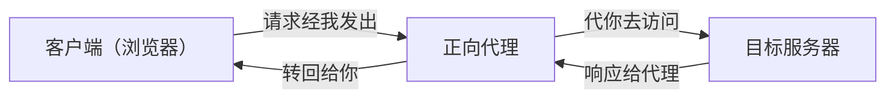
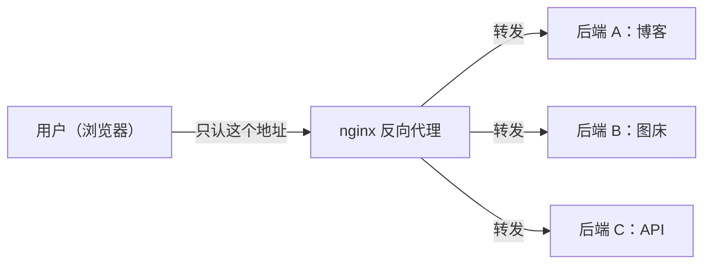

# nginx 入门

## 为什么要学习nginx

当你有了一台云服务器，准备在这台服务器上部署多个服务（个人博客，个人资源站，图床等），nginx 是一个绕不开的话题。尽管在 ai 发展如此迅猛的今天，这些工作完全可以 all in ai ，但是作为一个保守派，我还是喜欢自己把一些东西搞清楚的掌控感。本文主要围绕着我自己这台小服务上的nginx配置展开，不会涉及很复杂的内容，以掌握基础的配置，了解基本原理为主。

## 核心概念

### 什么是 nginx

nginx 是一个高性能的 Web 服务器和反向代理服务器。假设你机器上同时跑着博客、图床、资源站，它们不能都占 80 和 443 端口，nginx 就站在门口统一接客：浏览器只认它一个，它再看请求把活分发给后面的服务。

nginx 主要干三件事：
- 静态文件（HTML、图片、CSS）直接读盘返回，不惊动后端；
- 反向代理：把请求转给真实后端，后端不用暴露给公网；
- TLS 终止：在自家解开 HTTPS 加密，后端只跑明文 http，省得每个服务都折腾证书。

它凭什么能扛住海量连接？传统做法是"一个连接一个线程"，连接一多内存和切换就崩；nginx 用一个 worker 进程的事件循环同时盯着所有连接，谁有数据才处理谁。打个比方：阻塞 IO 是一个服务员盯一桌盯到吃完，事件驱动是一个服务员扫全场、哪桌举手才过去。具体怎么排的，看下面的进程模型。

### 正向代理与反向代理

讲反向代理之前，得先把正向代理拎出来对照，不然容易混。

正向代理你大概率用过——翻墙那个就是。它蹲在客户端这边：你浏览器把请求交给代理，代理替你去访问目标服务器，服务器看到的只是代理的地址，不是你。所以它干的事是**隐藏客户端**。



反向代理刚好反过来，它站在**服务端**。你机器上的 nginx 就是：用户只跟 nginx 说话，nginx 再把请求转给后面的博客、图床，用户根本不知道背后跑的是啥、拿啥写的。它干的事是**隐藏后端**。



把俩放一块看就明白了：正向代理替客户端说话，藏的是你的身份，得你自己主动配代理，翻墙就是例子；反向代理替服务器说话，藏的是后端实现，用户毫无感知，你机器上的 nginx 正是如此。一句话记牢——正向代理让别人看不到**你**，反向代理让别人看不到**你的服务**。

### 进程模型

一个 master 进程负责调度，多个 worker 进程负责干活。
- master：读取配置、管理 worker、处理信号（如 reload）
- worker：真正处理请求，事件驱动地并发服务
- 为什么 reload 不断连：master 加载新配置、平滑拉起新 worker，处理中的旧连接不受影响
这一点到后面讲管理命令时会有直观感受。

### 层级结构（不确定要不要放在这里）

http {} -> server {} -> location {}

下一层级继承上一层级的配置，下一层级配置可覆盖上一层级同名配置。

配置层级：http → server → location
http {
    server {          # 对应一个站点
        listen 80;
        location / {  # 对应一个 URL 路径
            ...
        }
    }
}
两条规则：
- 继承：下层继承上层的配置
- 覆盖：同名配置，下层覆盖上层

## just do it

### 准备服务器环境

- 一台 Linux 云服务器（Ubuntu/Debian）
- 检查系统版本
- 使用 root 或带 sudo 的用户
- 检查端口连通性
    - 服务器上检查端口是否被监听：`ss -tlnp`
    - 本地测试服务器是否连通：`curl -I http://服务器 IP` 或 `telnet 服务器 IP 80`
    - 这里需要注意有两组防火墙的存在
        - 服务器防火墙：ufw / firewalld / iptables
        - 提供云服务的厂商的安全组策略，需要在控制台配置相关规则
80 端口与 443端口，

### nginx 的下载与安装

```shell
# 安装
sudo apt update && sudo apt install nginx
# 验证安装
nginx -v
```


### nginx 的目录结构

```shell
/etc/nginx/
├── nginx.conf           # 主配置
├── sites-available/     # 可用站点
└── sites-enabled/       # 启用站点（软链接）
```

核心机制：available 放配置，enabled 里 ln -s 才生效
这里启动与关闭就是创建和删除软链接

### nginx 的基础管理命令

```shell
sudo systemctl status nginx    # 查看状态
sudo systemctl start nginx     # 启动
sudo systemctl stop nginx      # 停止
sudo systemctl restart nginx   # 重启（断连）
sudo systemctl reload nginx    # 重载（优雅，不断连）
nginx -t
```

### hello world

动手验证前面的知识：
- 在 /var/www/ 建一个 hello.html
- 在 sites-available/ 写一个 server block（监听 80，指向该文件）
- ln -s 到 sites-enabled/
- sudo nginx -t 验证 → sudo systemctl reload nginx
- 浏览器访问 http://务器IP/hello.html

## 实战
