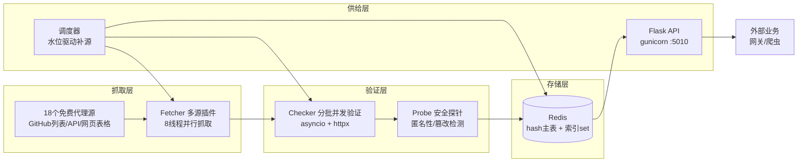
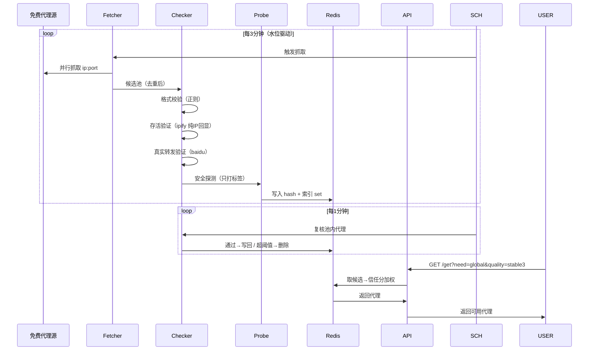

# 从 0 到 1 搭建一个自用代理池：架构、MVP 与踩坑实录

## 引子：一个"说不清道不明，但很有必要"的东西

很多人问为什么做代理池。说实话，很多事情并没有那么多"为什么"，但做这个代理池，动机非常实在——爬虫，和薅羊毛。

最直接的目的，是薅 opencode 的羊毛。我用了很久的 opencode，就因为它免费提供一些模型给人用，而且无需登录、无需配置 API Key。为什么能这样免费？一直以来我就是吭哧吭哧地用，偶尔也感叹：opencode 一个终端应用，用起来不算方便，但别的 agent（codex、cursor）又没有像 deepseek-v4-flash 这种免费又比较能打的模型。世间安得双全法，也只能将就。

直到有一天我突然回过神来，想搞明白一个问题：opencode 在完全不做权限认证的情况下，是靠什么保证安全的？琢磨了一圈，我突然意识到——它压根儿就没做什么限制，靠的是 IP 限制。于是我试了试：挂上代理，切换代理，额度的确刷新了，非常高兴。

但高兴没超过半天。我的使用强度太大，昨天中午，机场里所有代理在 opencode 上都被限额了。我只好改用官方 API，结果一下午用掉 7 亿 token，非常 amazing。数据摆在面前，一个稳定的代理池去持续薅 opencode 的羊毛，就势在必行了。

### 代理池是什么

一句话：它把几十上百个代理统一管理起来，验证、清洗、淘汰，对外只提供一个 API——你要什么条件，它吐什么 IP。

### 代理池能做什么

- 伪装 IP，隐藏自己的真实位置
- 把扫描、攻击行为分散到多个 IP
- 增加对手的追踪难度
- 突破单个 IP 的请求频率限制
- 绕开地域封锁
- 对抗封禁政策，被封了自动切换
- 并发能力增强
- 绕过 API 调用频率限制

### 优质代理与劣质代理

作为一个垃圾佬，能花一分不花。代理从哪来？从网上扒一些公开的 proxies——可能是网页（用爬虫去抓），可能是 API（那太好了）。但公开出来的代理，就别指望质量多好了：大家都在用，挂掉、被封控的概率非常高。所以这个池子的核心工作，就是尽可能筛一筛相对较好的代理。

这篇文章背后的真实项目是 [proxy-pool](https://github.com/IvoryGate/proxy-pool)，经历了 16 个开发阶段。下面按"先把架构想清楚，再写一个跑得通的 MVP，最后展开那些被真实数据逼出来的策略"来讲，踩过的坑我都会提，能少踩一个是一个。

---

## 一、整体架构：写代码之前，先拍四个板

动手写第一行代码之前，我花了不少时间定系统骨架。不是说要先知全貌才能动手，而是这四个问题不落定，后面每加一块都在返工。先记住一句话：**代理池 = 定时抓免费 `ip:port` → 层层验证 → 存进 Redis → 通过 API 按需供给**。

### 1.1 存储用什么

第一个问题是代理存哪。我选了 Redis，而且不是简单用一个 hash 存完，是"主表 + 索引 set"的双结构。

主表 `use_proxy` 是个 hash，field 是 `ip:port`，value 是代理信息的 JSON 串。另外建了几个索引 set，分别记"支持 https 的""区域是 CN 的""全球区域的""安全的"。为什么要加索引？因为业务取代理总是带条件的，比如"给我一个支持 https 的全球代理"。如果只有一个 hash，这条查询得把整张表捞回来、在 Python 里逐条过滤，O(n)。多存一个专门的 https 名单 set，查询直接变成 O(1) 的集合运算。这是典型的"用冗余索引换速度"。

还有一个环境细节：服务器上 Redis 是 6.0，没有 `HRANDFIELD` 这个命令（7.2 才有）。所以取随机代理只能用 `HKEYS` 拉出来自己 rand。这个限制直接决定了后面取用逻辑的写法。

### 1.2 验证分几层

免费代理最大的特点，就是绝大多数不可用。我这个池子最终全量跑了 28,588 个候选，验证完只剩 250 个，可用率 0.9%。所以验证必须分层，每一层用最便宜的成本拦住最多的坏货：

1. **格式校验**：正则判 `ip:port` 合不合法，不合法直接淘汰，连网络请求都不发；
2. **存活验证**：走代理访问 ipify，校验返回体是纯 IP，拦下劫持代理；
3. **真实转发验证**：走代理访问百度拿 200，确认代理真的把流量转发过去；
4. **https 能力检测 + 安全探针**：前者标能力，后者只打标签不判生死。

层与层是严格的"与"关系，上一层不过，后面全部跳过。这样坏货在越前面被拦下，花费越低。

这四层的排序也有讲究：http 是"代理活没活着"的底线，https 是"能力"，所以先验 http、过了才验 https，避免为死代理发无谓的请求。当初有人问过我一句：只测百度是不是不够，国外怎么办？这个问题问得很值，直接把验证从"单目标存亡"逼成了"多能力分层"——后面所有目标选择策略，都是从这个问题的延伸。

### 1.3 验证怎么并发

验证是最吃时间的一环。顺序验证 100 个代理，每个最多等 3 秒超时，最坏要 300 秒——但实际大部分时间都花在等网络上，CPU 是闲的。所以验证必须并发。用 `asyncio` 让验证从"一个个等"变成"一起等"，总耗时约等于最慢的那个。我实测过，10 个任务各延时两秒，顺序大概 20 秒，并发只要两秒。量级差距摆在这，没得选。

### 1.4 调度怎么触发

最早我写的是定时抓取：不管池子缺不缺，每 N 分钟抓一轮。后来发现太浪费——抓回来一堆用不上的。改成水位驱动：定好每个服务的目标水位（比如"全球稳定三档要 100 个"），低于下限才去补源，补满了就停。这个决定的完整故事放在第三章，这里先记住结论：系统不是"定时干活"，而是"缺了才干活"。

### 1.5 一张图看懂全貌



数据流是这样：左侧是"补源"循环，由水位检查（3 分钟）驱动；右侧是"复核"循环，1 分钟一次清死代理；业务取用走下面的 API。



把这张图每一格展开，就是一个代理的完整一生：先从某个源的列表里被扒出来，带着"生源地"标签进候选池；格式不对的直接死掉；格式对的走代理去 ipify 报个到，能回显纯 IP 就过第一关；再被拿去看一眼百度，确认它真的舍得帮你把流量送出去；活下来的标上 https 能力、地域、匿名性，写进 Redis。之后每过一分钟被复核一次，失败记小账本，连续超过 5 次就被扫地出门。整个过程没有人工介入，全靠几条定时循环在跑——这也是这套系统最让我舒服的地方。

---

## 二、MVP：一小段一小段代码把它跑起来

架构定了，下面按依赖顺序把代码一块一块拼出来。我不追求展示完整工程，只把每条链路上最关键的部分拎出来，串起来就是一个能跑的系统。项目叫 proxy-pool，注意你现在看到的结构，正是这段开发过程中踩坑踩出来的。

### 2.1 Proxy 数据模型：先定义"身份证"

池子里每个代理，本质是 Redis hash 里一个 field 对应的 value。所以第一件事是定义这个对象长什么样。

```python
# model/proxy.py
class Proxy:
    def __init__(self, proxy, https=False, fail_count=0, check_count=0,
                 last_status=False, last_time=None, source="", region="",
                 anonymous="", latency_ms=None, score=0, tampered=False):
        self.proxy = proxy            # ip:port，唯一标识
        self.https = https            # 是否支持 https
        self.fail_count = fail_count  # 连续失败次数（淘汰依据）
        self.check_count = check_count  # 累计校验次数
        self.last_status = last_status  # 上次校验是否成功
        self.last_time = last_time    # 上次校验时间
        self.source = source          # 从哪个源抓来的
        self.region = region          # 地域（源标签打底）
        self.anonymous = anonymous    # 匿名级别
        self.latency_ms = latency_ms  # 延迟（质量标签）
        self.score = score            # 信任分（稳定性）
        self.tampered = tampered      # 是否被篡改（安全标签）

    def to_json(self):
        import json
        return json.dumps(self.to_dict(), ensure_ascii=False)

    @classmethod
    def create_from_json(cls, json_str):
        import json
        data = json.loads(json_str)
        defaults = {
            "proxy": "", "https": False, "fail_count": 0,
            "check_count": 0, "last_status": False, "last_time": None,
            "source": "", "region": "", "anonymous": "",
            "latency_ms": None, "score": 0, "tampered": False,
        }
        defaults.update(data)
        return cls(**defaults)
```

两个点说一下。一是字段只放了"当下够用"的，region、anonymous 一开始留了位但没深用，避免一上来就过度设计，等后面策略需要时再加。二是 `create_from_json` 做了向后兼容，老版本 JSON 缺新字段时用默认值兜底。这个看着不起眼，但后面模型升级过好几次——比如阶段 09 一次性加了 `latency_ms`、`score`、`tampered` 三个字段，没有这层兜底，线上几万个旧 JSON 早就读炸了。

### 2.2 Redis 存储层：主表 + 索引

有了一格一格的"身份证"，接下来封装对 Redis 的读写。

```python
# db/redis_client.py
import random
import redis
from model.proxy import Proxy


class RedisPool:
    def __init__(self, host=None, port=None, db=0, table_name="use_proxy"):
        host = host or os.environ.get("REDIS_HOST", "127.0.0.1")
        port = int(port or os.environ.get("REDIS_PORT", 6379))
        self._redis = redis.Redis(host=host, port=port, db=db,
                                  decode_responses=True)
        self._table = table_name
        self._table_https = f"{table_name}:https"   # 索引：支持https的
        self._table_cn = f"{table_name}:cn"         # 索引：CN区域
        self._table_global = f"{table_name}:global" # 索引：global区域
        self._table_safe = f"{table_name}:safe"     # 索引：安全代理

    def put(self, proxy):
        """存一个代理，并同步维护各索引 set。"""
        self._redis.hset(self._table, proxy.proxy, proxy.to_json())
        # https 索引
        if proxy.https:
            self._redis.sadd(self._table_https, proxy.proxy)
        else:
            self._redis.srem(self._table_https, proxy.proxy)
        # 区域索引
        cn = (proxy.region == "CN")
        if cn:
            self._redis.sadd(self._table_cn, proxy.proxy)
            self._redis.srem(self._table_global, proxy.proxy)
        else:
            self._redis.sadd(self._table_global, proxy.proxy)
            self._redis.srem(self._table_cn, proxy.proxy)
        # 安全索引：匿名(elite) 且 未篡改
        safe = (proxy.anonymous == "elite" and not proxy.tampered)
        if safe:
            self._redis.sadd(self._table_safe, proxy.proxy)
        else:
            self._redis.srem(self._table_safe, proxy.proxy)

    def get(self, https=False, region=None, safe=False):
        """按需取一个代理（不删除）。"""
        candidates = set(self._redis.hkeys(self._table))
        if https:
            candidates &= self._redis.smembers(self._table_https)
        if region == "cn":
            candidates &= self._redis.smembers(self._table_cn)
        elif region == "global":
            candidates &= self._redis.smembers(self._table_global)
        if safe:
            candidates &= self._redis.smembers(self._table_safe)
        if not candidates:
            return None

        # 随机抽，逐个二次校验属性（索引可能过期）
        for _ in range(min(20, len(candidates))):
            pick = random.choice(list(candidates))
            proxy = self._get_proxy(pick)
            if proxy and self._matches(proxy, https, region, safe):
                return proxy
            candidates.discard(pick)
        return None

    def _matches(self, proxy, https, region, safe):
        if https and not proxy.https:
            return False
        if region == "cn" and proxy.region != "CN":
            return False
        if region == "global" and proxy.region == "CN":
            return False
        if safe and not (proxy.anonymous == "elite" and not proxy.tampered):
            return False
        return True
```

这层有三个"够用就好"的取舍。

**索引是"尽力同步"的。** 代理的属性会变——比如某次验证发现它其实不支持 https，那 `put` 时就要把索引纠正过来。但 `get` 时拿到候选后仍会二次校验属性，防止过期索引骗你。图的是：过期索引不影响取用正确性，下次 put 自会纠正。简单，够用。

**取用带随机性。** `random.choice` 从候选里抽，避免每次取到同一个。后面加了信任分加权，用它替代这里就行。

**O(1) 取 https。** 靠 set 集合运算，不用全表扫。

### 2.3 验证器：绝不能"抓到就信"

代理抓到后不能直接信，免费代理存活率极低（实测 10 里 1 个可用都算好）。验证器是一层"质检车间"。

```python
# helper/check.py
import asyncio
import re
import httpx

HTTP_URL = "http://api.ipify.org"          # 存活验证：纯IP回显
HTTPS_URL = "https://api.ipify.org"        # https 能力验证
REALITY_URL = "http://www.baidu.com"       # 真实转发验证
REALITY_HTML_MARK = b"baidu"
TIMEOUT = 3
MAX_FAIL_COUNT = 5                          # 连续失败超过就淘汰
PROXY_FORMAT = re.compile(r'^\d{1,3}(?:\.\d{1,3}){3}:\d{2,5}$')
PROXY_IP_ONLY = re.compile(r'^\d{1,3}(?:\.\d{1,3}){3}$')


class Checker:
    def __init__(self, timeout=TIMEOUT):
        self.timeout = httpx.Timeout(
            timeout, connect=min(timeout, 2), read=timeout,
            pool=timeout, write=timeout)

    def check(self, proxy):
        """验证一个 proxy，更新其状态。返回 (是否可用, fail_count)。"""
        # 格式不合法直接失败，不发网络请求
        if not PROXY_FORMAT.match(proxy.proxy):
            proxy.fail_count += 1
            proxy.last_status = False
            return False, proxy.fail_count

        http_ok = self._http_check(proxy)
        if http_ok:
            proxy.https = self._https_check(proxy)
            proxy.fail_count = 0
            proxy.last_status = True
        else:
            proxy.fail_count += 1
            proxy.last_status = False
        proxy.check_count += 1
        self._update_score(proxy, http_ok)
        return http_ok, proxy.fail_count

    def _http_check(self, proxy):
        return self._fetch_ok(HTTP_URL, proxy.proxy)

    def _https_check(self, proxy):
        return self._fetch_ok(HTTPS_URL, proxy.proxy)

    def _fetch_ok(self, url, proxy_addr):
        try:
            r = httpx.get(url, proxy=f"http://{proxy_addr}",
                          timeout=self.timeout, verify=False)
            if r.status_code != 200:
                return False
            # 校验返回体是纯IP：拦截"劫持代理"（返回自己网页冒充200）
            return bool(PROXY_IP_ONLY.match(r.text.strip()))
        except Exception:
            return False
```

这段代码浓缩了几个最深的坑。

**超时要拆成 connect / read。** 只设 read 超时的话，连不上的死代理会被内核 TCP 层层重试拖住几十秒。connect 短超时（2 秒）让死代理快速失败，这是全量验证提速的关键。卡住大部分人的往往不是功能，而是这种两行字的细节。

**内容要校验，不能只看状态码。** 很多免费代理收到请求后不转发，直接返回自己的一张网页，状态码照样 200。ipify 的好处是它只回显纯 IP，我只要校验返回体必须是合法 IP，劫持代理就过不来。

**淘汰要留缓冲。** 失败一次不马上删，靠 `fail_count` 累计、超过阈值才删。免费代理波动大，连续三两次失败很容易误删还活着的。这个阈值我后来从 3 调到了 5。

### 2.4 从"一个个等"到"一起等"

顺序验证慢到不能用，用 asyncio 重写一遍。但这里立刻撞上一个新坑：几万个候选一次全并发，连接和内存直接爆掉。所以是**分批并发**——每批 500，批内并发、批间串行。

```python
# helper/check.py 增加
CHECK_BATCH_SIZE = 500

class Checker:
    def check_all(self, proxies, batch_size=CHECK_BATCH_SIZE, on_batch=None):
        """分批并发验证。每批内并发，批间串行，防打爆连接/内存。"""
        proxies = list(proxies)
        ok_count = 0
        total = len(proxies)
        for i in range(0, total, batch_size):
            batch = proxies[i:i + batch_size]
            ok, _ = asyncio.run(self._check_all_async(batch))
            ok_count += ok
            if on_batch:
                on_batch(i // batch_size + 1, ok, min(i + batch_size, total))
        return ok_count, proxies

    async def _check_all_async(self, proxies):
        results = await asyncio.gather(
            *(self._check_one_async(p) for p in proxies))
        return sum(1 for ok, _ in results if ok), results

    async def _check_one_async(self, proxy):
        if not PROXY_FORMAT.match(proxy.proxy):
            proxy.fail_count += 1
            proxy.last_status = False
            return False, proxy.fail_count

        proxy_url = f"http://{proxy.proxy}"
        async with httpx.AsyncClient(proxy=proxy_url,
                                     timeout=self.timeout,
                                     verify=False) as client:
            try:
                r = await client.get(HTTP_URL)
                http_ok = (r.status_code == 200
                           and PROXY_IP_ONLY.match(r.text.strip()))
            except Exception:
                http_ok = False

            if http_ok:
                # 真实转发与 https 能力并行检测：慢代理耗时从 3×timeout 降到 ~timeout
                reality_ok, https_ok = await asyncio.gather(
                    self._reality_ok(client),
                    self._fetch_https_ok(client),
                )
                proxy.https = https_ok
                proxy.fail_count = 0 if reality_ok else proxy.fail_count + 1
                proxy.last_status = reality_ok
            else:
                proxy.fail_count += 1
                proxy.last_status = False
        proxy.check_count += 1
        self._update_score(proxy, http_ok)
        return http_ok, proxy.fail_count
```

三个细节。`CHECK_BATCH_SIZE` 取 500 是实测出来的，试过 1000，吞吐更高，但部分代理会被源站限流误杀。`AsyncClient` 要复用，不要每个代理重建一个，否则全花在 TCP 握手上了。真实转发验证和 https 能力检测用 `asyncio.gather` 并行发，慢代理从串行 3×timeout 降到一个 timeout。

还有一个容易看漏的点：几千个代理分批验证，中间没有任何输出的话，看起来就像卡死了。我加了 `on_batch` 回调，每批记一行日志，大批量验证时能确认它确实在推进。后来整套复核逻辑又把探针也异步化、复用同一个 AsyncClient，全池复核从最初的 24 分钟降到了一分钟内——这都能在日志里看到清晰的变化。

顺带讲一个差点让整个项目失去信心的 bug。有一阵子测试发现"所有代理都不可用"，起初我也以为是免费代理存活率低——毕竟这一行早就习惯了 0.9% 这种数字。但手动诊断一次就露馅了：直连百度 200，走代理就抛 TypeError。根因是一行代码：`AsyncClient.get(url, proxy=...)` 根本不认 `proxy` 这个参数，必须把 proxy 写进 `AsyncClient` 的构造参数。而这个 TypeError 被 `except Exception` 静默吞掉了，于是所有代理都被悄悄判死，池子从来没真正有货过。那次之后我给自己立了条规矩：**结果不符合预期时，先隔离问题，别急着归因于业务现实；`except Exception` 要么打日志，要么别写。**

### 2.5 抓源：插件模式

代理源千差万别：有的是 JSON API、有的是纯文本列表、有的是网页表格。要统一，最省事的是插件模式——一个源一个文件，继承同一个基类，实现 `fetch()` 返回 `ip:port`。

```python
# fetcher/base.py
class BaseFetcher:
    name = ""        # 源唯一标识
    url = ""         # 源首页 URL
    enabled = True   # 可禁用

    def fetch(self):
        """爬取本源的代理，yield "host:port" 字符串。子类必须实现。"""
        raise NotImplementedError
```

一个 JSON API 源：

```python
# fetcher/sources/geonode.py
class GeonodeFetcher(BaseFetcher):
    name = "geonode"
    url = "https://geonode.com/"

    def fetch(self):
        api_url = ("https://proxylist.geonode.com/api/proxy-list?"
                   "filterLastChecked=10&page=1&limit=100"
                   "&sort_by=lastChecked&sort_type=desc")
        try:
            r = httpx.get(api_url, timeout=10)
            data = r.json().get("data", [])
        except Exception:
            return  # 源挂了就当没抓到，不影响其它源

        for item in data:
            ip, port = item.get("ip", ""), item.get("port", "")
            if ip and port:
                yield f"{ip}:{port}"
```

一个纯文本 GitHub 大列表源：

```python
# fetcher/sources/thespeedx.py
class TheSpeedXHttpFetcher(BaseFetcher):
    name = "thespeedx-http"
    url = "https://github.com/TheSpeedX/PROXY-List"

    def fetch(self):
        raw_url = ("https://raw.githubusercontent.com/TheSpeedX/"
                   "PROXY-List/master/http.txt")
        text, _ = fetch_text(raw_url)   # 双通道抓取，见3.4
        if not text:
            return
        for proxy in yield_unique_proxies(parse_proxies_from_text(text)):
            yield Proxy(proxy=proxy)
```

然后是自动发现所有源的管理器：

```python
# fetcher/manager.py
import importlib
import os
import random
from concurrent.futures import ThreadPoolExecutor, as_completed
from model.proxy import Proxy
from fetcher.base import BaseFetcher


def _discover_fetcher_classes():
    """扫描 sources/ 目录，返回所有继承 BaseFetcher 且 enabled 的类。"""
    sources_dir = os.path.join(
        os.path.dirname(os.path.abspath(__file__)), "sources")
    classes = []
    for filename in sorted(os.listdir(sources_dir)):
        if not filename.endswith(".py") or filename.startswith("_"):
            continue
        try:
            module = importlib.import_module(f"fetcher.sources.{filename[:-3]}")
        except Exception:
            continue  # 单个源坏了不影响其它源
        for attr_name in dir(module):
            attr = getattr(module, attr_name)
            if (isinstance(attr, type) and issubclass(attr, BaseFetcher)
                    and attr is not BaseFetcher and attr.enabled):
                classes.append(attr)
    return classes


class Fetcher:
    def run(self, max_per_source=None, source_timeout=15, max_workers=8):
        """并行抓所有源，去重汇总。"""
        fetcher_classes = _discover_fetcher_classes()
        random.shuffle(fetcher_classes)  # 打乱顺序，均衡各源频率

        proxy_dict = {}
        dict_lock = threading.Lock()

        def grab(cls):
            fetcher = cls()
            local = {}
            try:
                source_items = fetcher.fetch()
                if max_per_source:
                    source_items = itertools.islice(source_items, max_per_source)
                for item in source_items:
                    item_proxy = item.proxy if isinstance(item, Proxy) else item
                    p = item if isinstance(item, Proxy) else Proxy(proxy=item)
                    if not p.source:
                        p.source = fetcher.name
                    local[item_proxy] = p
            except Exception:
                pass
            with dict_lock:
                for addr, p in local.items():
                    proxy_dict.setdefault(addr, p)  # 天然去重

        with ThreadPoolExecutor(max_workers=max_workers) as ex:
            futures = [ex.submit(grab, cls) for cls in fetcher_classes]
            try:
                for fut in as_completed(futures, timeout=source_timeout * 2):
                    fut.result()
            except Exception:
                pass  # 有源超时：已完成的结果保留

        for proxy in proxy_dict.values():
            yield proxy
```

插件模式最大的好处：**加一个新源 = 往 `sources/` 放一个文件**，manager 自动扫描发现，一行代码不用改。后来我做"取用策略"时，又把这个心智模型原样用了一遍。到后面 18 个源、40 多个候选源，全靠这个机制，不然早被源的结构差异烦死了。

### 2.6 服务层：把抓取-验证-入库串起来

```python
# handler/proxy_service.py
class ProxyService:
    def __init__(self, fetcher=None, checker=None, pool=None):
        # 依赖注入：测试可换假组件，不用连 Redis 不发网络
        self.fetcher = fetcher or Fetcher()
        self.checker = checker or Checker()
        self.pool = pool or RedisPool()

    def refresh(self, max_per_source=None):
        """抓新代理 → 并发验证 → 首次入库（不重复放）。"""
        proxies = list(self.fetcher.run(max_per_source=max_per_source))
        existing = {p.proxy for p in self.pool.getAll()}

        # 只验证真正的新 IP，省掉大量重复验证
        new_proxies = [p for p in proxies
                       if p.proxy not in existing
                       and PROXY_FORMAT.match(p.proxy)]
        ok_count, _ = self.checker.check_all(new_proxies)

        added = 0
        for proxy in new_proxies:
            if proxy.last_status and not self.pool.exists(proxy):
                self.pool.put(proxy)
                added += 1
        return added, ok_count

    def check_pool(self):
        """复核池内全部代理，淘汰失效的。"""
        proxies = self.pool.getAll()
        self.checker.check_all(proxies)

        eliminated = 0
        for proxy in proxies:
            if proxy.last_status:
                self.pool.put(proxy)              # 通过 → 写回
            elif self.checker.should_eliminate(proxy.fail_count):
                self.pool.delete(proxy)           # 超阈值 → 淘汰
                eliminated += 1
            else:
                self.pool.put(proxy)              # 失败但没超 → 再给机会
        return len(proxies), eliminated
```

两个方法的职责分得很干净：`refresh` 只管"放进不重复的可用代理"，`check_pool` 只管"淘汰失效的"——一个管进、一个管出，互不纠缠。另外这里用了依赖注入，测试时可以换假的 fetcher/checker/pool，不用连 Redis、不用发网络。这是后面所有测试能跑得动的前提。

### 2.7 API：对外供给

```python
# api/proxy_api.py
from flask import Flask, jsonify, request
from handler.proxy_service import ProxyService


def create_app(service=None):
    service = service or ProxyService()
    app = Flask(__name__)

    @app.route("/get")
    def get_proxy():
        https = request.args.get("type") == "https"
        need = request.args.get("need", "any")
        count = _safe_int(request.args.get("count"), 1, low=1, high=200)
        if count > 1:
            proxies = service.get_many(count, need=need, https=https)
            if not proxies:
                return jsonify({"code": 404, "msg": "没有符合条件的代理"}), 404
            return jsonify({"code": 200, "data": [p.proxy for p in proxies]})
        proxy = service.get(need=need, https=https)
        if not proxy:
            return jsonify({"code": 404, "msg": "没有符合条件的代理"}), 404
        return jsonify({"code": 200, "data": proxy.proxy})

    @app.route("/pop")
    def pop_proxy():
        https = request.args.get("type") == "https"
        need = request.args.get("need", "any")
        proxy = service.pop(https=https, need=need)
        if not proxy:
            return jsonify({"code": 404, "msg": "没有符合条件的代理"}), 404
        return jsonify({"code": 200, "data": proxy.proxy})

    @app.route("/count")
    def count():
        return jsonify({"code": 200, "data": service.count()})

    return app
```

MVP 阶段 API 只有三个路由，后来顺着真实需求又长出来一批：`/get?count=N` 批量取多个去重 IP，给"一次取一批、挨个拿去测"的场景；`/get?max_latency_ms=3000` 按延迟筛，只返回延迟达标的一批；`/list?page=&size=` 按信任分降序分页，方便直接看池子里到底有什么；`/health` 返回各层水位，交给监控探活。加路由一直守着一个边界：**这个仓库只做"IP 基础供给"，凡是偏业务的能力（鉴权、黑白名单、用量统计）一律不放进来**，免得池子被业务逻辑撑爆。

到这儿，一个能跑的 MVP 就成型了。完整流程是这三条命令：

```bash
# 1. 抓取 + 验证 + 入库（手动冒烟）
PYTHONPATH=. python -c "
from handler.proxy_service import ProxyService
s = ProxyService()
print('refresh:', s.refresh())
print('check_pool:', s.check_pool())"

# 2. 起 API
PYTHONPATH=. python api/proxy_api.py

# 3. 取用
curl "http://127.0.0.1:5010/get?type=https"
curl "http://127.0.0.1:5010/count"
```

最后用 Docker Compose 把 scheduler、redis、api 三个容器编排起来。这里也有故事。本机跑通之后，部署最初是手动 `setsid nohup` 后台挂着：进程崩了没人拉起，API 还开着 debug 模式（reload 有开销、也不安全）。后来干脆容器化，编排文件长这样（节选）：

```yaml
# docker-compose.yml（节选）
services:
  redis:
    image: redis:7-alpine
    command: redis-server --appendonly yes   # AOF 持久化，重建不丢池子
    volumes: [redis-data:/data]
    healthcheck: {test: ["CMD", "redis-cli", "ping"], interval: 5s}

  api:
    build: .
    command: gunicorn -w 4 -b 0.0.0.0:5010 api.wsgi:app
    environment: [REDIS_HOST=redis]
    depends_on: {redis: {condition: service_healthy}}

  scheduler:
    build: .
    command: python helper/scheduler.py
    environment: [REDIS_HOST=redis, PYTHONPATH=/app]
    restart: unless-stopped
```

几个不起眼但救命的点。`depends_on` 带 `condition: service_healthy`，等 Redis 健康了再起 API 和调度器，不然启动就竞态崩溃。Redis 开 AOF 持久化到 volume，容器重建不丢池子。`PYTHONPATH=/app` 是显式加的——脚本直接 `python helper/scheduler.py` 启动时，`sys.path[0]` 会变成脚本所在目录，import 不到顶层包，不写这一行调度器在容器里必崩（这个坑踩过，日志只有一句 `No module named 'handler'`）。生产用 gunicorn 4 个 worker 替代 Flask 自带单线程 server，单次慢验证不会把整个 API 堵死。一条 `docker compose up -d` 就是全部部署，`restart: unless-stopped` 顺手解决了进程守护。唯一的外挂条件是 Docker Hub 拉不动时要在 `/etc/docker/daemon.json` 配个国内镜像加速器，毕竟这台服务器也在墙内。

---

## 三、策略与踩坑：从"能用"到"好用"

跑通 MVP 只是第一步。真正让这个池子站得住的，是下面这些被真实数据逼出来的策略。每个策略背后都有一个具体的坑，我按"踩坑 → 想明白 → 怎么改"来讲。

### 3.1 验证目标反复横跳：一个改了三次的大坑

**这是整个项目最大的坑——验证目标换来换去。** 前后换了三次，每次都引入新缺陷。

一开始只测百度。结果国外代理连不上百度，全被误杀。改成"国内代理测百度、国外代理测 youtube"——更糟，youtube 在服务器上被墙，境外真代理又被误杀。再换 ipify（纯 IP 回显接口），这回太宽松，把 Cloudflare 假代理和劫持代理都收进来了。第四次更离谱，换成百度但内容校验还写着"要纯 IP"，一气之下把所有返回百度的代理全杀光……每个方案都有各自的坑，池子统计反复"反转"，当时连我自己都怀疑判断标准是不是出了问题。用池子的人更早就发现了，反复问我：结论怎么一会儿 global 达标、一会儿 cn 达标，从来没都达标过？现在回头看，这句话比任何日志都说明问题——**不是数据在跳，是我的验证标准在跳**。

这个问题的根源在于：**每次换验证目标都只想着解决上一轮的缺陷，没想着目标本身该满足什么条件。** 最后沉淀下来的答案就两条：验证目标必须**稳定可达 + 能拦假货**；换目标必须同步换配套的内容校验。

最终方案是**双保险**：

```python
HTTP_URL = "http://api.ipify.org"        # 第一道：存活验证，校验返回纯IP
REALITY_URL = "http://www.baidu.com"     # 第二道：真实转发验证，确认代理真转发流量
```

ipify 负责拦劫持（校验返回体必须纯 IP）；baidu 负责确认真实转发（有些伪代理/Cloudflare 边缘能回显 IP，但不转发到任意目标，必须访问真实网站确认）。两个目标互补，缺一不可。

### 3.2 可用不等于安全：免费代理全是透明的

验证通过只代表"这代理这会儿活着"，不代表安全。

我做过一次真实的匿名性检测：从 hproxy 拿 25 个 CN 代理，可用 16 个，但**这 16 个全部是透明代理**——它们把你的真实 IP 直接暴露给目标网站，自己只当了个转发器。还有 7 个篡改响应内容。用免费代理做敏感的事，等于裸奔。

安全探针的思路是"走代理 vs 直连"对照：

```python
# helper/probe.py
def check_anonymity(proxy_addr):
    """匿名性检测：走代理看目标看到的 IP 是不是代理自己的。"""
    r = _get(IP_ECHO_URL, proxy_addr)
    if r is None:
        return False, None
    seen_ip = r.text.strip()
    claimed_ip = proxy_addr.split(":")[0]
    return seen_ip == claimed_ip, seen_ip
    # 目标看到的IP == 代理IP → 高匿(elite)；否则 → 透明(transparent)


def check_tamper(proxy_addr):
    """篡改检测：走代理 vs 直连对比稳定页面内容哈希。"""
    direct_hash = _direct_hash()   # 直连 example.com 的哈希（带缓存，全池一次）
    if direct_hash is None:
        return True, None
    via_proxy = _get(STABLE_URL, proxy_addr)
    if via_proxy is None:
        return True, direct_hash
    via_hash = hashlib.md5(via_proxy.content).hexdigest()
    return via_hash == direct_hash, direct_hash
    # 内容哈希不同 → 代理篡改/注入了响应
```

**匿名性探针**：走代理访问 ipify，看目标"看到的 IP"是不是代理声称的 IP。一致 → 高匿（elite）；不一致 → 透明（transparent）。**篡改探针**：走代理和直连分别访问 example.com（内容极其稳定），比 MD5，哈希不一样说明代理往响应里塞了东西。

两个设计细节。**探针只打标签，不参与淘汰**——探针依赖外部接口，本来就偶发失败，让它参与淘汰等于误杀好代理。安全是"标签"，存活是"生死线"，纪律必须分开。**直连哈希做了模块级缓存**，全池共用一次直连结果，不用每个代理请求一遍 example.com。

那次 hproxy 实测还顺带量了延迟，能用的代理平均也要 14.7 秒——就算它不透明，慢得也够呛。也正是这些数据让我接受了现实：`safe` 桶长期接近空，业务侧只能自己权衡，要么接受"透明但快"的代理应付普通场景，要么就别拿免费池干敏感的事。

### 3.3 信任分：从"刚到池子里"到"一直很稳"

验证通过只能说明"这一刻活着"。业务上常需要区分刚进池的新代理和久经考验的老代理，于是有了信任分。

```python
def _update_score(self, proxy, ok):
    """成功 +1、失败 -2（失败惩罚更重），封顶 10。"""
    if ok:
        proxy.score = min(10, proxy.score + 1)
    else:
        proxy.score = max(0, proxy.score - 2)
```

成功 +1、失败 -2，失败惩罚更重——一次失败丢掉的是业务对一个 IP 的信任，业务那边可能已经为它付过一次超时或失败重试的代价了。惩罚重一点，让"刚活"和"一直很稳"的差距更快拉开。注意它和 `fail_count` 的区别：`fail_count` 是连续失败，会清零；`score` 是累计信任，反映长期稳定性，只会慢慢沉淀。然后按分数分档，业务就能精确选档：

```python
# config/services.py
STABLE_LEVELS = {
    "stable1": 1,   # 至少通过1次验证
    "stable2": 3,   # 至少3分（验证通过3次左右）
    "stable3": 5,   # 至少5分
}
```

轻任务用 stable1，重任务用 stable3。`score` 封顶 10 很关键——不封的话分数无限涨，stable 分档就失效了。取用的时候再做一次信任分加权，score 越高越容易被选中，但又保留随机性：

```python
def get(self, need="any", https=False, security=None, quality=None):
    candidates = self.pool.get_many(20, https=https, region=region, safe=safe)
    if not candidates:
        return None
    # 信任分加权：score 越高的代理，被选中的概率越大
    weights = [max(1, p.score + 1) for p in candidates]
    total = sum(weights)
    r = random.random() * total
    acc = 0
    for p, w in zip(candidates, weights):
        acc += w
        if r <= acc:
            return p
    return candidates[-1]
```

### 3.4 取用策略：同一个池子，三种脾气

不同业务对"取 IP"的诉求完全不同。批量采集的，希望每次拿到不同的 IP、尽量不重复；做登录态的，希望同一个会话固定用一个 IP、别变来变去；通用场景随机就好。所以在取用这层，我做了和 fetcher 一样的插件化，加新策略 = 往 `strategies/` 放一个文件。

```python
# strategy/base.py
class BaseStrategy:
    name = ""      # 策略名，API 用 mode 参数选

    def get(self, service, **params):
        raise NotImplementedError
```

```python
# strategy/strategies/random.py
class RandomStrategy(BaseStrategy):
    name = "random"
    def get(self, service, **params):
        return service.get(**params)
```

```python
# strategy/strategies/rotate.py
class RotateStrategy(BaseStrategy):
    name = "rotate"
    def __init__(self):
        self._recent = []      # 最近给过的代理
        self._MAX_RECENT = 100

    def get(self, service, **params):
        candidates = service.pool.get_many(50, **self._pool_kwargs(params))
        if not candidates:
            return None
        recent_set = set(self._recent)
        fresh = [p for p in candidates if p.proxy not in recent_set]
        if fresh:
            chosen = max(fresh, key=lambda p: p.score)  # 优先没给过的
        else:
            chosen = candidates[len(self._recent) % len(candidates)]
        self._recent.insert(0, chosen.proxy)
        if len(self._recent) > self._MAX_RECENT:
            self._recent = self._recent[:self._MAX_RECENT]
        return chosen
```

```python
# strategy/strategies/sticky.py
class StickyStrategy(BaseStrategy):
    name = "sticky"
    def get(self, service, session=None, **params):
        if not session:
            return service.get(**params)   # 没给 session 退化为随机
        key = (session, self._filter_key(params))
        last = self.record.get(key)
        candidates = service.pool.get_many(50, **self._pool_kwargs(params))
        pool_keys = {p.proxy for p in candidates}
        if last in pool_keys:   # 上次那个还活着，继续给同一个
            return next(p for p in candidates if p.proxy == last)
        if candidates:          # 死了就换新的
            chosen = max(candidates, key=lambda p: p.score)
            self.record[key] = chosen.proxy
            return chosen
        return None
```

| 策略 | 场景 | 核心行为 |
|------|------|---------|
| random | 通用默认 | 信任分加权随机 |
| rotate | 批量采集 | 尽量不重复、轮流给 |
| sticky | 登录态/反爬会话 | 同 session 复用同代理，死了才换 |

sticky 的 key 里带上了筛选条件：同一个 session 但换了业务条件，不该硬复用旧代理。策略管理器用和 fetcher 一样的自动扫描模式，未知 mode 回退默认 random。

### 3.5 双通道抓取：服务器直连 GitHub 是随缘的

免费代理大列表大多托管在 GitHub。我服务器直连 `raw.githubusercontent.com`，抖动到什么程度？实测 1 秒到 60 秒不定，纯随缘。解决方法是双通道：先试 raw，短超时快速失败；失败就走 jsdelivr CDN 兜底，实测稳定在 0.6~1.8 秒。

```python
# fetcher/util.py
def fetch_text(url, timeout=20, retries=1):
    """raw 短超时快速失败，jsdelivr 稳定兜底。"""
    import httpx
    # raw 通道：短超时，抖了就立即换，不干等
    raw_timeout = min(timeout, 8)
    try:
        r = httpx.get(url, timeout=httpx.Timeout(
            raw_timeout, connect=min(raw_timeout, 5), read=raw_timeout,
            pool=raw_timeout, write=raw_timeout))
        if r.status_code == 200:
            return r.text, url
    except Exception:
        pass
    # jsdelivr 通道：稳定 CDN，自动转 @branch 格式
    if "raw.githubusercontent.com" in url:
        # raw -> jsdelivr：/user/repo/branch/path → /user/repo@branch/path
        # （jsdelivr 必须有 @branch，否则 404 —— 这个坑踩了很久）
        parts = url.split("raw.githubusercontent.com/", 1)
        seg = parts[1].split("/", 2)
        if len(seg) == 3:
            user, repo, rest = seg
            branch, _, path = rest.partition("/")
            cand = (f"https://cdn.jsdelivr.net/gh/{user}/{repo}"
                    f"@{branch}/{path}")
            ...  # 走 jsdelivr 重试
    return None, None
```

代码注释里那句"这个坑踩了很久"值得展开：**raw 转 jsdelivr 必须带 `@branch`。** `cdn.jsdelivr.net/gh/user/repo/path` 直接 404，必须写成 `cdn.jsdelivr.net/gh/user/repo@master/path`（或 `@main`）。这个规则只在真实报错时才会被发现，没有文档提醒你。顺带一提，connect 超时同样是那个老问题：httpx 单值 `timeout=8` 只管 read，连接卡住时内核 TCP 拖 30 秒以上。

### 3.6 抓源提速：从" 90 秒"到" 17 秒"

18 个源串行抓要 90 秒以上，改成 8 个线程并行只要 17 秒——总耗时从"所有源之和"变成"最慢的那个源"。

```python
with ThreadPoolExecutor(max_workers=8) as ex:
    futures = [ex.submit(grab, cls) for cls in fetcher_classes]
    try:
        for fut in as_completed(futures, timeout=source_timeout * 2):
            fut.result()
    except Exception:
        pass   # 有源超时：已完成的结果保留，未完成的丢弃
```

配合两个细节。**每个源限时消费**：慢源（一个请求可能卡 30 多秒）不能拖垮整体，独立线程消费生成器、主线程限时接收。**抓源支持走代理**：不少免费代理站对本机 IP 有反爬（429/403），抓源时也可以绕池子里的代理出去，用完还回。

提速过程还顺手修了个小坑：部分源返回 301 重定向，`fetch()` 不跟随的话直接抓个空，后来给 `_http_get` 加了 `follow_redirects=True`。另外我一度用"水塘抽样"给大源随机取样本，思路没问题，但它要遍历整条流才能等概率——两万多条的大源直接从秒级变分钟级。最后抽样全部改成"取前 N 条"，反正验证环节还会再筛一遍，用抽样省下的时间是实实在在的。

### 3.7 水位驱动：从"定时抓"到"缺了才补"

MVP 里我写的是定时抓取，缺不缺都每 N 分钟抓一轮。后来改成水位驱动：

```python
# config/services.py
SERVICE_MIN = {
    "cn": {"all": 0, "safe": 0, "stable1": 0, "stable2": 0, "stable3": 0},
    "global": {
        "all": 1000, "safe": 100,
        "stable1": 400, "stable2": 200, "stable3": 100,
    },
}
MAX_STALL_ROUNDS = 2       # 连续多少轮无新增就停
MAX_WATERLINE_ROUNDS = 2   # 单次最多补多少轮
MAX_PER_SOURCE = 250       # 每源每轮抓多少
```

```python
# handler/proxy_service.py
def ensure_waterlines(self):
    """把低于下限的服务补齐。"""
    levels = self.service_levels()
    rounds = 0
    stalls = 0
    while self.below_waterline(levels):
        added, _ = self.refresh(max_per_source=MAX_PER_SOURCE)
        rounds += 1
        if rounds >= MAX_WATERLINE_ROUNDS:
            break                    # 硬性停：防 job 霸占调度器
        if added == 0:
            stalls += 1
            if stalls >= MAX_STALL_ROUNDS:
                break                # 源耗尽：连续无新增
        else:
            stalls = 0
        levels = self.service_levels()
    return levels, rounds, not self.below_waterline(levels)
```

注意 `SERVICE_MIN` 里 CN 那一列全是 0。这不是我不想要国内代理，而是被数据教育出来的：免费源里国内活的最少，一轮 refresh 可能只补 1 个 CN，把 CN 设成硬性下限，补源 job 就永远退不出来。降成 0 = 诚实交付：池里有就给，没有就 404，不硬撑。

这里还连锁着一个特别反直觉的线索。正式部署那阵，账面上 CN 看起来"挺满"——有 70 个，但拿出来的代理一测全死。我一度怀疑是淘汰逻辑出了 bug，翻日志才发现不是误删：免费 CN 代理寿命只有分钟级，而复核 job 一直被补源给挤掉，死掉的根本没人清。问题不在验证器，在调度器被一个永远完不成目标的 job 独占着——这又引出了下面那个最隐蔽的坑。

这里藏着全项目最隐蔽的一个坑——**补源 job 周期超时**。一轮 refresh 40-80 秒，如果轮数不限制，单次 job 能跑 320 秒以上，超过三分钟调度周期，APScheduler 的 `max_instances=1` 会让这个 job 的后续周期被永久 skip。表面只是无声的 skip，实际效果是补源严重滞后、池子悄悄缩水。我一开始没察觉，直到发现池子从 216 悄悄缩水，翻日志才看到满屏的 skip。修法朴素：给补源轮数加硬上限，配合"连续 N 轮无新增就停"，双保险。

### 3.8 调度频率：免费代理要"边漏边补"

为什么拼命维护水位？因为免费代理寿命是分钟级的。复核太快删不干净、太慢留一池子死货；补源太慢跟不上死亡速度。实测复核 1 分钟、补源 3 分钟，池子能保持"边漏边补"的动态平衡——每分钟死掉一批，每三分钟补回一批，水位基本不掉。

```python
# helper/scheduler.py
WATERLINE_INTERVAL = 3   # 每3分钟检查水位并补源
CHECK_INTERVAL = 1       # 每1分钟复核淘汰

def make_waterline_job(service):
    def waterline_job():
        levels, rounds, ok = service.ensure_waterlines()
        below = service.below_waterline(levels)
        print("所有服务达标" if not below else f"补源{rounds}轮后仍未达标")
        print(f"池子 {service.count()}")
    return waterline_job

def run_scheduler():
    service = ProxyService()
    scheduler = BlockingScheduler()
    scheduler.add_job(make_waterline_job(service), "interval",
                      minutes=WATERLINE_INTERVAL)
    scheduler.add_job(make_check_job(service), "interval",
                      minutes=CHECK_INTERVAL)
    scheduler.start()
```

### 3.9 一个几乎把池子清零的 bug

讲完策略，插一段与技术无关、但必须讲的事故。

`tests/test_redis_client.py` 的 `make()` 里写了一句 `pool.clear()`。看着无害——测试嘛，清一下数据库天经地义。但它清的是 db=0，生产库。某次跑测试，把生产 Redis 里的池子整个清了，一度归零。从那以后，所有测试改用独立的 db=15，`make()` 永远只碰测试库，跑完随手 clear 也不心疼。这是全项目最贵的一条教训，代价就是一行 `pool.clear()`。

### 3.10 真实数据：免费代理的长什么样

跑满全量验证之后，数据是这样：

```
总候选 28,588 → 可用 250 (0.9%)，耗时 26 分钟
池子 {total: 250, https: 94, cn: 4, global: 246}
安全标签：elite=3 / transparent=26 / safe=3
```

先说这批数据是怎么来的，它不是"顺便跑一下"的结果。那之前池子里只有 8 个代理，连 all 都填不满，用户直接质疑：是不是源没校验全？真相是八个源全跑了，但免费源可用率只有约 1%，抓取量开得小自然填不满。于是拍板：加大抓取量直接跑满，不计时间成本，跑通是第一要务。于是有了全量抓取脚本，几万个候选分批验证、一次性入库，26 分钟跑完就是上面这组数字。没有这轮"不计成本"的跑满，后面所有策略都无从谈起。

三个扎心的结论。

**可用率不到 1%。** 两万八千多个候选只剩 250 个，但量大仍然堆得出实货——这就是"免费"的代价：用数量换质量。

**国内代理极度稀缺。** 250 个里只有 4 个 CN。免费源里国内活的最少，这就是为什么我把 CN 水位置成 0——不是系统和 bug 的问题，是源质量上限就在这。

**安全代理几乎不存在。** 只有 3 个"匿名+未篡改"。免费代理绝大多数透明，能安全用的凤毛麟角，`safe` 桶长期接近空。

后来我继续全网搜源，试了 40 多个候选源，结论是**免费 HTTP 代理源已经基本挖掘殆尽**。有个叫 mishakorzik 的源，号称上百万条代理，看着壮观，实测抽样 100 个验证全灭——纯垃圾灌水，直接移除。还有一批 sslproxies 系列的源，宿主机能访问，但 Docker 容器里网络不可达，接不了。最后接入的 6 个全球大源（thespeedx/jetkai/monosans 等，约 7700 候选）把池子从 200 扩到 290 上下，继续加源的边际收益已经极低。

### 3.11 一个源值不值得抓：用数据说话

四十多个候选源试下来，我发现"源质量"完全可以量化，不用拍脑袋。每个源抓来的候选都带着 `source` 标签，入库后一验证，可用率高低一眼就看出来。

几个印象深刻的结论。hproxy 这类大而全的源，全量两万多条候选可用率约 10%，但**定向到 CN 才有质量**——这是它 metadata 里自带的标签，白捡的。databay 支持按 `anonymity=elite` 定向抓取，专门用来补 safe 桶。free-proxy-list 的 HTML 表格自带 region/anonymous/https 元数据，等于每行代理都配好了出生证明。反过来，mishakorzik 那种上百万条"壮观列表"抽样验证全灭，靠的就是 `source` 标签复盘出来的——否则你还以为它是个宝库。

所以最后总结了个判断框架：**一个源值不值得留，看三件事**——候选量够不够大、可用率够不够高（>=5% 才算良性）、能不能提供元数据（region/anonymous 省掉一次探测）。质量主力永远是那三四个源，其余要么锦上添花，要么直接砍掉。

顺带说一句元数据里的 region：纯文本源（像 hproxy、ip3366）根本不带地域信息，入库后全被错分进 global——这会让"要国内代理"的查询白白漏掉。我们的处理是拿 ip-api.com 批量反查代理 IP 归属地，对空 region 的代理补一层标签。一次反查几百个 IP，花费不大，却让 CN 分桶不再是个摆设。

---

## 四、收尾

### 几句话回顾架构

```
抓取（18源并行插件） → 验证（格式→存活→真实转发→https→安全，asyncio分批并发）
→ 存储（Redis主表+索引set） → 供给（水位驱动补源 + 策略化API）
```

### 几个能带走的工程经验

**插件模式 + 目录扫描。** 加新源、加新策略，都是一放文件。这个心智模型用了两次之后，整个系统的扩展成本降到几乎为零。

**依赖注入。** 服务层和 API 都支持注入假组件，测试不用连 Redis、不用发网络。这是"敢反复重构"的底气。

**异步 + 分批并发。** I/O 密集场景用 asyncio，几万代理分批 500 并发，快一个量级又不爆资源。

**双保险验证。** ipify 拦劫持、baidu 拦伪转发，缺一不可。验证目标必须"稳定可达 + 能拦假货"。

**探针只打标签不判生死。** 安全检测依赖外部接口、容易偶发失败，参与淘汰会误杀好代理。存活的生死线和安全的标签要分开。

**水位驱动而非定时抓取。** 缺才补，补满停。省资源，且贴合"按需供应"的定位。

**给数据打标签。** 每个代理从哪个源来、几分信任、什么地域，全程带着标签。没有了这些标签，四十多个源的复盘和 CN 分桶都是空中楼阁——"数据驱动决策"的前提是先有可追溯的数据。

**阶段式开发。** 整个项目拆成 16 个小阶段，每阶段解决一个问题、写一次测试、留一份思考记录。前期"先打通 MVP 再逐步加细节"，后期所有重构都有据可查、可以回滚。

**测试必须隔离生产数据。** 用独立的 db，代价是一行 `pool.clear()` 的教训。

### 踩坑清单

| 坑 | 后果 | 解法 |
|----|------|------|
| 验证目标反复横跳 | 池子统计反复"反转"，数据不可信 | ipify+baidu 双保险，改目标同步改校验 |
| connect 超时只设 read | 死代理拖 30s+，整批验证变慢 | `httpx.Timeout(8, connect=2)` 拆开设置 |
| raw→jsdelivr 缺 @branch | jsdelivr 返回 404 | 转换必须带 `@master`/`@main` |
| 补源轮数不限制 | job 超调度周期被永久 skip，池子缩水 | 轮数硬上限 2，双保险 |
| 测试清空生产库 | 池子归零 | 测试用独立 db（db=15） |
| 并发 batch=1000 | 部分代理被源站限流误杀 | 降到 500 |
| 水塘抽样遍历大源 | 2 万+ 候选从秒级变分钟级 | 大源改取前 N |

### 最后说两句实话

免费代理池是个"以量取胜"的领域，但天花板很清楚：可用率不到 1%，安全代理几乎不存在，CN 代理稀缺且分钟级短命。如果你的业务对延迟和成功率敏感，最终还是要考虑付费或独享代理源。免费池更适合当"候选供给底座"——量大、能顶一阵子，让上游去筛选。

我能给的最实在的建议，也写在项目里了：先打通 MVP，再逐步加细节。你会发现一个特别真实的规律——**每个策略都不是设计出来的，是被真实数据逼出来的**。免费代理的残酷，只有真正跑过一轮全量验证的人才体会得到。

真要照着我的路径来，顺序别乱：先把数据模型和 Redis 存储跑通（一天内），再打通"抓取 → 验证 → 入库 → 吐出"这条 MVP 主线（两三天），这时候大概能有一两百个能用的 IP；然后才轮到信任分、安全探针、水位控制这些"细节"。这些细节不是从需求表里抄出来的，是数据一次次打脸打出来的——这也是我写这篇东西最想传达的：踩坑不可怕，可怕的是把坑当成是环境不行、代理不行，而不是去怀疑自己的验证逻辑。

代码都在 [proxy-pool](https://github.com/IvoryGate/proxy-pool)，每个阶段的思考记录在 `docs/` 目录。

---

*本文基于真实项目 proxy-pool（Python + Redis + Flask + APScheduler）写作，16 个开发阶段的完整踩坑记录见项目 docs/ 目录。*