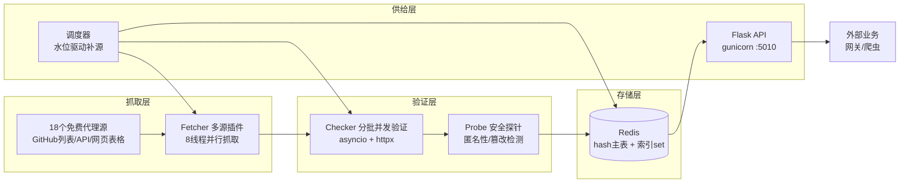
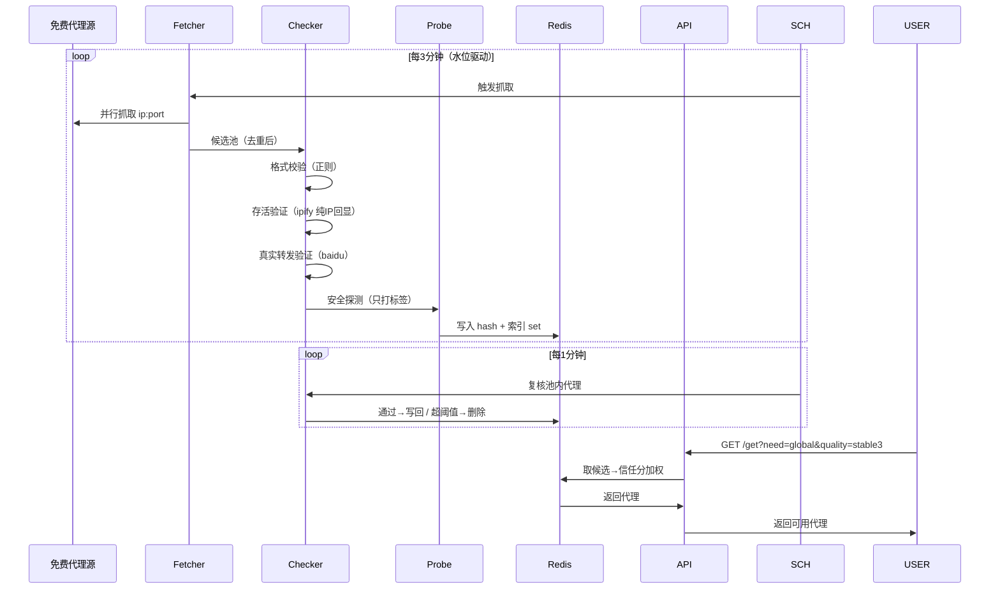
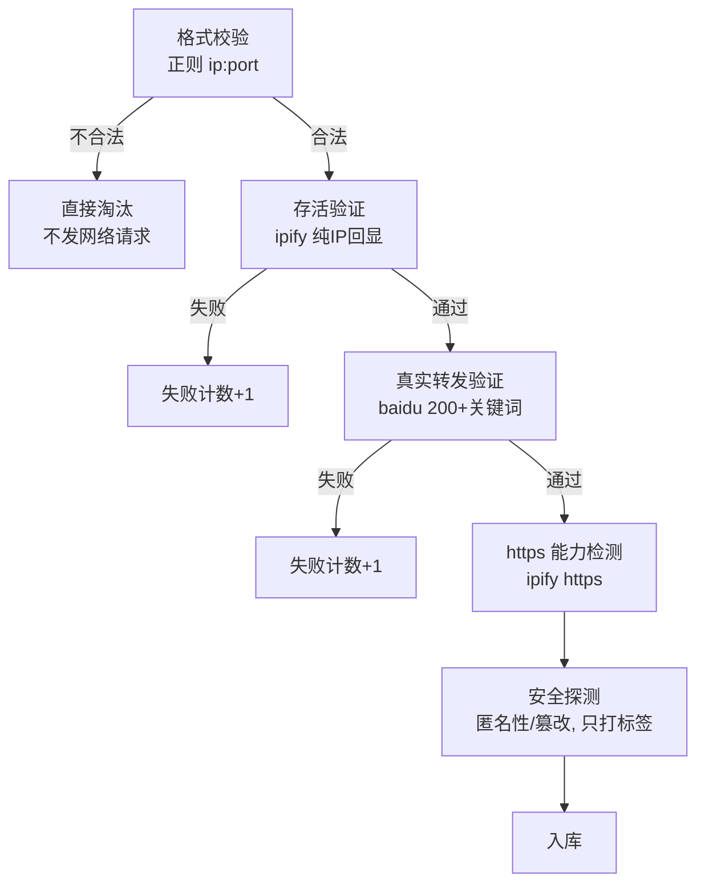
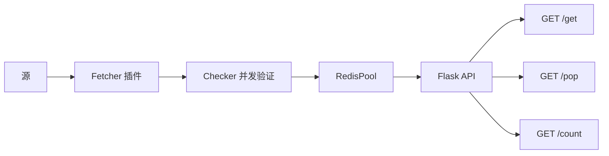

# 从 0 到 1 搭建一个自用代理池：架构、MVP 与踩坑实录

## 引子：我为什么需要代理池

一切源于一个朴素的需求：我在做一个网关服务，需要批量调用大模型接口，而调用的过程中总是撞上各种限制——不是接口本身报错，而是**出口 IP 被限流、被风控、被地理封锁**。

一开始的解决方案很原始：找机场买代理，手动把 IP 填进配置。但很快发现三个问题：

1. **手动配置跟不上节奏**：一个 IP 用一阵子就废了，得频繁去更新
2. **机场代理贵**：按流量计费，跑批量任务肉疼
3. **不透明**：不知道这个 IP 到底能不能用、是不是被标记过、是不是透明的（会泄露真实 IP）

于是决定自己做一个**代理池**：从全网免费代理源抓取海量 `ip:port`，经过多层验证后存入 Redis，对外提供一条 API 按需取用。听起来简单，做起来踩坑无数。

这篇文章就用我的真实项目 [proxy-pool](https://github.com/IvoryGate/proxy-pool) 讲清楚：**先讲架构，再用一段段核心代码实现一个 MVP，最后展开各种细节策略是怎么做的**。希望能帮你避开我踩过的坑。

---

## 一、IP 池的整体架构

### 1.1 一句话概括

> 一个代理池 = 定时抓取免费的 `ip:port` → 层层验证 → 存入 Redis → 通过 API 按需供给。

### 1.2 架构总览



### 1.3 数据流：一条代理的完整生命周期



### 1.4 核心设计决策

在写任何代码之前，有几个关键决策决定了整个系统的骨架。我用 MECE 的方式归纳为四类：

#### 决策一：存储用什么

**选择 Redis**，而且用了**主表 + 索引**的双结构。

- 主表：`use_proxy` 这个 hash，field 是 `ip:port`，value 是代理的 JSON 序列化
- 索引：几个 set，分别记录「支持 https 的」「CN 区域」「global 区域」「安全的」

为什么要加索引 set？因为"取 https 代理"如果只靠 hash，得全量扫一遍再在 Python 里过滤（O(n)）。加一个 set 专门存 https 名单，取用变成 O(1)。这是典型的**冗余索引换速度**。

#### 决策二：验证分几层

免费代理最大的特点就是**绝大多数不可用**。实测 28,000 多个候选，最后只有 250 个能用，可用率不到 1%。

所以验证必须分层，每层都用最便宜的方式拦住最多坏货：



#### 决策三：验证怎么并发

顺序验证 100 个代理，每个最多等 3 秒超时，最坏要 300 秒。但验证过程大部分时间在**等网络**，CPU 是闲置的。

所以用 `asyncio` 让验证从"一个个等"变成"一起等"——总耗时 ≈ 最慢的那个。实测 10 个任务各延时 2 秒，顺序约 20s，并发实测 2s。

#### 决策四：调度怎么触发

一开始用定时抓取：不管缺不缺都每 N 分钟抓一轮。后来改成了**水位驱动**：检查每个服务（如"全球稳定3档"）的当前数量，低于下限才补源，补满了就停。

这样不会浪费资源抓一堆用不上的代理，也保证了业务侧"按需供应"。

---

## 二、核心代码：实现一个 MVP

理解了架构，下面用一小段一小段的代码把它实现出来。我按依赖顺序来，最后串成一个能跑的系统。

### 2.1 Proxy 数据模型

池子里每个代理，本质上是 Redis hash 里一个 field 对应的 value。先定义它的"身份证"：

```python
# model/proxy.py
class Proxy:
    def __init__(self, proxy, https=False, fail_count=0, check_count=0,
                 last_status=False, last_time=None, source="", region="",
                 anonymous="", latency_ms=None, score=0, tampered=False):
        self.proxy = proxy            # ip:port，唯一标识
        self.https = https            # 是否支持 https
        self.fail_count = fail_count  # 连续失败次数（淘汰依据）
        self.check_count = check_count  # 累计校验次数
        self.last_status = last_status  # 上次校验是否成功
        self.last_time = last_time    # 上次校验时间
        self.source = source          # 从哪个源抓来的
        self.region = region          # 地域（源标签打底）
        self.anonymous = anonymous    # 匿名级别
        self.latency_ms = latency_ms  # 延迟（质量标签）
        self.score = score            # 信任分（稳定性）
        self.tampered = tampered      # 是否被篡改（安全标签）

    def to_json(self):
        import json
        return json.dumps(self.to_dict(), ensure_ascii=False)

    @classmethod
    def create_from_json(cls, json_str):
        import json
        data = json.loads(json_str)
        defaults = {
            "proxy": "", "https": False, "fail_count": 0,
            "check_count": 0, "last_status": False, "last_time": None,
            "source": "", "region": "", "anonymous": "",
            "latency_ms": None, "score": 0, "tampered": False,
        }
        defaults.update(data)
        return cls(**defaults)
```

几个要点：

- **字段只放"当下够用"的**，region/anonymous 一开始就留位但先不深用，避免过度设计
- **`create_from_json` 做了向后兼容**：老版本的 JSON 缺少新字段时用默认值兜底，这样升级模型不会弄挂线上数据
- Redis 没法直接存 Python 对象，所以序列化成 JSON 字符串

### 2.2 Redis 存储层

有了一格一格的"身份证"，接下来封装对 Redis 的读写。核心是主表 + 索引 set 的双结构：

```python
# db/redis_client.py
import random
import redis
from model.proxy import Proxy


class RedisPool:
    def __init__(self, host=None, port=None, db=0, table_name="use_proxy"):
        host = host or os.environ.get("REDIS_HOST", "127.0.0.1")
        port = int(port or os.environ.get("REDIS_PORT", 6379))
        self._redis = redis.Redis(host=host, port=port, db=db,
                                  decode_responses=True)
        self._table = table_name
        self._table_https = f"{table_name}:https"   # 索引：支持https的
        self._table_cn = f"{table_name}:cn"         # 索引：CN区域
        self._table_global = f"{table_name}:global" # 索引：global区域
        self._table_safe = f"{table_name}:safe"     # 索引：安全代理

    def put(self, proxy):
        """存一个代理，并同步维护各索引 set。"""
        self._redis.hset(self._table, proxy.proxy, proxy.to_json())
        # https 索引
        if proxy.https:
            self._redis.sadd(self._table_https, proxy.proxy)
        else:
            self._redis.srem(self._table_https, proxy.proxy)
        # 区域索引
        cn = (proxy.region == "CN")
        if cn:
            self._redis.sadd(self._table_cn, proxy.proxy)
            self._redis.srem(self._table_global, proxy.proxy)
        else:
            self._redis.sadd(self._table_global, proxy.proxy)
            self._redis.srem(self._table_cn, proxy.proxy)
        # 安全索引：匿名(elite) 且 未篡改
        safe = (proxy.anonymous == "elite" and not proxy.tampered)
        if safe:
            self._redis.sadd(self._table_safe, proxy.proxy)
        else:
            self._redis.srem(self._table_safe, proxy.proxy)

    def get(self, https=False, region=None, safe=False):
        """按需取一个代理（不删除）。"""
        candidates = set(self._redis.hkeys(self._table))
        if https:
            candidates &= self._redis.smembers(self._table_https)
        if region == "cn":
            candidates &= self._redis.smembers(self._table_cn)
        elif region == "global":
            candidates &= self._redis.smembers(self._table_global)
        if safe:
            candidates &= self._redis.smembers(self._table_safe)
        if not candidates:
            return None

        # 随机抽，逐个二次校验属性（索引可能过期）
        for _ in range(min(20, len(candidates))):
            pick = random.choice(list(candidates))
            proxy = self._get_proxy(pick)
            if proxy and self._matches(proxy, https, region, safe):
                return proxy
            candidates.discard(pick)
        return None

    def _matches(self, proxy, https, region, safe):
        if https and not proxy.https:
            return False
        if region == "cn" and proxy.region != "CN":
            return False
        if region == "global" and proxy.region == "CN":
            return False
        if safe and not (proxy.anonymous == "elite" and not proxy.tampered):
            return False
        return True
```

这里有三个值得说的设计：

1. **索引是"尽力同步"的**：代理属性会变（比如验证发现它不支持 https），所以 `put` 时同步增删索引，但 `get` 时取到候选后**仍会二次校验属性**。这样过期索引不影响取用正确性，留待下次 put 纠正。简单，够用。

2. **取用有随机性**：`random.choice` 从候选里抽，避免每次取到同一个代理。后面还有信任分加权，这里先不管。

3. **O(1) 取 https**：全靠索引 set 的集合运算，不用全表扫。

### 2.3 验证器

代理抓到后不能直接信——免费代理存活率极低。验证器是一层"质检车间"：

```python
# helper/check.py
import asyncio
import re
import httpx

HTTP_URL = "http://api.ipify.org"          # 存活验证：纯IP回显
HTTPS_URL = "https://api.ipify.org"        # https 能力验证
REALITY_URL = "http://www.baidu.com"       # 真实转发验证
REALITY_HTML_MARK = b"baidu"
TIMEOUT = 3
MAX_FAIL_COUNT = 5                          # 连续失败超过就淘汰
PROXY_FORMAT = re.compile(r'^\d{1,3}(?:\.\d{1,3}){3}:\d{2,5}$')
PROXY_IP_ONLY = re.compile(r'^\d{1,3}(?:\.\d{1,3}){3}$')


class Checker:
    def __init__(self, timeout=TIMEOUT):
        self.timeout = httpx.Timeout(
            timeout, connect=min(timeout, 2), read=timeout,
            pool=timeout, write=timeout)

    def check(self, proxy):
        """验证一个 proxy，更新其状态。返回 (是否可用, fail_count)。"""
        # 格式不合法直接失败，不发网络请求
        if not PROXY_FORMAT.match(proxy.proxy):
            proxy.fail_count += 1
            proxy.last_status = False
            return False, proxy.fail_count

        http_ok = self._http_check(proxy)
        if http_ok:
            proxy.https = self._https_check(proxy)
            proxy.fail_count = 0
            proxy.last_status = True
        else:
            proxy.fail_count += 1
            proxy.last_status = False
        proxy.check_count += 1
        self._update_score(proxy, http_ok)
        return http_ok, proxy.fail_count

    def _http_check(self, proxy):
        return self._fetch_ok(HTTP_URL, proxy.proxy)

    def _https_check(self, proxy):
        return self._fetch_ok(HTTPS_URL, proxy.proxy)

    def _fetch_ok(self, url, proxy_addr):
        try:
            r = httpx.get(url, proxy=f"http://{proxy_addr}",
                          timeout=self.timeout, verify=False)
            if r.status_code != 200:
                return False
            # 校验返回体是纯IP：拦截"劫持代理"（返回自己网页冒充200）
            return bool(PROXY_IP_ONLY.match(r.text.strip()))
        except Exception:
            return False
```

这段代码浓缩了最重要的几个经验：

- **超时拆成 connect/read**：只设 read 时，连不上的死代理会被内核 TCP 超时拖住几十秒。connect 短超时（2s）让死代理快速失败，这是全量验证提速的关键。
- **内容兜底拦截劫持代理**：很多免费代理收到请求后返回自己的网页（status 也是 200），会把爬虫带沟里去。ipify 返回纯 IP，校验它必须是合法 IP 才能通过。
- **淘汰给缓冲**：失败一次不马上删，`fail_count` 累计超过阈值才删。免费代理波动大，连续 3 次失败很容易误删还活着的。

### 2.4 并发验证：从"一个个等"到"一起等"

顺序验证太慢，用 asyncio 改造：

```python
# helper/check.py 增加
CHECK_BATCH_SIZE = 500

class Checker:
    def check_all(self, proxies, batch_size=CHECK_BATCH_SIZE, on_batch=None):
        """分批并发验证。每批内并发，批间串行，防打爆连接/内存。"""
        proxies = list(proxies)
        ok_count = 0
        total = len(proxies)
        for i in range(0, total, batch_size):
            batch = proxies[i:i + batch_size]
            ok, _ = asyncio.run(self._check_all_async(batch))
            ok_count += ok
            if on_batch:
                on_batch(i // batch_size + 1, ok, min(i + batch_size, total))
        return ok_count, proxies

    async def _check_all_async(self, proxies):
        results = await asyncio.gather(
            *(self._check_one_async(p) for p in proxies))
        return sum(1 for ok, _ in results if ok), results

    async def _check_one_async(self, proxy):
        if not PROXY_FORMAT.match(proxy.proxy):
            proxy.fail_count += 1
            proxy.last_status = False
            return False, proxy.fail_count

        proxy_url = f"http://{proxy.proxy}"
        async with httpx.AsyncClient(proxy=proxy_url,
                                     timeout=self.timeout,
                                     verify=False) as client:
            try:
                r = await client.get(HTTP_URL)
                http_ok = (r.status_code == 200
                           and PROXY_IP_ONLY.match(r.text.strip()))
            except Exception:
                http_ok = False

            if http_ok:
                # 真实转发与 https 能力并行检测：慢代理耗时从 3×timeout 降到 ~timeout
                reality_ok, https_ok = await asyncio.gather(
                    self._reality_ok(client),
                    self._fetch_https_ok(client),
                )
                proxy.https = https_ok
                proxy.fail_count = 0 if reality_ok else proxy.fail_count + 1
                proxy.last_status = reality_ok
            else:
                proxy.fail_count += 1
                proxy.last_status = False
        proxy.check_count += 1
        self._update_score(proxy, http_ok)
        return http_ok, proxy.fail_count
```

关键点：

- **分批串行**：几万个代理一次全并发会把连接/内存打爆。每批 500 个并发是实测出来的平衡值——1000 吞吐更高，但部分代理会被限流误杀。
- **复用 AsyncClient**：不要每个代理 new 一个 client，用 `async with` 建一次，连接复用，避免重复握手。
- **并行检测**：真实转发验证 + https 能力检测用 `asyncio.gather` 同时发，慢代理从串行 3×timeout（10s+）降到最快 ~timeout。

### 2.5 抓取源：插件模式

代理源千差万别：有的返回 JSON、有的是纯文本列表、有的是网页表格。用**插件模式**统一：

```python
# fetcher/base.py
class BaseFetcher:
    name = ""        # 源唯一标识
    url = ""         # 源首页 URL
    enabled = True   # 可禁用

    def fetch(self):
        """爬取本源的代理，yield "host:port" 字符串。子类必须实现。"""
        raise NotImplementedError
```

一个 JSON API 源：

```python
# fetcher/sources/geonode.py
class GeonodeFetcher(BaseFetcher):
    name = "geonode"
    url = "https://geonode.com/"

    def fetch(self):
        api_url = ("https://proxylist.geonode.com/api/proxy-list?"
                   "filterLastChecked=10&page=1&limit=100"
                   "&sort_by=lastChecked&sort_type=desc")
        try:
            r = httpx.get(api_url, timeout=10)
            data = r.json().get("data", [])
        except Exception:
            return  # 源挂了就当没抓到，不影响其它源

        for item in data:
            ip, port = item.get("ip", ""), item.get("port", "")
            if ip and port:
                yield f"{ip}:{port}"
```

一个纯文本 GitHub 大列表源：

```python
# fetcher/sources/thespeedx.py
class TheSpeedXHttpFetcher(BaseFetcher):
    name = "thespeedx-http"
    url = "https://github.com/TheSpeedX/PROXY-List"

    def fetch(self):
        raw_url = ("https://raw.githubusercontent.com/TheSpeedX/"
                   "PROXY-List/master/http.txt")
        text, _ = fetch_text(raw_url)   # 双通道抓取，见3.5
        if not text:
            return
        for proxy in yield_unique_proxies(parse_proxies_from_text(text)):
            yield Proxy(proxy=proxy)
```

然后是**自动发现所有源**的管理器：

```python
# fetcher/manager.py
import importlib
import os
import random
from concurrent.futures import ThreadPoolExecutor, as_completed
from model.proxy import Proxy
from fetcher.base import BaseFetcher


def _discover_fetcher_classes():
    """扫描 sources/ 目录，返回所有继承 BaseFetcher 且 enabled 的类。"""
    sources_dir = os.path.join(
        os.path.dirname(os.path.abspath(__file__)), "sources")
    classes = []
    for filename in sorted(os.listdir(sources_dir)):
        if not filename.endswith(".py") or filename.startswith("_"):
            continue
        try:
            module = importlib.import_module(f"fetcher.sources.{filename[:-3]}")
        except Exception:
            continue  # 单个源坏了不影响其它源
        for attr_name in dir(module):
            attr = getattr(module, attr_name)
            if (isinstance(attr, type) and issubclass(attr, BaseFetcher)
                    and attr is not BaseFetcher and attr.enabled):
                classes.append(attr)
    return classes


class Fetcher:
    def run(self, max_per_source=None, source_timeout=15, max_workers=8):
        """并行抓所有源，去重汇总。"""
        fetcher_classes = _discover_fetcher_classes()
        random.shuffle(fetcher_classes)  # 打乱顺序，均衡各源频率

        proxy_dict = {}
        dict_lock = threading.Lock()

        def grab(cls):
            fetcher = cls()
            local = {}
            try:
                source_items = fetcher.fetch()
                if max_per_source:
                    source_items = itertools.islice(source_items, max_per_source)
                for item in source_items:
                    item_proxy = item.proxy if isinstance(item, Proxy) else item
                    p = item if isinstance(item, Proxy) else Proxy(proxy=item)
                    if not p.source:
                        p.source = fetcher.name
                    local[item_proxy] = p
            except Exception:
                pass
            with dict_lock:
                for addr, p in local.items():
                    proxy_dict.setdefault(addr, p)  # 天然去重

        with ThreadPoolExecutor(max_workers=max_workers) as ex:
            futures = [ex.submit(grab, cls) for cls in fetcher_classes]
            try:
                for fut in as_completed(futures, timeout=source_timeout * 2):
                    fut.result()
            except Exception:
                pass  # 有源超时：已完成的结果保留

        for proxy in proxy_dict.values():
            yield proxy
```

插件模式的好处：**加一个新源 = 在 sources/ 目录放一个文件**，manager 自动发现，不用改一行代码。这个心智模型在后面加"取用策略"时又用了一遍。

### 2.6 服务层：把抓取-验证-入库串起来

```python
# handler/proxy_service.py
class ProxyService:
    def __init__(self, fetcher=None, checker=None, pool=None):
        # 依赖注入：测试可换假组件，不用连 Redis 不发网络
        self.fetcher = fetcher or Fetcher()
        self.checker = checker or Checker()
        self.pool = pool or RedisPool()

    def refresh(self, max_per_source=None):
        """抓新代理 → 并发验证 → 首次入库（不重复放）。"""
        proxies = list(self.fetcher.run(max_per_source=max_per_source))
        existing = {p.proxy for p in self.pool.getAll()}

        # 只验证真正的新 IP，省掉大量重复验证
        new_proxies = [p for p in proxies
                       if p.proxy not in existing
                       and PROXY_FORMAT.match(p.proxy)]
        ok_count, _ = self.checker.check_all(new_proxies)

        added = 0
        for proxy in new_proxies:
            if proxy.last_status and not self.pool.exists(proxy):
                self.pool.put(proxy)
                added += 1
        return added, ok_count

    def check_pool(self):
        """复核池内全部代理，淘汰失效的。"""
        proxies = self.pool.getAll()
        self.checker.check_all(proxies)

        eliminated = 0
        for proxy in proxies:
            if proxy.last_status:
                self.pool.put(proxy)              # 通过 → 写回
            elif self.checker.should_eliminate(proxy.fail_count):
                self.pool.delete(proxy)           # 超阈值 → 淘汰
                eliminated += 1
            else:
                self.pool.put(proxy)              # 失败但没超 → 再给机会
        return len(proxies), eliminated
```

两个方法的职责划分很清晰：

- `refresh`：**raw 入库**，只管"放进不重复的可用代理"
- `check_pool`：**use 复核**，只管"淘汰失效的代理"

一个管进，一个管出，互不纠缠。

### 2.7 Flask API：对外供给

```python
# api/proxy_api.py
from flask import Flask, jsonify, request
from handler.proxy_service import ProxyService


def create_app(service=None):
    service = service or ProxyService()
    app = Flask(__name__)

    @app.route("/get")
    def get_proxy():
        https = request.args.get("type") == "https"
        need = request.args.get("need", "any")
        count = _safe_int(request.args.get("count"), 1, low=1, high=200)
        if count > 1:
            proxies = service.get_many(count, need=need, https=https)
            if not proxies:
                return jsonify({"code": 404, "msg": "没有符合条件的代理"}), 404
            return jsonify({"code": 200, "data": [p.proxy for p in proxies]})
        proxy = service.get(need=need, https=https)
        if not proxy:
            return jsonify({"code": 404, "msg": "没有符合条件的代理"}), 404
        return jsonify({"code": 200, "data": proxy.proxy})

    @app.route("/pop")
    def pop_proxy():
        https = request.args.get("type") == "https"
        need = request.args.get("need", "any")
        proxy = service.pop(https=https, need=need)
        if not proxy:
            return jsonify({"code": 404, "msg": "没有符合条件的代理"}), 404
        return jsonify({"code": 200, "data": proxy.proxy})

    @app.route("/count")
    def count():
        return jsonify({"code": 200, "data": service.count()})

    return app
```

到这里，一个能跑的 MVP 就成型了：



**MVP 跑通的完整命令**：

```bash
# 1. 抓取 + 验证 + 入库（手动冒烟）
PYTHONPATH=. python -c "
from handler.proxy_service import ProxyService
s = ProxyService()
print('refresh:', s.refresh())
print('check_pool:', s.check_pool())"

# 2. 起 API
PYTHONPATH=. python api/proxy_api.py

# 3. 取用
curl "http://127.0.0.1:5010/get?type=https"
curl "http://127.0.0.1:5010/count"
```

---

## 三、细节与策略：从"能用"到"好用"

MVP 跑通只是开始。真实世界里，免费的代理池充满各种陷阱。这一章讲我踩过的坑和做过的策略决策。

### 3.1 验证目标的选择：为什么是 ipify + baidu

这可能是整个项目最大的坑——**验证目标反复横跳**。

一开始用 baidu 验证存活，发现国外代理连不上 baidu，全被误杀。于是改成"CN 测 baidu、境外测 youtube"，结果 youtube 被墙，又把境外真代理误杀。再换成 ipify（纯 IP 回显接口），又太宽松，收进了 Cloudflare 假代理和劫持代理。

最终的方案是**双保险**：

```python
HTTP_URL = "http://api.ipify.org"        # 第一道：存活验证，校验返回纯IP
REALITY_URL = "http://www.baidu.com"     # 第二道：真实转发验证，确认代理真转发流量
```

- **ipify** 负责拦劫持代理：它能回显 IP，校验返回体必须是合法 IP，假的过不了
- **baidu** 负责确认转发：有些伪代理/Cloudflare 边缘能回显 IP 但不转发到任意目标，必须访问真实网站确认

教训：**验证目标必须"稳定可达 + 能拦假货"，而且改目标必须同步改配套的内容校验**。每换一次目标，池子统计就"反转"一次，数据完全不可信。

### 3.2 安全探针：可用 ≠ 安全

免费代理里大量是**透明代理**——它把你真实 IP 暴露给目标网站。实测 25 个 hproxy 的 CN 代理，16 个可用，但 16 个全部是透明代理，还有 7 个篡改响应。

安全探针的思路是**"走代理 vs 直连"对照**：

```python
# helper/probe.py
def check_anonymity(proxy_addr):
    """匿名性检测：走代理看目标看到的 IP 是不是代理自己的。"""
    r = _get(IP_ECHO_URL, proxy_addr)
    if r is None:
        return False, None
    seen_ip = r.text.strip()
    claimed_ip = proxy_addr.split(":")[0]
    return seen_ip == claimed_ip, seen_ip
    # 目标看到的IP == 代理IP → 高匿(elite)；否则 → 透明(transparent)


def check_tamper(proxy_addr):
    """篡改检测：走代理 vs 直连对比稳定页面内容哈希。"""
    direct_hash = _direct_hash()   # 直连 example.com 的哈希（带缓存，全池一次）
    if direct_hash is None:
        return True, None
    via_proxy = _get(STABLE_URL, proxy_addr)
    if via_proxy is None:
        return True, direct_hash
    via_hash = hashlib.md5(via_proxy.content).hexdigest()
    return via_hash == direct_hash, direct_hash
    # 内容哈希不同 → 代理篡改/注入了响应
```

两个关键决策：

1. **探针只打标签，不参与淘汰**：探针依赖外部接口（ipify/example.com），偶发失败很正常，参与淘汰会误杀好代理。安全是"标签"，存活是"生死线"，两者分开。
2. **直连哈希做模块级缓存**：全池共用一次直连结果，不用每个代理都请求一遍 example.com。

### 3.3 信任分与 stable 分级

验证通过只代表"这一刻活着"。为了区分"刚活"和"一直很稳"，引入**信任分**：

```python
def _update_score(self, proxy, ok):
    """成功 +1、失败 -2（失败惩罚更重），封顶 10。"""
    if ok:
        proxy.score = min(10, proxy.score + 1)
    else:
        proxy.score = max(0, proxy.score - 2)
```

注意信任分和 fail_count 的区别：

- `fail_count` 是**连续失败**，会清零
- `score` 是**累计信任**，反映长期稳定性

然后按信任分分档：

```python
# config/services.py
STABLE_LEVELS = {
    "stable1": 1,   # 至少通过1次验证
    "stable2": 3,   # 至少3分（验证通过3次左右）
    "stable3": 5,   # 至少5分
}
```

这样业务可以精细选档：**轻任务用低档（稳定1），重任务用高档（稳定3）**。`score` 封顶 10 也很关键——不然分数无限上涨会让 stable 分级失效。

取用时的信任分加权：

```python
def get(self, need="any", https=False, security=None, quality=None):
    candidates = self.pool.get_many(20, https=https, region=region, safe=safe)
    if not candidates:
        return None
    # 信任分加权：score 越高的代理，被选中的概率越大
    weights = [max(1, p.score + 1) for p in candidates]
    total = sum(weights)
    r = random.random() * total
    acc = 0
    for p, w in zip(candidates, weights):
        acc += w
        if r <= acc:
            return p
    return candidates[-1]
```

加权随机保证"稳定代理更容易被选中"，又不是纯均匀随机。这是业务可用性的关键。

### 3.4 取用策略：random / rotate / sticky

不同业务对"取 IP"的诉求完全不同。做成一整套可插拔策略：

```python
# strategy/base.py
class BaseStrategy:
    name = ""      # 策略名，API 用 mode 参数选

    def get(self, service, **params):
        raise NotImplementedError
```

**默认：random（加权随机）**

```python
# strategy/strategies/random.py
class RandomStrategy(BaseStrategy):
    name = "random"
    def get(self, service, **params):
        return service.get(**params)
```

**批量采集用：rotate（轮换）**

```python
# strategy/strategies/rotate.py
class RotateStrategy(BaseStrategy):
    name = "rotate"
    def __init__(self):
        self._recent = []      # 最近给过的代理
        self._MAX_RECENT = 100

    def get(self, service, **params):
        candidates = service.pool.get_many(50, **self._pool_kwargs(params))
        if not candidates:
            return None
        recent_set = set(self._recent)
        fresh = [p for p in candidates if p.proxy not in recent_set]
        if fresh:
            chosen = max(fresh, key=lambda p: p.score)  # 优先没给过的
        else:
            chosen = candidates[len(self._recent) % len(candidates)]
        self._recent.insert(0, chosen.proxy)
        if len(self._recent) > self._MAX_RECENT:
            self._recent = self._recent[:self._MAX_RECENT]
        return chosen
```

**登录态/反爬会话用：sticky（粘性）**

```python
# strategy/strategies/sticky.py
class StickyStrategy(BaseStrategy):
    name = "sticky"
    def get(self, service, session=None, **params):
        if not session:
            return service.get(**params)   # 没给 session 退化为随机
        key = (session, self._filter_key(params))
        last = self.record.get(key)
        candidates = service.pool.get_many(50, **self._pool_kwargs(params))
        pool_keys = {p.proxy for p in candidates}
        if last in pool_keys:   # 上次那个还活着，继续给同一个
            return next(p for p in candidates if p.proxy == last)
        if candidates:          # 死了就换新的
            chosen = max(candidates, key=lambda p: p.score)
            self.record[key] = chosen.proxy
            return chosen
        return None
```

三种策略对比：

| 策略 | 场景 | 核心行为 |
|------|------|---------|
| random | 通用默认 | 信任分加权随机 |
| rotate | 批量采集 | 尽量不重复、轮流给 |
| sticky | 登录态/反爬会话 | 同 session 复用同代理，死了才换 |

策略管理器用和 fetcher 一样的**自动扫描**模式，加新策略 = 放一个文件，零侵入：

```python
# strategy/manager.py
class StrategyManager:
    def __init__(self):
        self._registry = {}
        for cls in _discover_strategy_classes():   # 扫描 strategies/ 目录
            self._registry[cls.name] = cls

    def get(self, service, mode="random", **params):
        if mode not in self._registry:
            mode = "random"       # 未知 mode 回退默认
        return self._registry[mode]().get(service, **params)
```

### 3.5 双通道抓取：raw + jsdelivr

免费代理大列表大多托管在 GitHub。但国内服务器直连 `raw.githubusercontent.com` 抖动严重（实测 1s 到 60s 不定）。

解决方案是**双通道抓取**：

```python
# fetcher/util.py
def fetch_text(url, timeout=20, retries=1):
    """raw 短超时快速失败，jsdelivr 稳定兜底。"""
    import httpx
    # raw 通道：短超时，抖了就立即换，不干等
    raw_timeout = min(timeout, 8)
    try:
        r = httpx.get(url, timeout=httpx.Timeout(
            raw_timeout, connect=min(raw_timeout, 5), read=raw_timeout,
            pool=raw_timeout, write=raw_timeout))
        if r.status_code == 200:
            return r.text, url
    except Exception:
        pass
    # jsdelivr 通道：稳定 CDN，自动转 @branch 格式
    if "raw.githubusercontent.com" in url:
        # raw -> jsdelivr：/user/repo/branch/path → /user/repo@branch/path
        # （jsdelivr 必须有 @branch，否则 404 —— 这个坑踩了很久）
        parts = url.split("raw.githubusercontent.com/", 1)
        seg = parts[1].split("/", 2)
        if len(seg) == 3:
            user, repo, rest = seg
            branch, _, path = rest.partition("/")
            cand = (f"https://cdn.jsdelivr.net/gh/{user}/{repo}"
                    f"@{branch}/{path}")
            ...  # 走 jsdelivr 重试
    return None, None
```

两个踩坑点：

- **raw→jsdelivr 转换必须带 @branch**：`cdn.jsdelivr.net/gh/user/repo/path` 是 404，必须有 `@master`/`@main`。这个坑在阶段 15 里花了不少功夫。
- **connect 超时陷阱**：httpx 单值 `timeout=8` 只约束 read，连接卡住时内核 TCP 拖 30s+。必须 `httpx.Timeout(8, connect=5, ...)`。

### 3.6 抓源提速：并行 + 限时

18 个源串行抓取要 90 秒以上，并行后只要 17 秒（耗时 ≈ 最慢的源，而非所有源之和）：

```python
with ThreadPoolExecutor(max_workers=8) as ex:
    futures = [ex.submit(grab, cls) for cls in fetcher_classes]
    try:
        for fut in as_completed(futures, timeout=source_timeout * 2):
            fut.result()
    except Exception:
        pass   # 有源超时：已完成的结果保留，未完成的丢弃
```

配合两个细节：

- **每个源限时消费**：慢源（一个请求可能卡 30s+）不能拖垮整体。用独立线程消费生成器，主线程限时接收。
- **抓取走自己的代理**：不少免费代理网站对本机 IP 反爬（429/403），抓源时也可以绕一层池子里的代理。manager 会给每个源发一个池内代理，用完还回。

### 3.7 水位控制：目标驱动补源

"定时抓取"变成"水位驱动"：

```python
# config/services.py
SERVICE_MIN = {
    "cn": {"all": 0, "safe": 0, "stable1": 0, "stable2": 0, "stable3": 0},
    "global": {
        "all": 1000, "safe": 100,
        "stable1": 400, "stable2": 200, "stable3": 100,
    },
}
MAX_STALL_ROUNDS = 2       # 连续多少轮无新增就停
MAX_WATERLINE_ROUNDS = 2   # 单次最多补多少轮
MAX_PER_SOURCE = 250       # 每源每轮抓多少
```

```python
# handler/proxy_service.py
def ensure_waterlines(self):
    """把低于下限的服务补齐。"""
    levels = self.service_levels()
    rounds = 0
    stalls = 0
    while self.below_waterline(levels):
        added, _ = self.refresh(max_per_source=MAX_PER_SOURCE)
        rounds += 1
        if rounds >= MAX_WATERLINE_ROUNDS:
            break                    # 硬性停：防 job 霸占调度器
        if added == 0:
            stalls += 1
            if stalls >= MAX_STALL_ROUNDS:
                break                # 源耗尽：连续无新增
        else:
            stalls = 0
        levels = self.service_levels()
    return levels, rounds, not self.below_waterline(levels)
```

这里有个隐蔽的坑：**补源 job 周期超时**。一轮 refresh 40-80 秒，如果轮数不限制，单次 job 跑 320 秒+，超过 3 分钟调度周期，APScheduler 的 `max_instances=1` 会导致后续周期永久 skip——补源严重滞后，池子悄悄缩水。这是阶段 15 里池子从 216 缩水的隐藏元凶。

### 3.8 调度频率

```python
# helper/scheduler.py
WATERLINE_INTERVAL = 3   # 每3分钟检查水位并补源
CHECK_INTERVAL = 1       # 每1分钟复核淘汰

def make_waterline_job(service):
    def waterline_job():
        levels, rounds, ok = service.ensure_waterlines()
        below = service.below_waterline(levels)
        print("所有服务达标" if not below else f"补源{rounds}轮后仍未达标")
        print(f"池子 {service.count()}")
    return waterline_job

def run_scheduler():
    service = ProxyService()
    scheduler = BlockingScheduler()
    scheduler.add_job(make_waterline_job(service), "interval",
                      minutes=WATERLINE_INTERVAL)
    scheduler.add_job(make_check_job(service), "interval",
                      minutes=CHECK_INTERVAL)
    scheduler.start()
```

为什么免费代理要"边漏边补"？因为**免费代理寿命是分钟级**的。复核太快删不干净、太慢留死代理；补源太慢跟不上死亡速度。实测复核 1 分钟、补源 3 分钟能让池子"边漏边补"保持水位。

### 3.9 大数据故事：免费代理的真实面貌

跑满验证后的真实数据，最能说明这个领域的残酷：

```
总候选 28,588 → 可用 250 (0.9%)，耗时 26 分钟
池子 {total: 250, https: 94, cn: 4, global: 246}
安全标签：elite=3 / transparent=26 / safe=3
```

几个扎心的事实：

1. **可用率不到 1%**：28,000 多个候选，只有 250 个能用。但量大仍能堆出实货——这是"免费"的代价，必须用数量换质量。
2. **国内代理极度稀缺**：250 个里只有 4 个 CN。免费源里国内活的最少，靠免费源无法稳定维持国内水位。
3. **安全代理几乎不存在**：250 个里只有 3 个"匿名+未篡改"。免费代理绝大多数透明（泄露真实 IP）。所以 `safe` 桶长期为 0，业务侧只能接受"透明但快"的代理。

这也是为什么后期接入了 6 个全球大源（thespeedx/jetkai/monosans 等，~7700 候选），把池子从 ~200 扩到 ~292。而且搜了 40+ 候选源后得出结论：**免费 HTTP 代理源已基本挖掘殆尽**，继续加源边际收益极低。

---

## 四、总结

### 架构一句话回顾

```
抓取（18源并行插件） → 验证（格式→存活→https→安全，asyncio并发）
→ 存储（Redis主表+索引set） → 供给（水位驱动补源 + 策略化API）
```

### 可复用的工程经验

1. **插件模式 + 目录扫描**：加新源 = 放一个文件。fetcher 和 strategy 两处都用了这个心智模型，系统扩展性极好。

2. **依赖注入**：`ProxyService` 和 `create_app` 都支持注入假组件，测试不用连 Redis、不用发网络请求。这是"可测试性"的经典手段，也是我能反复重构的底气。

3. **异步 + 分批并发**：I/O 密集场景用 asyncio，几万个代理分批 500 并发，快一个量级又不爆资源。

4. **双保险验证**：ipify（能拦劫持）+ baidu（能拦伪转发），缺一不可。验证目标必须"稳定可达 + 能拦假货"。

5. **探针只打标签不判生死**：安全检测依赖外部接口、容易偶发失败，参与淘汰会误杀好代理。存活的"生死线"和安全的质量"标签"要分开。

6. **水位驱动而非定时抓取**：缺才补，补满停。省资源且贴合"按需供应"的定位。

7. **测试必须隔离生产数据**：这是血泪教训。测试里一个 `pool.clear()` 直接清空了生产 Redis 池（db=0），池子一度归零。后来测试全部改用独立 db=15。

### 踩坑清单汇总

| 坑 | 后果 | 解法 |
|----|------|------|
| 验证目标反复横跳 | 池子统计反复"反转"，数据不可信 | ipify+baidu 双保险，改目标同步改校验 |
| connect 超时只设 read | 死代理拖 30s+，整批验证变慢 | `httpx.Timeout(8, connect=2)` 拆开设 |
| raw→jsdelivr 缺 @branch | jsdelivr 返回 404 | 转换必须带 `@master`/`@main` |
| 补源轮数不限制 | job 超调度周期被永久 skip，池子缩水 | 轮数 2 内快速返回 |
| 测试清空生产库 | 池子归零 | 测试用独立 db |
| 并发 1000 | 部分代理被限流误杀 | 降到 500 平衡 |
| 水塘抽样遍历大源 | 2 万+ 源抓取从秒级变分钟级 | 大源改取前 N |

### 最后说两句

免费代理池是个"以量取胜"的领域：可用率不到 1%，安全代理几乎不存在，CN 代理稀缺且分钟级短命。如果你的业务对延迟和成功率敏感，**最终还是要考虑付费/独享代理源**。免费代理池更适合做"候选供给底座"——量大、能顶一阵子，让上游去筛选。

这篇文章对应的完整代码在 [proxy-pool](https://github.com/IvoryGate/proxy-pool)，开发过程中的阶段式思考记录在 `docs/` 目录。如果你也想搭一个，建议按我大纲的顺序走：先打通 MVP，再逐步加细节——你会发现每个策略都是在真实数据的逼迫下才长出来的。

---

*本文基于真实项目 proxy-pool（Python + Redis + Flask + APScheduler）写作，16 个开发阶段的完整踩坑记录见项目 docs/ 目录。*
