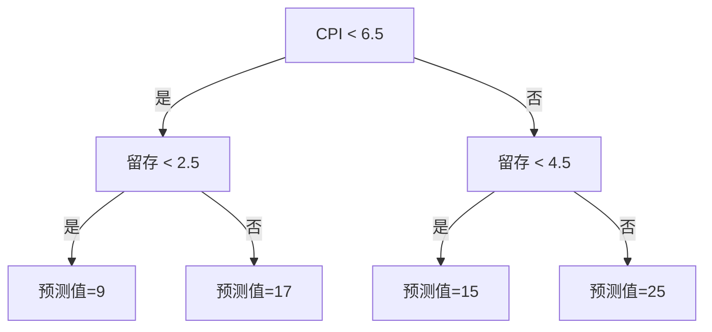
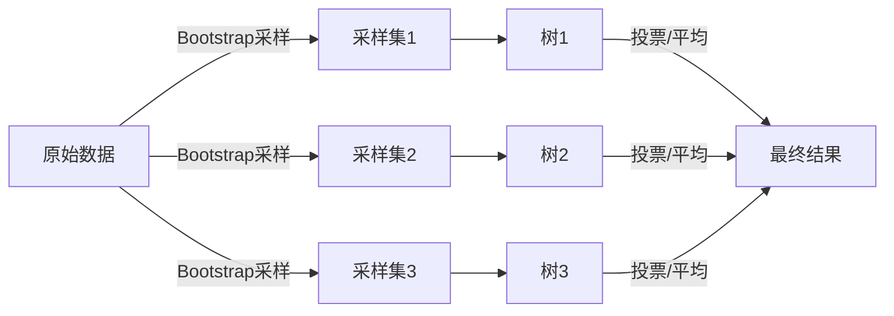

# 增长系数预测

> 记录最近遇到的一个业务问题及其解决方案

使用Boosting模型预测增长系数

问题：在之前判断一条计划能否回本的时候，通常依赖于使用幂函数模型拟合的长期ROAS的曲线，但是这会有一些问题，在数据较少的时候（只有3天7天的roas数据时），该拟合的误差较大，仅仅当数据量足够时（通常是30天甚至更长）时，才能比较好的拟合真实的长期ROAS变化。如果要等这个数据出来才制定相应的策略，那大概是不想在这一行干了（笑）。

因此我们要引入通过增长系数预判每天买入的用户的模型。

我们这里说的增长系数指的是，

举个例子，Day0-Day3的增长系数的值等于到Day3 ROAS的累计值 / Day0 Roas的累计值

这种方法没有什么很高深的理论，简单的来说，就是把当前的

那么这么多的指标我们要选取哪些指标来训练

系数 cpi 留存

为什么是这些指标

## 决策树基础

Boosting 和随机森林的基学习器都是决策树，所以先讲清楚单棵树是怎么工作的。

### 核心思路

决策树的思路很简单：**把特征空间反复切分成小块，每个块输出一个值**。

### 手动算例：预测用户贡献值

先准备一个简单的数据集，后面 Bagging 和 Boosting 的例子都基于它。

假设有 8 个用户，我们用两个特征预测他们的贡献值：

| 用户 | CPI(元) | 留存天数 | 贡献值 |
|------|---------|---------|--------|
| A | 3 | 2 | 10 |
| B | 4 | 3 | 14 |
| C | 5 | 1 | 8 |
| D | 6 | 4 | 20 |
| E | 7 | 2 | 12 |
| F | 8 | 5 | 26 |
| G | 9 | 3 | 18 |
| H | 10 | 4 | 24 |

**第一步：选哪个特征分裂？**

对 CPI 排序后尝试每个相邻中点的分割，计算分割后的 MSE 下降。

以 CPI < 6.5 为例（D 和 E 之间）：

```
左分支：A(3,10), B(4,14), C(5,8), D(6,20)
  → 均值 = (10+14+8+20)/4 = 13
  → MSE = [(10-13)² + (14-13)² + (8-13)² + (20-13)²] / 4 = (9+1+25+49)/4 = 21

右分支：E(7,12), F(8,26), G(9,18), H(10,24)
  → 均值 = (12+26+18+24)/4 = 20
  → MSE = [(12-20)² + (26-20)² + (18-20)² + (24-20)²] / 4 = (64+36+4+16)/4 = 30

总 MSE = (21 + 30) / 2 = 25.5
```

对留存天数做同样的计算，选出 MSE 下降最大的分割点。假设最终选 CPI < 6.5 为根节点，左分支再选留存天数分割：



**这就是一棵完整的决策树**。预测新用户时，沿着树走到叶子，叶子节点的均值就是预测值。

**Python 代码：**

```python
import numpy as np
from sklearn.tree import DecisionTreeRegressor, plot_tree
import matplotlib.pyplot as plt

# 数据
X = np.array([[3,2],[4,3],[5,1],[6,4],[7,2],[8,5],[9,3],[10,4]])
y = np.array([10,14,8,20,12,26,18,24])

# 训练单棵树（限制深度，方便可视化）
tree = DecisionTreeRegressor(max_depth=2)
tree.fit(X, y)

# 可视化
plot_tree(tree, feature_names=['CPI', '留存天数'], filled=True)
plt.show()

# 预测新用户
new_user = np.array([[5.5, 2.5]])  # CPI=5.5, 留存=2.5
print(f"预测贡献值: {tree.predict(new_user)[0]:.1f}")
```

每一层都选一个特征和一个分割点，把数据分成两组。选择的标准是让分组后两组内部的差异尽可能小——回归问题用**方差下降**，分类问题用**信息增益**或**基尼系数**。

### 树的特点

| 优点 | 缺点 |
|------|------|
| 可解释性强（规则直观） | 容易过拟合（完全生长的话） |
| 自动处理非线性关系 | 对数据扰动敏感（换几行数据树就变了） |
| 不需要特征归一化 | 输出不连续（跳跃的阶梯） |
| 天然处理混合类型特征 | 对加性关系表达较弱 |

### 过拟合与剪枝

树可以一直生长到每个叶子只有一个样本——这时训练误差为零，但泛化能力极差。解决方法是**剪枝**：生长一棵大树，然后从下往上合并叶子，用验证集或正则项（如 $\lambda \times |T|$）来平衡树的复杂度和拟合精度。

### 为什么一棵树不够

单棵树的局限性决定了它不是一个通用解法：
- 方差大：训练集的微小变化可能产生完全不同的树
- 精度天花板：不管怎么调参，单棵树的预测能力有限
- 不稳定：个别异常点能改变整个树结构

解决这些问题的思路就是**集成学习**——把多棵树组合起来，用群体的力量弥补个体的不足。

## Bagging：并行组合树

### 核心思想

Bagging（Bootstrap Aggregating）是最直接的集成方法：**用随机采样训练多棵树，然后投票或取平均**。



Bootstrap 采样是指从数据集中有放回地抽取同样大小的子集——每次大约有 63% 的数据被抽到，剩下 37% 作为"包外样本"用来做验证。

### 手动算例

用同样的用户数据集，训练 3 棵 Bagging 树。

**第 1 棵树的训练集**（Bootstrap 采样）：

| 用户 | CPI | 留存 |
|------|-----|------|
| A | 3 | 2 |
| A | 3 | 2 |
| C | 5 | 1 |
| E | 7 | 2 |
| F | 8 | 5 |
| F | 8 | 5 |
| G | 9 | 3 |
| H | 10 | 4 |

A 和 F 被抽到两次，B 和 D 没被抽到。用这个子集训练一棵树（假设结果如下）：

```
树 1:
  CPI < 6.5 → 留存 < 2.5 → 预测 9
  CPI < 6.5 → 留存 ≥ 2.5 → 预测 17
  CPI ≥ 6.5 → 留存 < 4.5 → 预测 15
  CPI ≥ 6.5 → 留存 ≥ 4.5 → 预测 25
```

**第 2 棵树的训练集**（另一个 Bootstrap）：

| 用户 | CPI | 留存 |
|------|-----|------|
| B | 4 | 3 |
| C | 5 | 1 |
| D | 6 | 4 |
| D | 6 | 4 |
| E | 7 | 2 |
| G | 9 | 3 |
| G | 9 | 3 |
| H | 10 | 4 |

```
树 2:
  CPI < 5.5 → 留存 < 2 → 预测 8
  CPI < 5.5 → 留存 ≥ 2 → 预测 14
  CPI ≥ 5.5 → 留存 < 3.5 → 预测 16
  CPI ≥ 5.5 → 留存 ≥ 3.5 → 预测 23
```

**第 3 棵树的训练集**：

| 用户 | CPI | 留存 |
|------|-----|------|
| A | 3 | 2 |
| C | 5 | 1 |
| D | 6 | 4 |
| E | 7 | 2 |
| F | 8 | 5 |
| H | 10 | 4 |
| H | 10 | 4 |

```
树 3:
  CPI < 4 → 预测 10
  CPI 4~7 → 留存 < 2 → 预测 10
  CPI 4~7 → 留存 ≥ 2 → 预测 17
  CPI ≥ 7 → 留存 < 4.5 → 预测 15
  CPI ≥ 7 → 留存 ≥ 4.5 → 预测 25
```

**预测一个新用户**（CPI=5.5, 留存=2.5）：

| 树 | 路径 | 预测值 |
|----|------|--------|
| 树 1 | CPI<6.5 → 留存≥2.5 | 17 |
| 树 2 | CPI≥5.5 → 留存<3.5 | 16 |
| 树 3 | CPI 4~7 → 留存≥2 | 17 |
| **平均** | | **16.7** |

单棵树可能过拟合或偏激，但 3 棵树平均后，预测更稳定。

**Python 代码：**

```python
from sklearn.ensemble import BaggingRegressor
from sklearn.tree import DecisionTreeRegressor

# 数据
X = np.array([[3,2],[4,3],[5,1],[6,4],[7,2],[8,5],[9,3],[10,4]])
y = np.array([10,14,8,20,12,26,18,24])

# Bagging：10 棵树，每棵深度 3
bag = BaggingRegressor(
    estimator=DecisionTreeRegressor(max_depth=3),
    n_estimators=10,
    random_state=42
)
bag.fit(X, y)

# 预测
print(f"Bagging 预测: {bag.predict([[5.5, 2.5]])[0]:.1f}")

# 查看每棵树的预测
for i, tree in enumerate(bag.estimators_):
    pred = tree.predict([[5.5, 2.5]])[0]
    print(f"  树 {i+1}: {pred:.1f}")
```

### 为什么 Bagging 有效

单棵树的预测可以分解为：

$$
\text{误差} = \text{偏差} + \text{方差}
$$

Bagging 不改变偏差（每棵树的偏差一样），但它能**降低方差**。如果 $n$ 棵树的预测是独立同分布的，平均后的方差是单棵树方差的 $1/n$。

实际中树之间不完全独立（因为数据来自同一分布），方差降低的效果没有理论值好，但仍然显著。

### 随机森林：Bagging + 随机特征

随机森林在 Bagging 的基础上加了一个关键改进：**每棵树在分裂时只随机选取一部分特征作为候选**。

```text
Bagging:      每棵树用不同的数据 + 全部特征
随机森林:     每棵树用不同的数据 + 随机选取的部分特征
```

"随机选特征"这个看似微小的改动，效果却很大——它让树之间的相关性进一步降低，方差降得更低。这就是为什么随机森林通常比纯 Bagging 效果好。

### Bagging 树的缺点

Bagging 树（包括随机森林）的局限性在于**每棵树都是独立训练的，没有针对性**。如果数据中存在某些"难例"，没有机制让后面的树去重点关注它们。

这就引出了 Boosting——**串行地训练树，每棵新树都去补上一棵的短板**。

## Boosting 模型基础理论

### 集成学习的思想

单个模型的预测能力有限。Boosting 的核心思路是：**把一堆弱模型组合成一个强模型**。

"弱模型"指的是比随机好一点点的模型——最简单的就是决策树桩（只有一层分叉的决策树）。单个决策树桩很容易欠拟合，但把它们串起来效果就很不一样。

### Boosting 怎么做

和 Bagging 并行训练多棵树不同，Boosting 是**串行**的：


每一轮新树都更关注上一轮预测错的样本。几轮迭代后，模型会越来越擅长处理"难例"。

### 手动算例：拟合残差

同样用用户贡献值数据集，演示 3 轮 Boosting。

**初始状态**：先用均值作为第 0 轮预测。

```
第 0 轮预测值 = 均值 = (10+14+8+20+12+26+18+24)/8 = 16.5
残差 = 真实值 - 预测值
```

| 用户 | 真实值 | 预测值 | 残差 |
|------|--------|--------|------|
| A | 10 | 16.5 | -6.5 |
| B | 14 | 16.5 | -2.5 |
| C | 8 | 16.5 | -8.5 |
| D | 20 | 16.5 | 3.5 |
| E | 12 | 16.5 | -4.5 |
| F | 26 | 16.5 | 9.5 |
| G | 18 | 16.5 | 1.5 |
| H | 24 | 16.5 | 7.5 |

**第 1 轮**：用 CPI 和留存天数为特征，**拟合残差**。训练一棵浅树预测残差。

假设学到的树是：

```
树 1（预测残差）:
  CPI < 6.5 → 留存 < 2.5 → 预测残差 -7.5
  CPI < 6.5 → 留存 ≥ 2.5 → 预测残差 3
  CPI ≥ 6.5 → 留存 < 4.5 → 预测残差 -3
  CPI ≥ 6.5 → 留存 ≥ 4.5 → 预测残差 8.5
```

更新预测（学习率 η=0.5）：

```
新预测 = 旧预测 + 0.5 × 树1预测
```

| 用户 | 旧预测 | 树1预测残差 | 新预测 | 新残差 |
|------|--------|------------|--------|--------|
| A | 16.5 | -7.5 | 16.5+0.5×(-7.5)=**12.75** | -2.75 |
| B | 16.5 | 3 | 16.5+0.5×3=**18** | -4 |
| C | 16.5 | -7.5 | **12.75** | -4.75 |
| D | 16.5 | 3 | **18** | 2 |
| E | 16.5 | -3 | **15** | -3 |
| F | 16.5 | 8.5 | **20.75** | 5.25 |
| G | 16.5 | -3 | **15** | 3 |
| H | 16.5 | 8.5 | **20.75** | 3.25 |

第 0 轮的 MSE = 35.75，第 1 轮后 MSE = 13.2——误差下降了一半多。

**第 2 轮**：用同样的方法拟合第 1 轮的新残差，得到树 2。依此类推。

```
最终预测 = 均值 + 0.5 × 树1预测 + 0.5 × 树2预测 + 0.5 × 树3预测 + ...
```

这就是 Boosting 的精髓：**每棵树都在修正前面所有树的集体错误**。

**Python 代码：**

```python
from sklearn.ensemble import GradientBoostingRegressor

# 数据
X = np.array([[3,2],[4,3],[5,1],[6,4],[7,2],[8,5],[9,3],[10,4]])
y = np.array([10,14,8,20,12,26,18,24])

# GBDT：步进式拟合残差
gbdt = GradientBoostingRegressor(
    n_estimators=10,       # 10 棵树
    max_depth=2,           # 每棵浅树
    learning_rate=0.5,     # 学习率
    random_state=42
)
gbdt.fit(X, y)

# 预测
print(f"GBDT 预测: {gbdt.predict([[5.5, 2.5]])[0]:.1f}")

# 查看每棵树在做什么（训练过程）
for i, preds in enumerate(gbdt.staged_predict(X)):
    mse = ((preds - y) ** 2).mean()
    if i < 3 or i == 9:
        print(f"  第 {i+1} 棵树后 MSE: {mse:.2f}")
```

### 和传统回归的区别

| | 幂函数拟合 | Boosting |
|------|-----------|----------|
| 输入 | 只有时间维度 | 多特征（cpi、留存等） |
| 关系假设 | 固定函数形式 y = a·x^b | 无假设，数据驱动 |
| 数据量要求 | 少时误差大 | 少量数据也能训练 |
| 可解释性 | 参数 a、b 有物理意义 | 特征重要性排序 |

对这个业务场景最关键的区别是：幂函数只能告诉你"时间 x 天时的 ROAS"，而 Boosting 能告诉你"给定 cpi=X、留存=Y 的用户，第 x 天时的 ROAS"——因为它在训练时看到了更多维度的信息。

### 常见实现

| 库 | 特点 |
|------|------|
| XGBoost | 最经典，工业界验证最多 |
| LightGBM | 训练更快，内存更省，叶子节点生长策略不同 |
| CatBoost | 对类别特征处理友好，开箱即用 |

对于广告增长系数预测这种**表格数据 + 特征数量适中**的场景，三者都能用。选哪个主要看数据量和特征类型。

### 为什么 Boosting 适合这个问题

1. **特征异质性**：cpi 是连续值，素材类型是类别值，平台是枚举值——Boosting 天然处理各类特征
2. **非线性关系**：留存和 ROAS 之间不是线性关系，树模型可以自动捕获
3. **可解释性**：能输出"哪个特征对增长系数影响最大"，方便业务决策
4. **容错性**：个别异常值不会炸掉整个模型

## 曲线拟合预测与Boosting模型的


> 其实效果并不好


