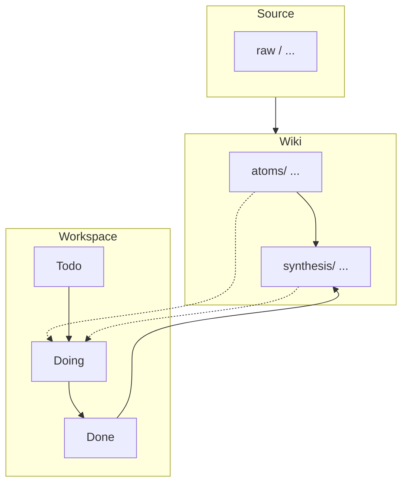

# oh-my-wiki： AI个人知识库实践

> Oh-my-wiki 是一场将个人知识库“代码化“的实验：通过 Agent 将原始资料自动编译为持续增量的结构化共识，让 AI 负责繁琐的维护，人类专注深度的创作。
> oh-my-wiki 不是一堆随意躺在硬盘中的文件夹和文件的集合，而是一个有源码、有构建产物、有检查，有合并策略的文档工程。

## 写在前面的话

传统的RAG知识库，与浏览器中的搜索引擎本质上是一类东西，它们都遵循“提出问题——基于某种规则匹配——召回相关内容”的逻辑，区别在于搜索引擎依赖倒排索引和关键词排序，RAG 则依赖向量嵌入和语义召回。它们的技术实现不同，但核心目标都是一致的：从已有的信息中找到理论上与你查询的内容最相关的信息。

这种检索方式无疑是高效的，它能够帮助你在浩如烟海的资料中快速定位到你需要的内容，但是它也有一个明显的问题：它仅仅服务于本次任务，而无法将本次任务的经验积累下来。当任务结束后，下一次面对类似问题时，你往往需要重新检索、重新筛选，并重新建立起信息之间的联系。就像浏览器中临时打开的一组标签页——它们在当下支撑着你的思考，但当问题解决、页面关闭之后，你或许完成了任务，却未必留下能够支撑下一次解决类似问题的知识。

如果说检索系统解决的是“如何快速获取信息”，那么个人知识库真正要解决的，则是“如何让知识沉淀下来，并在未来持续发挥作用”。

我理解的个人知识库，不是一个涵盖各个领域知识的巨型图书馆，也不是一个单纯堆积各种资料的仓库，它里面存放的是那些经过自己审查、理解、验证，并真正掌握的知识。个人知识库的价值，不在于收录了多少内容，而在于是否能够从中发现联系，建立独特的知识结构与解释体系。更重要的是，它不是一成不变的，认识过程本身具有反复性和无限性，个人知识库作为个人认知的外化载体也是不断演化的——通过写作、表达、实践与反思，将新的洞察重新沉淀回系统之中，形成输入、理解、连接、创造、再沉淀的循环。

从这个角度来看，个人知识库不是一堆静态文件的集合，而是一个需要长期维护，持续演进的复杂系统。当系统尚小，只有几十篇文档的时候，即使是手动维护也足够高效。但是随着笔记的增多，问题也会逐步显露出来：旧观点需要修订，新知识需要融入既有结构，不同阶段形成的理解彼此冲突，知识之间的关联不断增加。此时，维护成本会飞速上升，直到失控。

这并不是知识管理独有的问题，软件行业曾经历过几乎完全相同的阶段：在程序规模较小时，个人经验与临时方法足以支撑开发；但当系统复杂度提升，代码规模扩张，缺陷失控、维护困难、交付延期等问题集中爆发，最终形成了20世纪60年代著名的“软件危机”。软件工程的出现，本质上并不是为了让程序员写得更快，而是为了治理复杂性——通过流程、规范、版本控制与自动化工具，使系统能够在持续演化中保持可维护性。

oh-my-wiki正是为了应对这些问题而诞生的，它并不是一个快速检索的工具，而是一套将知识管理工程化的实践框架。它通过明确分层、职责边界、增量更新机制，把“知识沉淀”变成可维护流程。换句话说，它借鉴的并不是某种具体的软件工具，而是软件工程中治理复杂系统的方法论。

值得一提的是，oh-my-wiki与RAG知识库并不是对立的，当个人知识库规模较小时，结构化组织本身就足以支持我们快速查阅，但随着知识节点不断增长，单纯依靠人工导航或层级目录的效率会逐渐下降。这时，RAG技术或搜索式的能力就会成为必要补充。前者负责组织与演化知识，后者负责高效访问知识，它们并非替代关系，而是处于不同层次的协同能力。

最后，这套方法本身也并非凭空产生。它在一定程度上借鉴了 Andrej Karpathy 提出的 llm-wiki 思路，并结合个人实践进行了调整与延展，因此仍处于持续完善的过程中。它所形成的，不过是关于如何构建能够长期演化的个人知识库的一种回答，而非唯一答案。比起寻找一套放之四海而皆准的方法，更重要的是在实践中不断调整、重构，并最终形成适合自己的知识结构。

## “知识”应该如何管理？

在介绍oh-my-wiki的结构之前，我先抛出一个问题：“‘知识’应该如何管理？”

最常用的方法是按照领域进行分类：历史、政治、经济、哲学、技术……这样的划分看起来十分合理，也符合直觉。但当知识逐渐变多之后，这种方式的问题会慢慢显现出来——很多内容其实很难被放进某一个单一的分类里。因为这些“领域”，本身就不是彼此独立的。比如，一个与政治相关的话题，往往同时涉及历史背景与经济结构；而一个商业案例，既包含技术实现，也离不开组织方式，甚至还会牵涉到人的行为与心理。

或许在一开始你还会仔细分析如何分类，但慢慢的你就开始随便放，再后来，你干脆就不再整理。这时，整个知识库又变成了开头所说的“一堆随意躺在硬盘中的文件夹和文件的集合”。

为了解决这个问题，在oh-my-wiki中，我考虑的不是这篇笔记应该属于哪个领域，而是考虑这篇笔记处于什么状态。让我们先来看看oh-my-wiki的结构：

```
oh-my-wiki/
│
├── raw/                          # 原始资料（只读）
│   ├── articles/                 # 通用文章（博客、公众号、网页）
│   ├── papers/                   # 学术论文
│   ├── videos/                   # 视频内容
│   ├── podcasts/                 # 播客文稿
│   ├── books/                    # 书籍笔记
│   ├── social/                   # 社交媒体（Twitter/X、微博等）
│   └── manifest.json             # 文件状态索引
│   # 注：可自由添加新子目录，Agent 会自动发现
│
├── wiki/                         # 知识库（Agent 维护）
│   ├── atoms/                    # 原子知识（稳定）
│   │   ├── concepts/             # 概念定义
│   │   ├── entities/             # 实体信息
│   │   └── data/                 # 数据/引用
│   │
│   ├── synthesis/                # 综合知识（活跃）
│   │   ├── insights/             # 个人洞察
│   │   └── howto/                # 方法指南
│   │
│   ├── index.md                  # 内容索引
│   ├── log.md                    # 操作日志
│   └── graph.json                # 知识关系图谱
│
├── workspace/                    # 个人创作
│   ├── Todo/                     # 待办
│   ├── Doing/                    # 进行中
│   └── Done/                     # 已完成 → 流入 wiki
│
└── Agent.md                      # Agent 工作流配置
```

上面这个目录看起来有点复杂，我们一层一层的来看。首先整个系统被拆成了三个部分：**raw、wiki 和 workspace**。

```
oh-my-wiki/
│
├── raw/                          # 原始资料（只读）
├── wiki/                         # 知识库（Agent 维护）
├── workspace/                    # 个人创作
└── Agent.md                      # Agent 工作流配置
```

其中：
1. raw 是入口，用来存放原始资料。 
2. wiki 是中间层，由 Agent 负责整理与结构化。  
3. workspace 是使用者的创作空间，用来思考、写作和修改。

当我们继续向下拆解，这三层具备不同的内部结构：

---

**raw/** 目录作为整个系统的输入层，我希望它能够尽可能降低信息进入系统的成本，避免在收录新内容时花费大量精力去思考分类边界。因此，这里并不按照领域进行划分，而是基于**事实来源**进行分类。相较于领域，事实来源天然具有原子性，也更符合直觉。

---

**wiki/** 由 Agent 进行维护，负责处理整理与结构化raw目录这样的“脏活”。它可以被拆分为两个部分：

一个是相对稳固、几乎不被修改的 **atoms 层**。这一层完全由 Agent 维护，从 raw 中的内容中提取 concept、entity 等原子信息，它们共同构建起整个知识库的地基，本质上是一层结构化的资料库。

另一个是相对活跃的 **synthesis 层**。它主要承接来自 workspace 的内容，也就是你的个人创作。由于认知过程本身具有反复性，一些在当下看似成熟的内容，在未来未必依然成立。因此，一篇进入 synthesis 的文章，并不是终点——当你对其不再满意时，可以将其重新取回 workspace，修改后再流回 synthesis 层。在这一层中，insights 和 howto 分别对应两个维度：前者是“怎么想”，后者是“怎么做”。或者往大了一点说，它们分别代表了“世界观”和“方法论”。

---

**workspace/** 层按照时间维度进行拆分为 Todo、Doing 和 Done。

这样的划分逻辑与 raw 类似——它同样依赖一种具有“原子性”的维度：时间状态。一篇文章不可能同时既属于“已完成”，又属于“正在进行”，因此这种划分方式在规模增长时依然能够保持稳定。

其中，Done 实际上扮演着一个“缓冲区”的角色：已完成的内容不会立即进入 wiki，而是先停留在这里，等待最后的审视，再决定是否流入知识库。

---

整个过程可以用下面这张数据流图来表示：


值得注意的是，构建个人知识库的过程，本质上是一种数据驱动的过程。因此，raw 目录中的内容，应当是经过你主观判断、具备一定价值的资料。此外，workspace是交由你自由创作的空间，除了在你明确要求的情况下，agent在其他任何时候都不该侵入该空间。

最后，在这套流程下，最后进入wiki/synthesis/这里面的东西就是你积累下来的宝贵的知识财富。

## 人与 Agent 的责任边界

当我们把结构理清楚之后，一个更关键的问题自然会浮现出来：在这个系统中，人和 Agent 分别扮演着怎样的角色？

如果这个问题没有搞清楚，要么人承担了过多的维护任务，又走回了传统笔记的老路；要么过度依赖 AI，就会得到一个看似井然有序，细究不知所云的知识库。因此，oh-my-wiki 并没有试图将一切交给Agent，反而严格限制了其职责范围。在这里，人和 Agent 的分工可以用一句很简单的话来概括：Agent 负责处理结构，人负责赋予意义。

raw、wiki 和 workspace 这三层结构，本质上也是这条边界的展开。raw 是输入，它保持只读，因为原始资料一旦被修改，就失去了作为“来源”的意义。wiki 是中间层，由 Agent 负责维护，因为结构化、关联和一致性这些工作，既繁琐又适合自动化。在这一层里，atoms 层是地基，由 Agent 完整生成，synthesis 层则是你理解世界的空间，可以被你修改、推翻或扩展。而 workspace，则是使用者的“自留地”。这一层的特殊之处在于，它是“思考正在发生的地方”。你在这里写下的内容，可能是混乱的、零碎的，甚至是自相矛盾的，但是这些都没有关系，它们构成了认知演化的过程本身。正因为如此，Agent 在这一层被严格限制：它可以读取，可以理解，可以在对话中提出建议，但不会直接改动你的文字。这样的约束看起来有些“保守”，但它实际上是在保护一件更重要的东西——你对自己思考过程的掌控。

在这样的分工之下，人和 Agent 的关系并不是替代，而是协作。你不需要再花精力去维护结构的完整性，也不需要担心知识之间的连接是否遗漏，这些都会被Agent自动处理。而你所需要做的，只是专注于那些真正无法被外包的部分：理解某件事，表达某个想法，发现某个关系。

这也是这套系统试图达成的一个平衡——它既希望借助 AI 降低复杂度，又不希望因此削弱人的认知能力。最终留下来的，不是一套被自动整理好的资料，而是一套在不断变化中仍然属于你的知识结构。

## 结语

最后的最后，最近一段时间我在网上刷到了很多介绍llm-wiki的视频，有的在介绍实践经验，有的在探索更完善的方法体系。于此同时，在评论区往往会出现很多质疑的声音：“这种方式不利于检索”“大模型产生的内容不可靠”。诚然，这些问题是客观存在的，但在这里我想说的是，***对于个人知识库而言，真正核心的问题从来不是你使用什么工具，而是你对待知识的态度。***

如果你对进入知识库的内容没有基本的审慎与敬畏，只是把完全不经自己思考判断的内容扔进去，也从来不回顾、不检查、不更新，有一种“收藏了”等于“掌握了”的错觉，如果你把大模型生成的内容直接视作真理，不假思索的采纳并丢回知识库中，那你得到的将不是一个与你一起成长的知识库，而是一个徒有其表的垃圾堆。