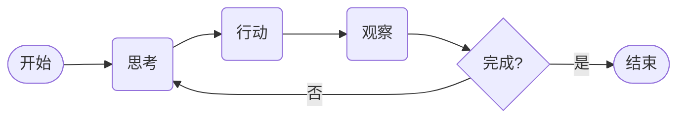
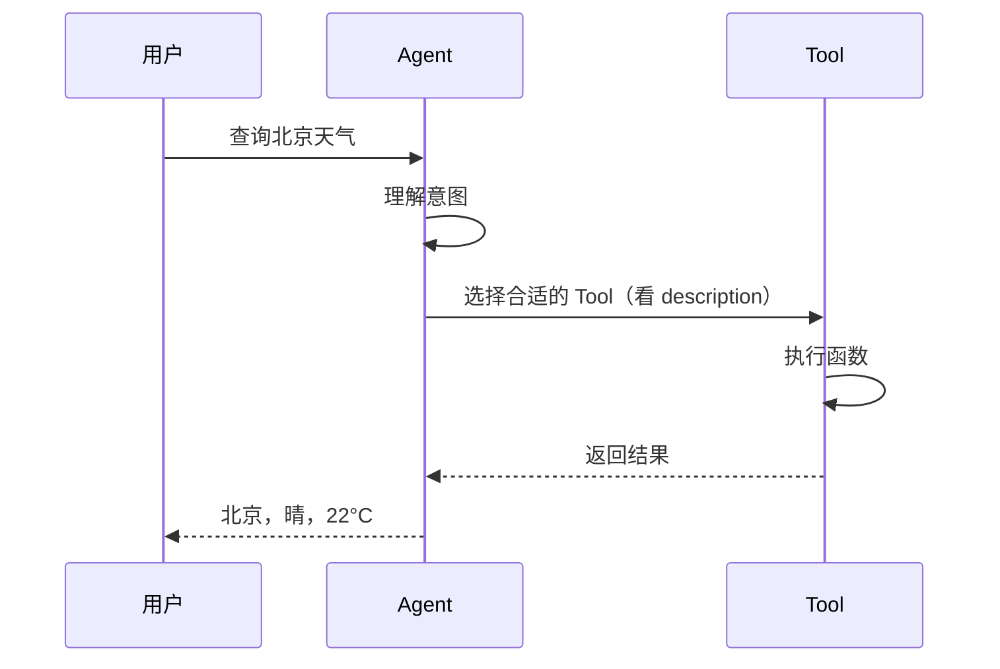
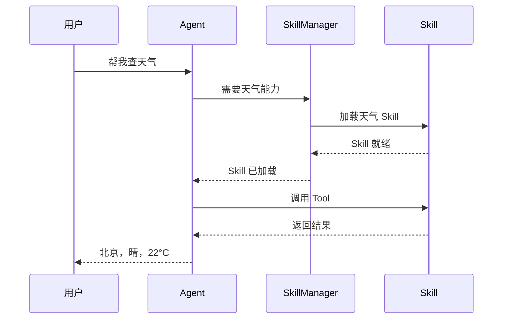
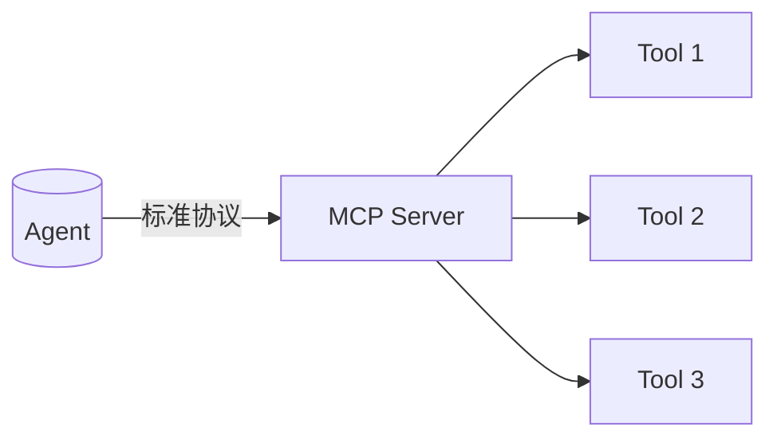
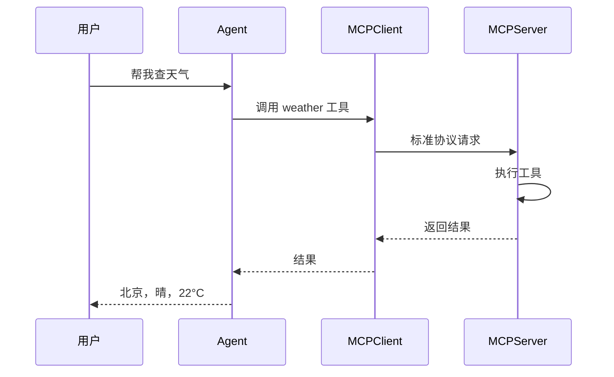
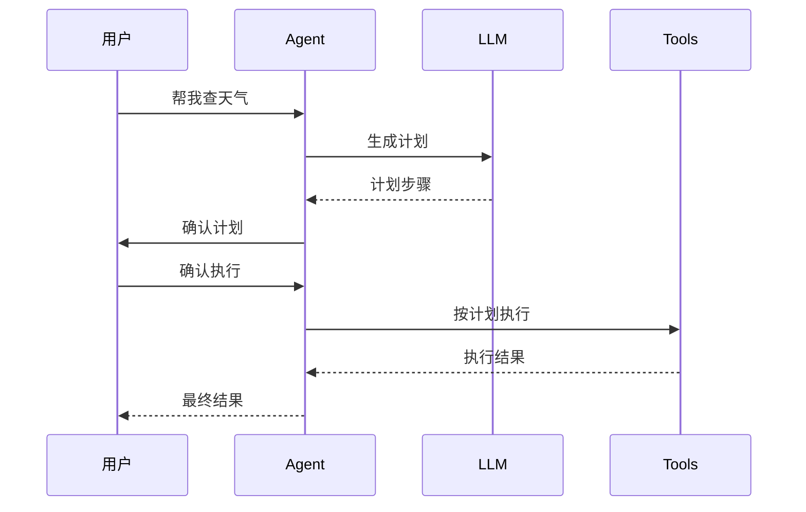

# 一文彻底搞懂 Agent

> 从 LLM 到 Agent，理解 Agent 的本质

---

## 1. 从 Chat 到 Agent

### 你用的 Chat 服务是什么？

打开 ChatGPT、Deepseek、Kimi 网页版——你会看到一个对话界面。
你随意发点内容给它，它生成一句回复。你们之间是**一对一问答**。LLM 输出的是**更聪明的文本（大多数时候是看上去更聪明）**，但它不帮你做任何事：你让它帮你写份稿子，等它回复后你还需要自己将这些内容粘贴到word里面。

>NOTE!
>
>严格的来说，这个例子并不恰当，当下各家的网页版同样拥有了联网搜索、上下文管理和跨对话长期记忆等能力，这些chat服务事实上已经是一个个弱化版的Agent。但话又说回来，它们能做的事情依然是有限的。

### Agent 它不一样！

仍然是那个经典的比喻，LLM是大脑，Agent就是给这个大脑配上躯壳。让它既能思考，又能做事。

|     | Chat 服务 | Agent |
| --- | ------- | ----- |
| 交互  | 你问我答    | 自主执行  |
| 能力  | 仅生成文本   | 调用工具  |
| 状态  | 每次独立    | 有记忆   |
| 目标  | 回答问题    | 完成任务  |

---

## 2. 举个例子

**场景**：你分别让 Chat 和 Agent 帮你"查北京天气"。

### Chat 的做法

```
You：查北京天气
Chat：好的，北京今天晴，20°C
```

在没有接入任何工具的情况下，你和LLM对话，它并不能回答你准确的天气情况，因为它的训练数据中并没有最新的天气情况，它只会根据概率推理一个答案给你。当然你在现在各家的chat服务上提问，你大概率能得到正确答案，因为它通过搜索相关实时展示天气情况的网页，得到了真实的天气情况。这也就是为什么前面说这些提供服务的chat产品应该算作一个弱化版的Agent。


### Agent 的做法

```
You：帮我查北京天气

Agent 思考：我需要调用天气工具
Agent 调用天气工具 → 获取数据
Agent 返回：北京今天晴，20°C

如果你的问题是"提醒我带伞"呢？

Agent 调用天气工具 → 发现下雨
Agent 调用日历工具 → 设置提醒 → 执行 → 告诉你已设置提醒
```

Agent 帮你**做了实事**，而不只是回答。

---

## 4. ReAct 模式

### 什么是 ReAct

ReAct = **Re**ason and **Act**

意思就是**想一步，做一步**。让我们看看下面这个流程图，



**核心**：Thought → Action → Observation → 循环

### 举个例子

```
Thought: 用户问天气，我需要调用天气工具
Action: call_weather(city="北京")
Observation: 北京，多云，22°C

Thought: 不下雨，不需要提醒带伞
Action: 直接回答用户
Observation: （结束）
```

再复杂一点：

```
Thought: 用户让我查天气然后设置提醒
Action: call_weather(city="北京")
Observation: 北京，小雨，16°C

Thought: 下雨了！需要提醒带伞
Action: call_reminder(content="带伞", time="明早7点")
Observation: 提醒已设置

Thought: 任务完成
Action: 返回结果给用户
Observation: （结束）
```

**关键**：让 LLM 的推理过程**可见**。

### 为什么需要 ReAct

1. **可追溯** —— 能看到 LLM 是怎么想的
2. **可干预** —— 发现想错了可以打断
3. **可修正** —— 根据观察结果调整下一步
4. **更像人** —— 人也是边想边做

### ReAct 的Prompt写法

```python
prompts = """你是一个 ReAct Agent。

按以下格式输出：

Thought: 你当前的想法
Action: 你要调用的工具
Observation: 工具返回的结果

开始吧！

用户问题：{input}
"""
```

本质是把"思考过程"显式化了。

---

## Prompt 设计实战

### 系统提示词

```xml
<system>
你是 ReAct Agent，负责根据用户问题进行推理和行动。
</system>
```

### 可用工具

```xml
<tools>
<tool name="get_weather">
    <description>查询城市天气，当用户问天气时使用</description>
</tool>
<tool name="calculator">
    <description>计算数学表达式</description>
</tool>
<tool name="echo">
    <description>简单回复用户</description>
</tool>
</tools>
```

### 输出格式

```xml
<reasoning>
分析用户问题，思考下一步应该做什么
</reasoning>

<action>
<tool_name>工具名</tool_name>
<param>参数</param>
</action>
```

### 用户问题示例

```xml
<query>
今天北京天气怎么样？
</query>
```

### Agent 响应示例

```xml
<reasoning>
用户问北京天气，我需要调用天气工具查询
</reasoning>

<action>
<tool_name>get_weather</tool_name>
<param>city="北京"</param>
</action>
```

### 执行结果

```xml
<observation>
北京，晴，22°C
</observation>
```

### 多轮对话示例

```xml
<reasoning>
用户问天气，我需要调用天气工具查询
</reasoning>

<action>
<tool_name>get_weather</tool_name>
<param>city="北京"</param>
</action>

<observation>
北京，晴，22°C
</observation>

<reasoning>
天气晴，不需要提醒带伞，可以直接回答用户
</reasoning>

<action>
<tool_name>echo</tool_name>
<param>北京今天天气晴，22°C，适合外出</param>
</action>
```

### 完整 Prompt 模板

```python
REACT_PROMPT = """
<system>
你是 ReAct Agent，按以下格式输出：
</system>

<reasoning>
你的推理过程
</reasoning>

<action>
<tool_name>工具名</tool_name>
<param>参数</param>
</action>

可用工具：
{tools}

用户问题：{query}
"""
```

---

## 5. Tools 工具

### 什么是 Tools

Tools = Agent 的**手**。

LLM 是"大脑"，Tools 是"手"——能帮 Agent 做实事。

### 一个 Tool 的结构

```python
class Tool:
    name: str        # 名字
    description: str # 描述（让 LLM 知道什么时候用）
    function: callable  # 实际执行的函数
```

Agent 看到 description，就知道什么时候该调用这个 Tool。

### 定义一个天气 Tool

```python
def get_weather(city: str) -> str:
    """查询城市天气"""
    # 实际调用天气 API
    return f"{city}，晴，22°C"

weather_tool = Tool(
    name="get_weather",
    description="当用户问天气时使用",
    function=get_weather
)
```

### Agent 怎么选 Tool

Agent 不是乱选，而是**根据描述判断**：

```
用户：今天北京热吗？
LLM：看到问题包含"天气"，调用 get_weather
```

这就是为什么 **description 很重要**——它是 LLM 选工具的依据。

### 使用时序



### 设计好 Tool 的原则

| 原则 | 说明 |
|------|------|
| **可发现** | description 描述清楚 |
| **可验证** | 返回值明确 |
| **单一职责** | 一个 Tool 只做一件事 |
| **幂等** | 重复调用结果一样 |

---

## 6. Skills 技能

### 什么是 Skills

Skill = **一组 Tools 的封装**。

一个 Skill 可以包含多个 Tool，是更大颗粒的能力单位。

### 举个例子

「天气」Skill：
```python
weather_skill = Skill(
    name="天气查询",
    tools=[get_weather, set_reminder]
)
```

「搜索」Skill：
```python
search_skill = Skill(
    name="搜索",
    tools=[web_search, news_search, image_search]
)
```

### 为什么要 Skill

| 好处 | 说明 |
|------|------|
| **按需加载** | 不用把所有工具都塞进上下文 |
| **解耦** | 能力独立，易维护 |
| **复用** | 不同 Agent 可以用同一个 Skill |

### 怎么做

Agent 不需要 100 个 Tool，只需要告诉他：
```
你需要天气能力 → 加载天气 Skill
```

按需加载，而不是全量加载。

### 使用时序



---

## 7. MCP 协议

### 什么是 MCP

MCP = **Model Context Protocol**，模型上下文协议。

标准化的**工具调用接口**，让任何 Agent 都能调用外部服务。

### 一句话解释

```
之前的做法：每个服务单独写一个 SDK
MCP：统一接口，一个协议调用所有服务
```

### MCP 结构



### 一个 MCP 例子

```python
# MCP Server 定义
class MCPServer:
    def __init__(self):
        self.tools = {}
    
    def add_tool(self, name, func):
        self.tools[name] = func
    
    def call(self, name, args):
        return self.tools[name](args)

# 注册工具
server = MCPServer()
server.add_tool("weather", get_weather)

# Agent 调用
result = server.call("weather", {"city": "北京"})
```

### 为什么要 MCP

1. **标准化** —— 不用每次都写适配器
2. **通用** —— 一个 Agent 可以调用任何 MCP 服务
3. **扩展性** —— 加新服务不用改 Agent 代码

### MCP 之前的对比

| 方式 | 缺点 |
|------|------|
| 直接写 SDK | 每家 API 不同，代码冗余 |
| MCP | 统一协议，一次适配 |

### 使用时序



---

## 8. Plan-Execute 模式

### 什么是 Plan-Execute

**先计划，再执行**。

和 ReAct 的"边想边做"不同，Plan-Execute 是先想清楚再动手。

### 使用时序



### 什么时候用

| 模式 | 做法 |
|------|------|
| ReAct | 边想边做 |
| Plan-Execute | 想完再做 |

### 什么时候用

- **任务明确** —— 流程固定
- **不能出错** —— 需要先确认步骤
- **需要审批** —— 先给人看一下计划

### 代码示例

```python
class PlanExecuteAgent:
    def run(self, task):
        # 1. 先计划
        plan = self.make_plan(task)
        
        # 2. 给用户确认（可选）
        # user_confirm(plan)
        
        # 3. 执行计划
        result = self.execute(plan)
        
        return result
    
    def make_plan(self, task):
        # LLM 生成计划
        return [
            {"step": 1, "action": "查天气"},
            {"step": 2, "action": "设置提醒"}
        ]
    
    def execute(self, plan):
        # 按步骤执行
        results = []
        for step in plan:
            results.append(self.run_tool(step))
        return results
```

### 优缺点

| 优点 | 缺点 |
|------|------|
| 可控 | 灵活性差 |
| 可审批 | 计划可能过时 |
