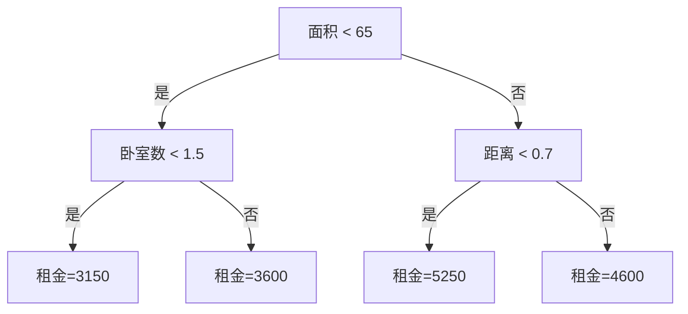
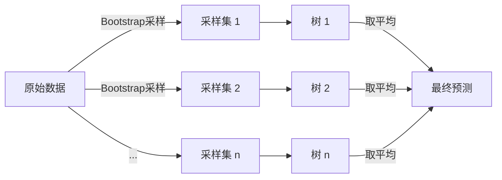
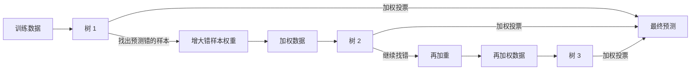
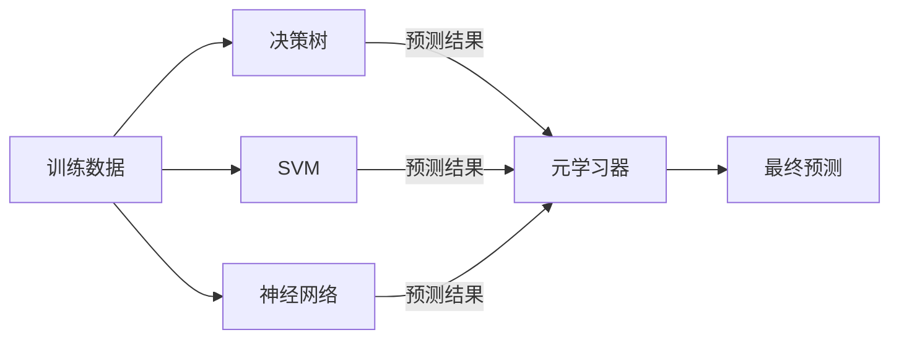
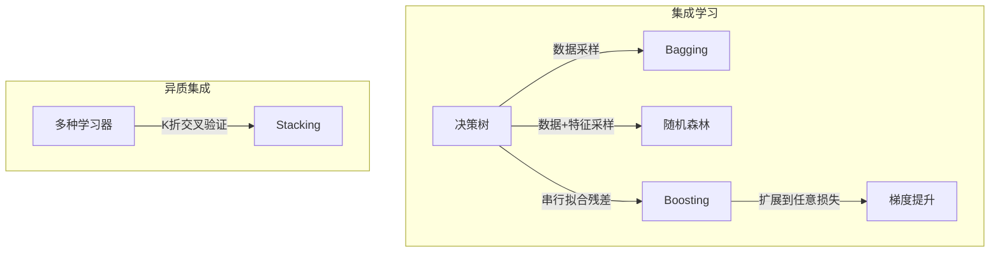

# 决策树与集成学习：从 Bagging 到梯度提升

- [准备工作：一个数据集贯穿全文](#准备工作一个数据集贯穿全文)
- [决策树](#决策树)
- [集成学习的思想](#集成学习的思想)
- [Bagging](#bagging)
- [随机森林](#随机森林)
- [Boosting](#boosting)
- [梯度提升（GBDT）](#梯度提升gbdt)
- [Stacking](#stacking)
- [总结对比](#总结对比)

## 准备工作：一个数据集贯穿全文

后面所有例子都基于同一个问题——预测公寓租金。

| 面积(m²) | 卧室数 | 距离地铁站(km) | 月租金(元) |
|---------|--------|--------------|-----------|
| 30 | 1 | 0.3 | 2800 |
| 45 | 1 | 0.5 | 3500 |
| 50 | 2 | 1.0 | 3200 |
| 60 | 2 | 0.2 | 4500 |
| 70 | 2 | 0.8 | 4000 |
| 75 | 3 | 1.5 | 4200 |
| 85 | 3 | 0.4 | 5500 |
| 90 | 3 | 1.2 | 5200 |
| 100 | 3 | 0.6 | 6000 |
| 110 | 4 | 2.0 | 5800 |

```python
import numpy as np

X = np.array([
    [30, 1, 0.3],
    [45, 1, 0.5],
    [50, 2, 1.0],
    [60, 2, 0.2],
    [70, 2, 0.8],
    [75, 3, 1.5],
    [85, 3, 0.4],
    [90, 3, 1.2],
    [100, 3, 0.6],
    [110, 4, 2.0],
])
y = np.array([2800, 3500, 3200, 4500, 4000, 4200, 5500, 5200, 6000, 5800])
```

## 决策树

### 核心思想

决策树把特征空间反复切分成矩形区域，每个区域输出一个常数值。



### 分割标准

回归树选择分割点时，最小化分割后的**加权均方误差**：

$$
\min_{j, s} \left[ \frac{n_L}{n} \sum_{i \in R_L} (y_i - \bar{y}_L)^2 + \frac{n_R}{n} \sum_{i \in R_R} (y_i - \bar{y}_R)^2 \right]
$$

其中 $j$ 是特征编号，$s$ 是分割阈值，$R_L$ 和 $R_R$ 是分割后的左右子集。

### 手动算例：第一次分割

计算"面积 < 65"这个分割：

左子集（面积 < 65）：30, 45, 50, 60 → 租金 2800, 3500, 3200, 4500

$$
\bar{y}_L = \frac{2800 + 3500 + 3200 + 4500}{4} = 3500
$$

$$
MSE_L = \frac{(2800-3500)^2 + (3500-3500)^2 + (3200-3500)^2 + (4500-3500)^2}{4}
      = \frac{490000 + 0 + 90000 + 1000000}{4} = 395000
$$

右子集（面积 ≥ 65）：70, 75, 85, 90, 100, 110 → 租金 4000, 4200, 5500, 5200, 6000, 5800

$$
\bar{y}_R = \frac{4000 + 4200 + 5500 + 5200 + 6000 + 5800}{6} = 5117
$$

$$
MSE_R = \frac{(4000-5117)^2 + (4200-5117)^2 + (5500-5117)^2 + (5200-5117)^2 + (6000-5117)^2 + (5800-5117)^2}{6}
      = 590139
$$

加权 MSE：

$$
MSE = \frac{4}{10} \times 395000 + \frac{6}{10} \times 590139 = 512083
$$

对比不分割时的 MSE：

$$
\bar{y}_{all} = \frac{2800 + 3500 + 3200 + 4500 + 4000 + 4200 + 5500 + 5200 + 6000 + 5800}{10} = 4470
$$

$$
MSE_{all} = \frac{1}{10} \sum (y_i - 4470)^2 = 998100
$$

MSE 从 998100 降到 512083，下降了 48.7%。其他分割点类似计算，选出下降最大的那个作为根节点。

### Python 实现

```python
from sklearn.tree import DecisionTreeRegressor, plot_tree
import matplotlib.pyplot as plt

tree = DecisionTreeRegressor(max_depth=2)
tree.fit(X, y)

# 可视化树结构
plot_tree(tree, feature_names=['面积', '卧室数', '距离'],
          filled=True, rounded=True)
plt.show()

# 预测
print(f"预测: {tree.predict([[65, 2, 0.5]])[0]:.0f} 元")
```

### 剪枝

树可以一直生长到每个叶子只有一个样本——训练误差为零，但泛化极差。**剪枝**（pruning）在树的复杂度和拟合精度之间做权衡：

$$
C(T) = \sum_{\tau=1}^{|T|} \sum_{x_i \in R_\tau} (y_i - \hat{y}_{R_\tau})^2 + \lambda |T|
$$

其中 $|T|$ 是叶子节点数，$\lambda$ 控制惩罚力度。$\lambda$ 越大，树越倾向于合并叶子、减少节点。通常的做法是先生长一棵大树，再用交叉验证找到最优 $\lambda$，从下往上剪。

### 决策树的局限

| 问题 | 原因 |
|------|------|
| 高方差 | 训练数据微小变化可能产生完全不同的树 |
| 不连续 | 分割边界处预测值跳跃，不够平滑 |
| 精度上限 | 单棵树的表达能力有限，不管怎么调参 |

解决这些问题的方法就是**集成学习**——用多棵树替代一棵树。

## 集成学习的思想

### 弱可学习 = 强可学习

集成学习有一个理论根基：**弱可学习问题**和**强可学习问题是等价的**。

"弱学习器"指性能只比随机猜测好一点点的模型（比如误差率 49% 的分类器）。"强学习器"指可以做到任意小错误率的模型。

计算学习理论证明，只要存在一个弱学习器，就一定有办法（提升方法）将它逐步增强为强学习器，达到任意低的错误率。这就是集成学习能工作的根本原因——不是经验管用，而是理论上保证可行。

### 和而不同

集成学习组合多个基学习器，得到比任何一个单独学习器更好的预测。

**核心原则**：基学习器要"和而不同"——每个学习器都有一定准确性，但它们的错误模式不同。

误差-分歧分解：

$$
E = \bar{E} - \bar{A}
$$

其中 $E$ 是集成模型的泛化误差，$\bar{E}$ 是基学习器的平均误差，$\bar{A}$ 是基学习器之间的平均分歧（多样性）。分歧越大，集成模型相对基学习器的提升就越大。

实现多样性的两种路径：

| 方式 | 代表方法 |
|------|---------|
| **并行**：独立训练多个模型，降低方差 | Bagging, 随机森林 |
| **串行**：顺序训练，每个新模型修正前面的错误 | Boosting, 梯度提升 |

## Bagging

### 核心思想

Bagging（Bootstrap Aggregating）通过**数据扰动**创造多样性：对原始数据做多次有放回抽样，每个样本集训练一棵树，最终取平均。



### 为什么 Bagging 有效

单棵树的预测误差可以分解为：

$$
E[T] = \text{Bias}^2 + \text{Var}[T]
$$

Bagging 对 $n$ 棵独立同分布的树取平均：

$$
\text{Var}[\bar{T}] = \frac{1}{n} \text{Var}[T]
$$

树的偏差不变，但方差降为原来的 $1/n$。实际中树之间并非完全独立，方差降低效果弱于理论值，但仍然显著。

更严格的数学表述是**方差不等式**：

$$
\text{Var}[E(T)] \leq E[\text{Var}(T)]
$$

即"先集成再求方差 ≤ 先求方差再集成"。这说明 Bagging 本质上是一种**平滑操作**——模型在不同数据子集上波动越大，Bagging 的效果就越好。如果模型本身对数据不敏感（比如线性回归），Bagging 的提升就很有限。

> **重要推论**：Bagging 不降低偏差。所以基学习器必须是**低偏差**的（比如完全生长的决策树或高阶多项式），否则集成后的偏差依然高，精度不会有本质提升。

### 手动算例：Bootstrap 采样

第 1 次采样（有放回）：

| 面积 | 卧室 | 距离 | 租金 |
|-----|------|------|------|
| 30 | 1 | 0.3 | 2800 |
| 30 | 1 | 0.3 | 2800 |
| 50 | 2 | 1.0 | 3200 |
| 70 | 2 | 0.8 | 4000 |
| 85 | 3 | 0.4 | 5500 |
| 85 | 3 | 0.4 | 5500 |
| 90 | 3 | 1.2 | 5200 |
| 100 | 3 | 0.6 | 6000 |
| 110 | 4 | 2.0 | 5800 |
| 110 | 4 | 2.0 | 5800 |

第 2 次采样：

| 面积 | 卧室 | 距离 | 租金 |
|-----|------|------|------|
| 45 | 1 | 0.5 | 3500 |
| 45 | 1 | 0.5 | 3500 |
| 60 | 2 | 0.2 | 4500 |
| 60 | 2 | 0.2 | 4500 |
| 70 | 2 | 0.8 | 4000 |
| 75 | 3 | 1.5 | 4200 |
| 75 | 3 | 1.5 | 4200 |
| 90 | 3 | 1.2 | 5200 |
| 100 | 3 | 0.6 | 6000 |
| 100 | 3 | 0.6 | 6000 |

每棵树在不同数据上训练，预测结果不同。集成后取平均，抵消个体偏差。

### Python 实现

```python
from sklearn.ensemble import BaggingRegressor
from sklearn.tree import DecisionTreeRegressor

bag = BaggingRegressor(
    estimator=DecisionTreeRegressor(),
    n_estimators=100,
    random_state=42
)
bag.fit(X, y)

print(f"Bagging 预测: {bag.predict([[65, 2, 0.5]])[0]:.0f} 元")
```

## 随机森林

随机森林在 Bagging 的基础上加了一个关键改动：**每棵树分裂时，只随机选取一部分特征作为候选**。

```text
Bagging:      每棵树用不同的数据  + 全部特征候选
随机森林:     每棵树用不同的数据  + 随机特征子集候选
```

### 为什么随机特征有帮助

Bagging 只通过数据扰动创造多样性。如果某个特征特别强（比如"面积"），所有树都会优先用它分裂——树之间的相关性仍然很高。

随机森林强制每棵树只能从随机选取的几个特征中选择分裂特征。这意味着有些树可能第一刀没有用"面积"，而是用了"距离地铁站"。树之间的结构差异更大，相关性更低，方差降得更彻底。

### 包外样本

Bootstrap 采样中，每个样本有约 37% 的概率不被抽到——这些没被抽到的样本称为**包外样本（OOB）**。

$$
P(\text{样本不被抽到}) = (1 - \frac{1}{n})^n \approx \frac{1}{e} \approx 0.37
$$

OOB 样本可以作为天然的验证集，不需要额外的 train-test 分割：

```python
from sklearn.ensemble import RandomForestRegressor

rf = RandomForestRegressor(n_estimators=100, oob_score=True, random_state=42)
rf.fit(X, y)

print(f"OOB R²: {rf.oob_score_:.3f}")  # 无需额外验证集
print(f"特征重要性: {rf.feature_importances_}")
```

### 另一个视角：RF 是近邻模型

随机森林可以换个角度理解：一个样本在森林里每棵树上都会落在一个叶子节点，和它落在同个叶子的其他样本就是它的"近邻"。

$$
\hat{y} = \frac{1}{n} \sum_{i=1}^n \sum_{j \in \text{same leaf}} w_{ij} \cdot y_j
$$

这和 k 近邻（k-NN）本质上一致——预测值由"邻居"的值加权平均得到。区别在于：
- k-NN 的"邻居"由欧氏距离定义，RF 的"邻居"由树的分割规则定义
- RF 自动学习哪些特征重要，k-NN 对所有特征一视同仁

### 另一个视角：RF 是扁平化分布式表示

随机森林的随机子空间方法有一个有趣的类比：每个样本被映射到多个低维子空间（随机选取的特征子集），在每个子空间上独立做预测。这和深度学习的分布式表示有相似之处——都是通过不同的"视角"来理解同一个样本。

不同的是深度学习通过多层层次化组合来增强表达能力，而 RF 是扁平的——所有子空间的预测直接平权投票，没有层次结构。这使 RF 训练更快、但表达能力的上限不如深度网络。

### 与 Bagging 的对比

| | Bagging | 随机森林 |
|-----------|---------|---------|
| 数据采样 | Bootstrap | Bootstrap |
| 特征选择 | 全部特征 | 随机子集 |
| 树的相关性 | 较高 | 较低 |
| 典型精度 | 好 | 更好 |

## Boosting

### 核心思想

和 Bagging 并行训练不同，Boosting 是**串行**的：每棵新树重点关注前面所有树都预测错的样本。



### AdaBoost：权重调整的数学

AdaBoost 给每个样本一个权重 $w_i$，初始全部相等 $w_i = 1/n$。

第 $m$ 轮训练后，计算该轮的误差率：

$$
\epsilon_m = \frac{\sum_{i=1}^n w_i \cdot I(y_i \neq T_m(x_i))}{\sum_{i=1}^n w_i}
$$

根据误差率确定该棵树的权重：

$$
\alpha_m = \frac{1}{2} \ln \frac{1 - \epsilon_m}{\epsilon_m}
$$

误差率越低，$\alpha_m$ 越大，这棵树在最终投票中的话语权越大。

更新样本权重，让下一轮更关注错样本：

$$
w_i \leftarrow w_i \cdot \exp(\alpha_m \cdot I(y_i \neq T_m(x_i)))
$$

预测错的样本权重增大，下一轮算法会优先拟合它们。

### 手动算例：AdaBoost 分类

简化版：用面积预测租金是否高于 4500。

| 面积 | 租金 > 4500 | 初始权重 |
|------|------------|---------|
| 30 | 否 | 0.1 |
| 45 | 否 | 0.1 |
| 50 | 否 | 0.1 |
| 60 | 是 | 0.1 |
| 70 | 否 | 0.1 |
| 75 | 否 | 0.1 |
| 85 | 是 | 0.1 |
| 90 | 是 | 0.1 |
| 100 | 是 | 0.1 |
| 110 | 是 | 0.1 |

**第 1 轮**：弱分类器"面积 < 65 → 否，否则是"。

预测结果：60 被预测为"否"（错）、70 被预测为"是"（错），其他正确。

$$
\epsilon_1 = 0.1 + 0.1 = 0.2
$$

$$
\alpha_1 = \frac{1}{2} \ln \frac{0.8}{0.2} = 0.693
$$

更新权重：面积 60 和 70 的权重从 0.1 增加到 0.2，其他从 0.1 减少到 0.05。

**第 2 轮**：新的弱分类器会重点照顾面积 60 和 70——因为它们的权重最大。

### AdaBoost 的本质：加强版逻辑回归

AdaBoost 使用的指数损失函数 $\exp(-y \cdot F(x))$ 有一个重要性质：

$$
F(x) = \frac{1}{2} \ln \frac{P(y=1|x)}{P(y=-1|x)}
$$

也就是说，AdaBoost 最终输出的 $F(x)$ 就是**对数几率的一半**。将 AdaBoost 的输出经过 $\frac{1}{1 + e^{-2F(x)}}$ 变换后，得到的就是类别的后验概率估计——和逻辑回归完全一致。

$$
P(y=1|x) = \frac{1}{1 + e^{-2 \cdot F_{Ada}(x)}}
$$

区别在于逻辑回归用线性模型拟合对数几率，AdaBoost 用多个弱学习器的加权和来拟合——所以它表达能力更强，可以捕获非线性关系。

### Python 实现

```python
from sklearn.ensemble import AdaBoostRegressor

ada = AdaBoostRegressor(
    estimator=DecisionTreeRegressor(max_depth=3),
    n_estimators=50,
    learning_rate=0.5,
    random_state=42
)
ada.fit(X, y)

print(f"AdaBoost 预测: {ada.predict([[65, 2, 0.5]])[0]:.0f} 元")
print(f"各树权重: {ada.estimator_weights_[:5]}")
```

## 梯度提升（GBDT）

### 从残差到梯度

AdaBoost 通过调整样本权重来关注错误。梯度提升换了一个更通用的思路：**每棵新树直接拟合前面所有树的残差**。

第 $m$ 轮后，当前模型为 $F_m(x)$，残差为：

$$
r_i = y_i - F_m(x_i)
$$

第 $m+1$ 棵树 $T_{m+1}$ 以残差 $r_i$ 为目标进行训练：

$$
T_{m+1} = \arg\min_T \sum_{i=1}^n (r_i - T(x_i))^2
$$

更新模型：

$$
F_{m+1}(x) = F_m(x) + \eta \cdot T_{m+1}(x)
$$

其中 $\eta$ 是学习率（0 < η ≤ 1），控制每棵树的贡献。

### 梯度视角

残差拟合实际上是梯度下降——以均方误差为损失函数：

$$
L(y, F(x)) = \frac{1}{2} (y - F(x))^2
$$

损失函数对 $F$ 的负梯度：

$$
-\frac{\partial L}{\partial F} = y - F(x)
$$

正好等于残差。所以"拟合残差" = "沿着负梯度方向更新"。这个视角的核心优势是：**可以使用任意可微损失函数**，不限于均方误差。

| 问题 | 损失函数 | 负梯度 |
|------|---------|--------|
| 回归 | $\frac{1}{2}(y - F)^2$ | $y - F$（残差） |
| 二分类 | $\log(1 + e^{-yF})$ | $\frac{y}{1 + e^{yF}}$ |
| 分位数回归 | $\rho_\tau(y - F)$ | 分段线性 |

### 手动算例：GBDT 回归

数据集不变，目标：租金。学习率 η = 0.5。

**第 0 步**：初始预测设为均值。

$$
F_0(x) = \bar{y} = 4470
$$

残差：

| 面积 | 真实租金 | $F_0$ 预测 | 残差 |
|-----|---------|-----------|------|
| 30 | 2800 | 4470 | -1670 |
| 45 | 3500 | 4470 | -970 |
| 50 | 3200 | 4470 | -1270 |
| 60 | 4500 | 4470 | 30 |
| 70 | 4000 | 4470 | -470 |
| 75 | 4200 | 4470 | -270 |
| 85 | 5500 | 4470 | 1030 |
| 90 | 5200 | 4470 | 730 |
| 100 | 6000 | 4470 | 1530 |
| 110 | 5800 | 4470 | 1330 |

MSE = 998100。

**第 1 步**：用面积、卧室数、距离预测残差。训练一棵浅树 $T_1(x)$。

假设学到的树：

```
T₁: 面积 < 65 → 预测残差 -970
    面积 65~92 → 预测残差 -230
    面积 ≥ 92 → 预测残差 1430
```

更新预测：

$$
F_1(x) = F_0(x) + 0.5 \times T_1(x)
$$

| 面积 | $F_0$ | $T_1$ | $F_1$ | 新残差 |
|-----|-------|-------|-------|--------|
| 30 | 4470 | -970 | 4470+0.5×(-970)=**3985** | -1185 |
| 45 | 4470 | -970 | **3985** | -485 |
| 50 | 4470 | -970 | **3985** | -785 |
| 60 | 4470 | -970 | **3985** | 515 |
| 70 | 4470 | -230 | **4355** | -355 |
| 75 | 4470 | -230 | **4355** | -155 |
| 85 | 4470 | -230 | **4355** | 1145 |
| 90 | 4470 | -230 | **4355** | 845 |
| 100 | 4470 | 1430 | **5185** | 815 |
| 110 | 4470 | 1430 | **5185** | 615 |

第 1 轮后 MSE：

$$
MSE_1 = \frac{1185^2 + 485^2 + 785^2 + 515^2 + 355^2 + 155^2 + 1145^2 + 845^2 + 815^2 + 615^2}{10}
      = 577525
$$

MSE 从 998100 降到 577525，下降了 42%。

**第 2 步**：用同样的方法拟合新残差，得到 $T_2$。

$$
F_2(x) = F_1(x) + 0.5 \times T_2(x)
$$

每一轮残差都更小，模型越来越逼近真实值。

### 完整流程


### Python 实现

```python
from sklearn.ensemble import GradientBoostingRegressor

gbdt = GradientBoostingRegressor(
    n_estimators=100,
    max_depth=3,
    learning_rate=0.1,
    random_state=42
)
gbdt.fit(X, y)

print(f"GBDT 预测: {gbdt.predict([[65, 2, 0.5]])[0]:.0f} 元")

# 观察训练过程：每棵树后误差变化
for i, preds in enumerate(gbdt.staged_predict(X)):
    mse = ((preds - y) ** 2).mean()
    if i % 20 == 0 or i == 99:
        print(f"  第 {i+1:3d} 棵树后 MSE: {mse:.0f}")
```

输出示例：

```
第   1 棵树后 MSE: 752198
第  21 棵树后 MSE: 282152
第  41 棵树后 MSE: 126076
第  61 棵树后 MSE: 56714
第  81 棵树后 MSE: 28307
第 100 棵树后 MSE: 19813
```

### 关键参数

| 参数 | 作用 | 设置建议 |
|------|------|---------|
| `n_estimators` | 树的数量 | 越多越好，配合早停 |
| `max_depth` | 每棵树的深度 | 3~6，浅树防过拟合 |
| `learning_rate` | 每棵树的贡献 | 0.01~0.3，越小越稳 |
| `subsample` | 每棵树使用的数据比例 | 0.5~0.8，引入随机性 |

学习率和树数量需要配合：$\text{学习率} \times \text{树数量} \approx \text{常数}$。学习率小就需要更多树，训练更慢但通常精度更高。

## Stacking

### 不同于 Boosting 和 Bagging

前两种方法都是**同质集成**——所有基学习器类型相同（都是决策树），只是训练方式不同（并行/串行）。

Stacking（堆叠法）用**异质学习器**：你可以同时用决策树、SVM、神经网络等不同的模型作为基学习器，再用一个**元学习器**（meta learner）把它们的结果组合起来。



### 训练流程

Stacking 的核心是**防止信息泄露**——元学习器不能直接使用基学习器在训练集上的预测结果，否则会过拟合。

正确的做法是**K 折交叉验证**：

```
第 1 步：将训练数据分成 K 折

第 2 步：对每个基学习器：
  for fold = 1..K:
    用其他 K-1 折训练
    预测第 fold 折（出拳样本）
  所有 fold 的预测结果拼成"新特征"

第 3 步：用"新特征"训练元学习器

第 4 步：预测时，基学习器在全量数据上重新训练，
         输出送入元学习器
```

### Python 实现

```python
from sklearn.ensemble import StackingRegressor
from sklearn.tree import DecisionTreeRegressor
from sklearn.svm import SVR
from sklearn.linear_model import Ridge

stack = StackingRegressor(
    estimators=[
        ('tree', DecisionTreeRegressor(max_depth=5)),
        ('svm', SVR(kernel='rbf')),
    ],
    final_estimator=Ridge()  # 元学习器
)
stack.fit(X, y)

print(f"Stacking 预测: {stack.predict([[65, 2, 0.5]])[0]:.0f} 元")
```

### 什么时候用 Stacking

- 基学习器类型差异大（例如树模型 + 线性模型），它们的错误模式不重叠
- 有足够数据做 K 折交叉验证
- 愿意为精度牺牲一定训练速度和可解释性

Stacking 可以看作是 Boosting 和 Bagging 的推广——前者是"同质+串行"，后者是"同质+并行"，Stacking 是"异质+层次化组合"。

## 总结对比



| | Bagging | 随机森林 | AdaBoost / GBDT | Stacking |
|-----------|---------|---------|-----------------|----------|
| 集成方式 | 同质+并行 | 同质+并行 | 同质+串行 | 异质+层次化 |
| 训练方式 | 独立 | 独立 | 顺序依赖 | 独立+K折 |
| 关注点 | 降方差 | 降方差 | 减偏差 | 组合优势 |
| 数据使用 | Bootstrap | Bootstrap | 全量+权重 | K折交叉 |
| 特征使用 | 全部 | 随机子集 | 全部 | 全部 |
| 抗过拟合 | 强 | 很强 | 中 | 中 |
| 训练速度 | 快 | 快 | 慢 | 慢（K折开销） |
| 典型精度 | 好 | 更好 | 很好 | 最好（充分数据时） |
|-----------|---------|---------|----------|------|
| 训练方式 | 并行 | 并行 | 串行 | 串行 |
| 关注点 | 降方差 | 降方差 | 减偏差 | 减偏差 |
| 数据使用 | Bootstrap | Bootstrap | 全量+权重 | 全量/子采样 |
| 特征使用 | 全部 | 随机子集 | 全部 | 全部 |
| 抗过拟合 | 强 | 很强 | 较弱 | 中（浅树+学习率） |
| 训练速度 | 快 | 快 | 慢（串行） | 慢（串行） |
| 典型精度 | 好 | 更好 | 好 | 最好（调参后） |

### 一句话选型

- 数据量大、特征多 → **随机森林**
- 追求极致精度、愿意调参 → **GBDT / XGBoost / LightGBM**
- 需要快速基线 → **随机森林**（默认参数就很好）
- 数据量小、特征少 → **GBDT**（浅树+小学习率）
- 分类问题、特征主要是类别 → **CatBoost**
