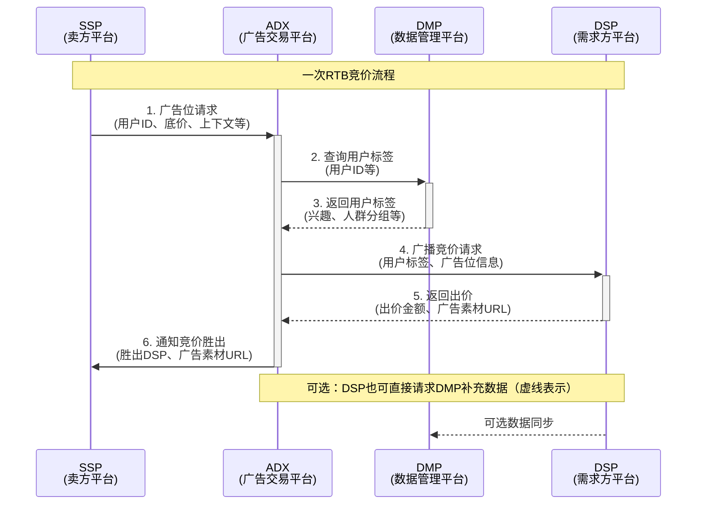

# 广告竞价逻辑
## DSP/SSP/ADX

```mermaid
sequenceDiagram
    participant SSP as SSP<br/>(卖方平台)
    participant ADX as ADX<br/>(广告交易平台)
    participant DMP as DMP<br/>(数据管理平台)
    participant DSP as DSP<br/>(需求方平台)

    Note over SSP,DSP: 一次RTB竞价流程

    SSP->>+ADX: 1. 广告位请求<br/>(用户ID、底价、上下文等)
    ADX->>+DMP: 2. 查询用户标签<br/>(用户ID等)
    DMP-->>-ADX: 3. 返回用户标签<br/>(兴趣、人群分组等)
    ADX->>+DSP: 4. 广播竞价请求<br/>(用户标签、广告位信息)
    DSP-->>-ADX: 5. 返回出价<br/>(出价金额、广告素材URL)
    ADX->>-SSP: 6. 通知竞价胜出<br/>(胜出DSP、广告素材URL)

    Note over ADX,DSP: 可选：DSP也可直接请求DMP补充数据（虚线表示）
    DSP-->>DMP: 可选数据同步
```
## 第二高价

