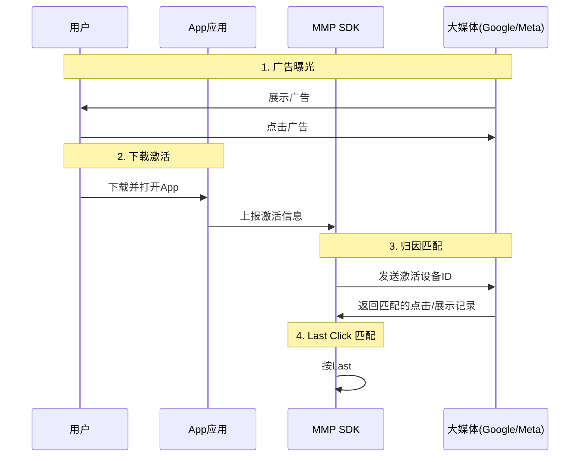

# 归因模型

某天你打开广告后台，Google说：我们带来了3000用户。Meta说：我们带来了3500用户。一共6500，但你的应用实际只新增了4000用户。多出来的 2500 是哪儿来的？答案是：它们"抢"的是同一批用户。

每个渠道都说"这个用户是我带来的"——因为每个平台都按自己的Last Click算，同一个用户被归因了两次。这就是Duplicate Attribution（重复归因）。

那这4000用户，有多少真正属于Google，有多少属于Meta？这就是归因模型要解决的问题：你获得了一个新用户，ta是由谁带来的。

例如，一个用户先看了tiktok，再在google上搜索了，最后从facebook上下载了你的应用，那么这个应用应该算是谁的？

引言这里举的例子不太恰当，google和meta是自归因平台，通常不会遵守一般的归因规则，而是认为无论是展示还是点击过它的广告的，都算作是它带来的（其实这句话也不准确，这里我有点拿不准，它们是把只要自己有贡献的都算给自己，还是说只是把自己的归因窗口拉得更长？需要查一下相关文档）

对归因的模型的正确开场，应该是用户经过不同渠道，转化了，衡量各个渠道的贡献率。

我们说大渠道（google、meta），“抢了别的渠道的量”），应该是基于这样的共识，即你认可last click的归因方案。

假设，一个用户先看了tiktok，再在google上搜索了，最后从facebook上下载了你的应用，那么这个用户应该算是哪个渠道带来的呢？这就是归因模型要解决的问题：你获得了一个新用户，ta是由谁带来的。

归因是判断用户基于什么原因下载应用的，按照是否和媒体互动分为两种：
- non organic 非自然流量：用户与媒体进行了互动（点击或展示） - 你买来的用户
- organic 自然流量：用户没有与媒体进行互动（直接下载了你的应用） - 自己来的
严格意义上说，把某用户归给 organic的说法并不准确，因为自然量显然是无法被归因的。

不同的平台的归因逻辑不尽相同，在出海广告领域，通常采用的是last click规则。然而在具体的实现上，又可以分为大媒体的自归因方案和三方归因方案。

MMP 归因流程时序图

## last-clik归因模型

针对上面的问题，你可以有很多个答案。比如你说你就是喜欢google，只要用户接触过google的广告，那就是google带来的。或者，用户最开始是在tiktok上发现我们的产品的，追根溯源，这个用户是tiktok带来的。似乎也有道理，又或者你认为用户是在接触了facebook的广告才下载你的产品的，所以是facebook将用户吸引到了你的产品上来，因此这个用户应该算是facebook带来的。而最后这种，就是当前行业的共识，last click。

last click即为无论用户经过了多少个渠道，用户在下载前最后一次点击的是哪个渠道的广告，就把这个用户算作是哪个渠道带来的。

## 多触点归因模型

如果你觉得last click 或是把一个用户单纯算作某一个渠道带来的这种模式过于粗暴，也有一些其他的多触点归因模型。

### 线性归因

每个点平均分配，针对开头的问题，就是tiktok，google，facebook各有1/3的功劳。

### 时间衰减归因

离转化越近，功劳越大。

### U型归因

首位给更高权重，中间平分剩下的功劳。

### Shapley值

### 马尔可夫链

